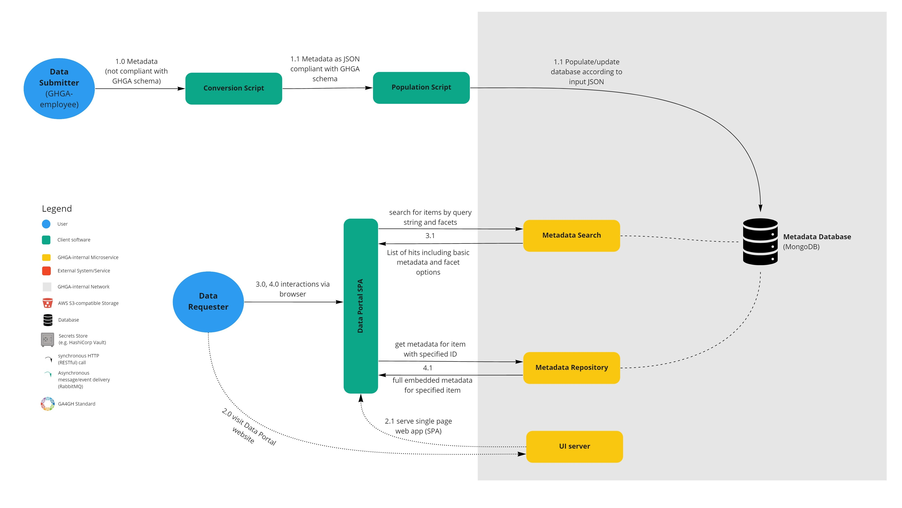

# Basic Metadata Catalog & UI (Blobfish)
**Epic Type:** Implementation Epic

**Attention: Please do not put any confidential content here.**

## Scope:
A scope definition can be found here: https://wiki.verbis.dkfz.de/x/SwFzCQ

## User Journeys

This epic covers the following user journeys:

Figure 1| Metadata Population and Usage via the Data Portal. (An editable version of this figure can be found here.)

The population of the Metadata Database:
The Data Submitter (a GHGA employee, not an external researcher) uses a script to convert "raw" metadata (from some source, e.g. EGA metadata JSON or an Excel spreadsheet) to JSON that is compatible with our GHGA metadata schema (1.0). Another script uses this JSON to populate the Metadata Database (1.1). In the case that the database has already been populated, the database is erased first.

The Data Requester visits the data portal website
The Data Requester visits the GHGA data portal website (2.0) using his/her browser of choice. A single-page web app is served by our "create-react-app" based UI server (2.1).

The Data Requester searches the metadata catalog:
The Data Requestor is greeted with a browse view. On this page, he/she can look at the list of stored studies/datasets, and have the option to drill down these via search or filtering. The Data Requester enters keywords to search for metadata items of interest (3.0). He/she might also apply filters, such as setting the "Experiment Type" to "RNA-seq". This request is served by the API of the Metadata Search service (3.1) which translates it into queries to the Metadata Database and sends back only basic non-embedded metadata of matching items. The API might also support pagination, so only sending part of the search result. Moreover, the API will send back facet options to filter down the current results, that can be visualized in the UI.

The Data Requester browses metadata for the search hits:
While browsing the search hits (4.0), the full metadata for a specific item (dataset/experiment/file/study/etc.) is retrieved on demand from the RESTful Metadata Repository service (4.1).

## API Definitions:

The definitions are hosted here:

### RESTful/Synchronous:

The RESTful service API are described using OpenAPI:

**Metadata Repository**: [Swagger UI](https://editor.swagger.io/?url=https://raw.githubusercontent.com/ghga-de/epic-docs/main/0_blob_fish/api_definitions/rest/metadata_repository.yaml)

**Metadata Search**: [Swagger UI](https://editor.swagger.io/?url=https://raw.githubusercontent.com/ghga-de/epic-docs/main/0_blob_fish/api_definitions/rest/metadata_search.yaml)

(The OpenAPI specifications are hosted in the `./api_defitions/rest` sub-directory. Please make sure the links are pointing to the main branch, even if the file doesn't exist there because the PR has not being merged, yet.)

### Metadata Schema Definition:
https://github.com/ghga-de/ghga-metadata-schema/releases/tag/0.2.0

(The metadata release might be simplified a bit to account for the limited information then we can get out of the existing EGA submissions.)

## Additional Implementation Details:

Further questions here: https://docs.google.com/document/d/1xR6_93E3ySxhucKHKsyZ_1g_Eb5NUsrwsfl1bw8cQhA/edit?usp=sharing

## Human Resource/Time Estimation:

Number of sprints required: -

Number of developers required: -
