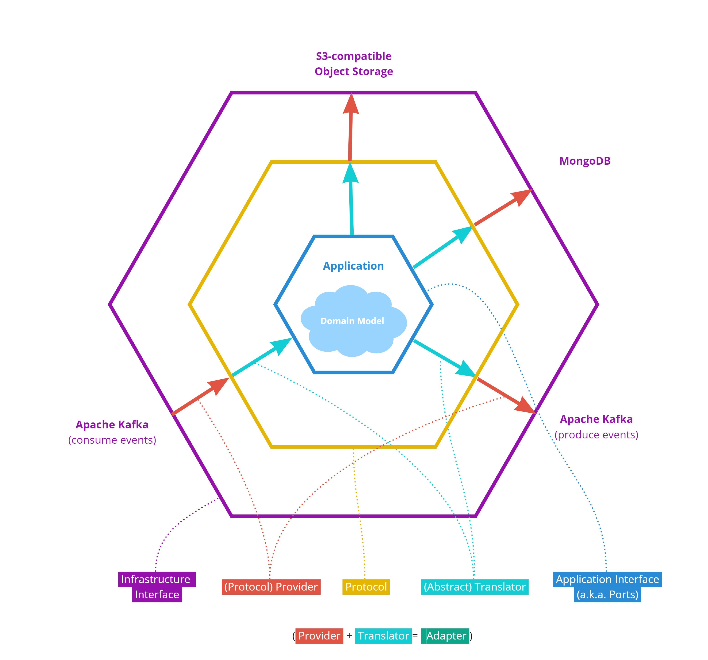

# Expanding Hexkit to Abstract the Persistence Layer (Golden Quail)
**Epic Type:** Implementation Epic

**Attention: Please do not put any confidential content here.**

## Scope:
A scope definition can be found here: https://wiki.verbis.dkfz.de/x/uQAECg

The following documents might be helpful to understand the context and objective of this epic:
1. [Hexagonal Architecture Design Pattern](https://wiki.verbis.dkfz.de/x/noAlCg)
2. [Triple Hexagonal Architecture Concept](https://wiki.verbis.dkfz.de/x/MABFCg)
3. [Reducing Redundancy and Ensuring Consistency between Microservices](https://wiki.verbis.dkfz.de/x/tgFVCg)

## Implementation Details:

This epic shall add outbound protocol/provider pairs for interacting with persistence architecture including databases
and object storages. The functionality implemented in the hexkit at the end of this step is summarized in the following figure:  

### S3-based Object Storage:
An abstraction around S3-like object storages is already provided in the ghga-service-chassis-lib.
Thereby the [ObjectStorageDao](https://github.com/ghga-de/ghga-service-chassis-lib/blob/main/ghga_service_chassis_lib/object_storage_dao.py#L259) roughly corresponds to a protocol and the [ObjectStorageS3](https://github.com/ghga-de/ghga-service-chassis-lib/blob/main/ghga_service_chassis_lib/s3.py#L175) roughly corresponds to a provider implementation.

These classes need to be ported to the hexkit and turned into async code.
Since the underlying boto3 library is synchronous, blocking calls from that library will be wrapped with the
`asyncio.to_thread` function to make them available.

### Basic CRUD Database:
A protocol for basic CRUD interactions with a database will be proposed. The operations shall include:
- get resource by ID
- create resource
- update resource
- upsert resource (if resource exists, will update, otherwise will create)
- delete resource by ID
- find resources by a list of key/value pairs (i.e. a dictionary) where the keys are resource attributes
  and the values corrspond to attribute values

Complex query operations will not be supported.
Resources will be accepted and returned as pydantic models that encapsulate serialization and validation.

There might be two flavours of this protocol:  
One that lets the user of the protocol set the resource ID upon creation.  
And another one for which the provider (and the underlying infrastructure) is expected to assign
and return an ID (will required a special pydantic model for creation).

There shall be one provider implementation of this protocol based on MongoDB and the async motor client library.

Both the protocols and providers need to be flexible to the pydantic model which is defined by the application.
For reaching this flexibility, we might evaluate the following options:
- using typing.Generics that uses the pydantic model as type variable
- using a factory that gets the pydantic model as input and returns protocols/providers configured accordingly

### Testing:
To keep the roadmap lean, we might skip producing testing-specific provider implementations.
However, we will provide pytest fixtures that will setup and teardown containers running the required infrastructure for
integration testing.

(We might provide a testing implementation for the CRUD Database Protocol, as this can be easily realized via a python dictionary.)

### Application
The newly created building blocks shall be applied to the existing file service, incl.:
- UCS
- DRS3
- IFRS

Thereby, these services will be transformed into async applications.

## Human Resource/Time Estimation:

Number of sprints required: 2

Number of developers required: 1
