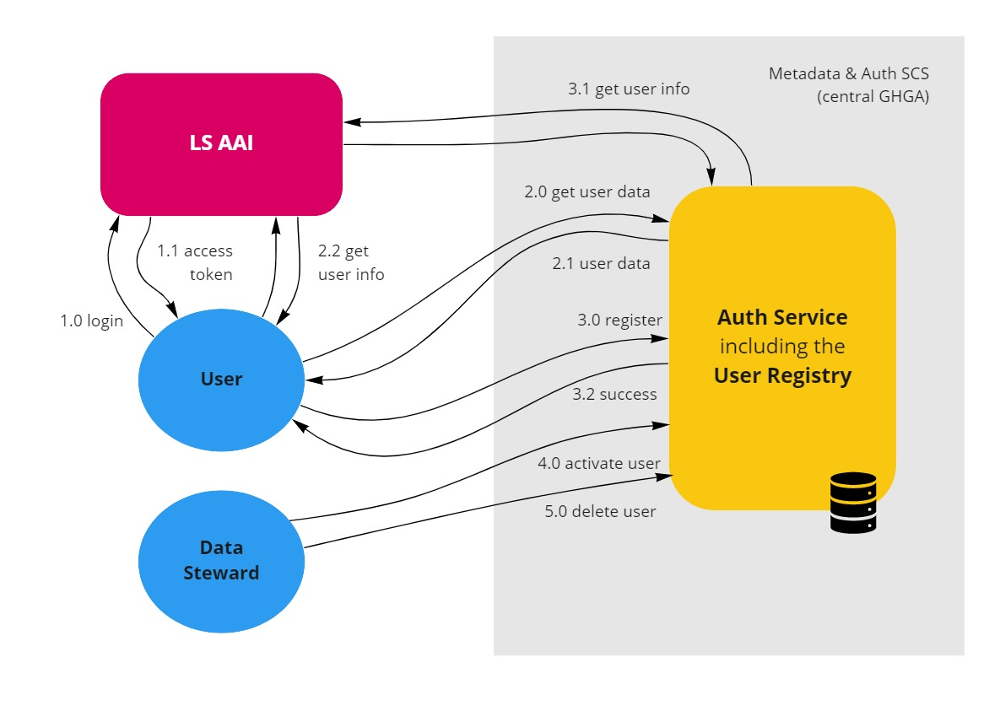

# Basic User Registry (Morning Sun Star)

**Epic Type:** Backend Implementation Epic

## Scope

Implement the basic user registry backend as part of the auth service.

## User Journeys

This epic covers the following user journeys:

### User registers with GHGA

(1.0) The user logs in using LS Login via the data portal SPA. This requires prior registration with LS Login when the user is not already registered there.

(1.1) As result of the OIDC flow, LS Login sends an access token back to the SPA which keeps it for the rest of the user session.

(2.0) The SPA sends a request to the "get user data" endpoint in order to get the basic user information and to check whether the user is already registered. As part of the request, it also submits the user id from the LS Login access token. 

(2.1) The Auth Service responds by sending the user data back to the SPA if a user with the given LS Login user ID is found in the user registry database. In this case the user has been already registered and the user journey ends here. If the user is not found in the database, the Auth Service responds with a "user not found" error message. In this case, the user still needs to register with GHGA, and the SPA aks the user to register themselves.

(3.0) The user fills the registration form in the SPA which is pre-populated with the data contained in the access token. This data is then submitted to the "register user" endpoint of the Auth Service. The Auth Service checks the validity of the data using the internal token that is provided by the auth adapter.

(3.1) If the data is valid, the user is saved in the database, and internal ID is created and the user data sent back to the SPA. Also, an event is published to the event stream that triggers the notification of a data steward about the newly registered user.

### Data steward activates user

(4.0) Upon receipt of the notification that a user has been registered, the data steward also logs in to the data portal. After checking the user registration, the data steward sets the status of the user to "activated" (or to "deactivated" if the registration does not seem to be legit). This is done via the SPA using the "modify user data" endpoint of the Auth Service.

(4.1) An event is published to the event stream that triggers the notification of the user, letting them known that they have been activated.

### Data steward deletes user

(5.0) Users can request the deletion of their user data. Such requests are handled via the data steward. This is done via the SPA using the "delete user" endpoint of the Auth Service.

(5.1) An event is published to the event stream that triggers the notification of the user, letting them known that their data has been deleted as requested.

## API Definitions

The definitions are hosted here:

### RESTful/Synchronous

The RESTful service API are described using OpenAPI:

**User Registry Service**: [OpenAPI YAML](api_definitions/rest/user_registry.yaml), [Swagger UI](https://editor.swagger.io/?url=https://raw.githubusercontent.com/ghga-de/epic-docs/main/15-morning-sun-star/api_definitions/rest/user_registry.yaml)

### Payload Schemas for Asynchronous Topics

The payloads for asynchronous topics are described using JSON schemas

(TBD!)

- \<my_example_event_type\>: [JSON Schema](https://raw.githubusercontent.com/ghga-de/ghga-message-schemas/main/ghga_message_schemas/json_schemas/drs_object_registered.json)

(The JSON schemas should be defined in the following repository: https://github.com/ghga-de/ghga-message-schemas. Please insert only links from the main branch.)

## Time Estimation

- Start: August 29
- Due: September 9
