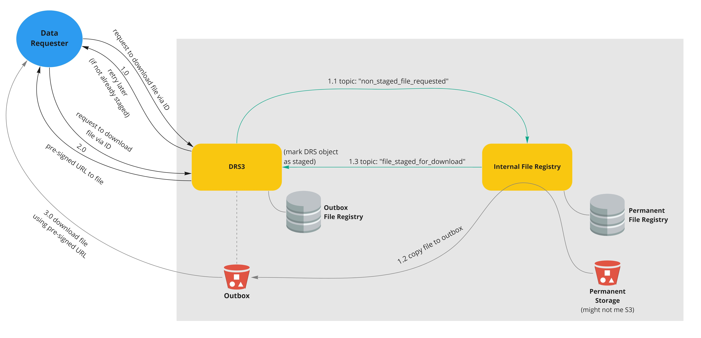

# Basic File IO Service (Red-lipped Batfish)
**Epic Type:** Implementation Epic

**Attention: Please do not put any confidential content here.**

## Scope:
A scope definition can be found here: https://wiki.verbis.dkfz.de/x/TgFzCQ

## User Journeys
This epic covers two user journeys: (1) downloading and (2) uploading data.

### Data Download:

**Figure 1| A Data Requester downloads data.** (An editable version of this figure can be found here.)

The Data Requester requests to download a file:
The Data Requester sends a request to the DRS3 service to retrieve a download URL for a file with a specified ID as per the GA4GH DRS specs (1.0). Since this file is not yet available in the Outbox S3 bucket, which serves as a staging area for downloads, the DRS3 service replies to the Data Requesters client by asking to retry the download request after a certain amount of time (HTTP response code: 202) that is needed to stage the file. Moreover, the DRS3 service publishes an event to inform the Internal File Registry of the download request (1.1). The Internal File Registry copies the file from the permanent storage system to the Outbox S3 bucket (1.2) and, once completed, it publishes an event informing the DRS3 service about the successful staging of the requested file (1.3). The DRS3 service marks the corresponding DRS object as being staged.

The Data Requester retrieves a pre-signed URL for downloading the file:
The Data Requester's client retries the download request after the prescribed amount of time (2.0). Since the requested DRS object is now available in the Outbox, the DRS3 service replies with a pre-signed URL to the corresponding S3 object (HTTP response code: 200).

The Data Requester downloads the file directly from S3:
By following the pre-signed URL, the Data Requester can directly download the file from S3 (3.0).

### Data Upload:

**Figure 2| Data Upload.** (An editable version of this figure can be found here.)

The Data Submitter uploads metadata for a new study:
This is not implemented in this Epic. However, we expect an event to be published by the Metadata Repository service informing other services about the newly added study (1.1). This event is received by the Upload Controller Service which registered the files included in the study for upload and creates a new Inbox S3 bucket for this study.

The Data Submitter requests a URL for depositing a file:
Using a file ID assigned by the Metadata Repository service, the Data Submitter requests a URL for depositing the corresponding file from the Upload Controller (2.0). The Upload Controller answers with a pre-signed URL that has put (but not get) permissions for the Inbox S3 bucket used as a temporary stage for uploaded file objects.

The Data Submitter uploads the file:
The Data Submitter uses the pre-signed URL to upload the file directly to S3 (3.0).

Steps 2. and 3. are repeated for all files of the newly created study.

The Data Submitter confirms the upload:
The Data Submitter confirms the upload by notifying the Upload Controller (4.0). The Upload Controller checks whether the file is present in the storage Inbox and, if existent, it publishes an event notifying the Internal File Registry about the successful upload (4.1). The Internal File Registry registered the files in its database and moves the file from the Inbox S3 bucket to the Permanent Storage solution (4.2). Moreover, the Internal File Registry publishes an event informing other services that a newly uploaded file was successfully persisted (4.3). As a response, the Upload Controller unregistering the file for upload. The DRS3 service, which also receives this event, registers the file as a new DRS object and generated a new public DRS ID that can be used outside of GHGA to refer to this file for download. The DRS3 service publishes an event to share that DRS ID along with the original file ID with the Metadata Repository (4.4). The Metadata Repository updates the file metadata to include the DRS ID which marks the file as being uploaded.

The Data Submitter creates a new dataset:
The data submitter can create a new downloadable bundle by posting metadata for a new dataset to the Metadata Repository service (5.0). Among others, this metadata includes references to all files that should be part of this dataset. The consumption of this event is not implemented in this epic.

## API Definitions:

### RESTful/Synchronous:

The RESTful service API are described using OpenAPI:

**DRS3**: [Swagger UI](https://editor.swagger.io/?url=https://raw.githubusercontent.com/ghga-de/epic-docs/main/1_red-lipped_batfish/api_definitions/rest/drs3.yaml)
**Upload Controller**: [Swagger UI](https://editor.swagger.io/?url=https://raw.githubusercontent.com/ghga-de/epic-docs/main/1_red-lipped_batfish/api_definitions/rest/upload_controller.yaml)

(The OpenAPI specifications are hosted in the `./api_defitions/rest` sub-directory. Please make sure the links are pointing to the main branch, even if the file doesn't exist there because the PR has not being merged, yet.)

### Payload Schemas for Asynchronous Topics:

The payloads for asynchronous topics are described using JSON schemas:

- non_staged_file_requested: [JSON Schema](https://raw.githubusercontent.com/ghga-de/epic-docs/main/1_red-lipped_batfish/api_definitions/message_topics/non_staged_file_requested.json)
- file_staged_for_download: [JSON Schema](https://raw.githubusercontent.com/ghga-de/epic-docs/main/1_red-lipped_batfish/api_definitions/message_topics/file_staged_for_download.json)
- new_study_created: [JSON Schema](https://raw.githubusercontent.com/ghga-de/epic-docs/main/1_red-lipped_batfish/api_definitions/message_topics/new_study_created.json)
- file_upload_received: [JSON Schema](https://raw.githubusercontent.com/ghga-de/epic-docs/main/1_red-lipped_batfish/api_definitions/message_topics/file_upload_received.json)
- file_internally_registered: [JSON Schema](https://raw.githubusercontent.com/ghga-de/epic-docs/main/1_red-lipped_batfish/api_definitions/message_topics/file_internally_registered.json)
- drs_object_registered: [JSON Schema](https://raw.githubusercontent.com/ghga-de/epic-docs/main/1_red-lipped_batfish/api_definitions/message_topics/drs_object_registered.json)

## Human Resource/Time Estimation:

Number of sprints required: -

Number of developers required: -
