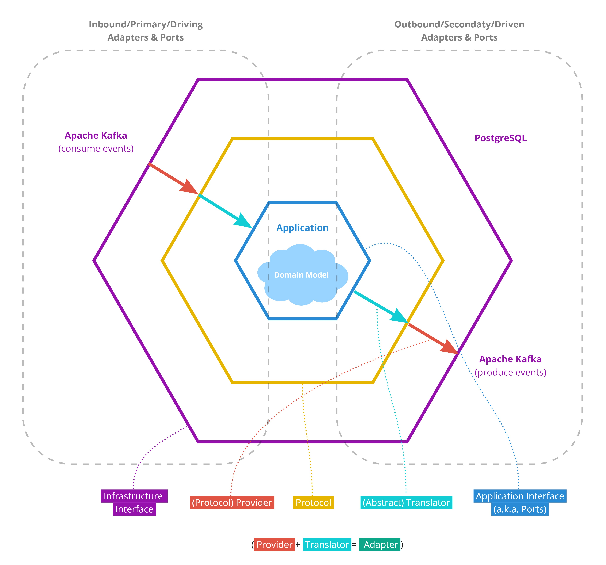

# Pilot Study for 3-Hex Chassis Lib (Domestic Quail)
**Epic Type:** Half Exploration / Half Implementation

**Attention: Please do not put any confidential content here.**

## Scope:
A scope definition can be found here: https://wiki.verbis.dkfz.de/x/tQAECg

This epic is classified as both exploratory and implementation type. That is because it is a prove of concept study that seeks to explore and evaluate options for implementing the triple hexagonal design pattern in python. So there are many open questions but the result should be a working implementation of the design pattern for a narrowly defined scope (of event handling).

The following documents might be helpful to understand the context and objective of this epic:
1. [Hexagonal Architecture Design Pattern](https://wiki.verbis.dkfz.de/x/noAlCg)
2. [Triple Hexagonal Architecture Concept](https://wiki.verbis.dkfz.de/x/MABFCg)
3. [Reducing Redundancy and Ensuring Consistency between Microservices](https://wiki.verbis.dkfz.de/x/tgFVCg)

This epic specifically tries to deliver a draft for the library proposed in document 3.

## Implementation Details:

This epic aims at prototyping the triple hexagonal architecture by exemplarily implementing protocols and providers for event handling as summarized in following figure and further discussed below.

### Protocols:

The even subscription protocol defines an interface that uses the following vocabulary:
- **topic**: string identifying the topic from which to consume events. A topic serves as the highest organization unit for events.
- **event_payload**: the actual data that is shipped with the event. It has to be JSON-serilizable.
- **event_type**: string identifying the type of event, e.g. "user_account_created" or "user_account_deleted". One topic can deliver multiple event types.
- **event_schema**: JSON schema describing the shape of the event payload. Typically, each event type is associated with a specific event schema. The schema shall be used by the provider to validate the event payload.

The event publishing protocol defines an interface that, in addition to the vocabulary of the event subscription protocol, uses the following terms:
- **event_key**: of type string. The protocol provider should guarantee that events with the same key are delivered in the same order as they were produced. The string is typically set to the identifier of the event subject. E.g. for a user with the username "Batman27", events of the following types might happen: "user_account_created" and "user_account_deleted". Of course, it would make no sense that the "user_account_deleted" event is consumed before the "user_account_created". Thus the key of these events can be set to the username "Batman27" to ensure that all of them are delivered in order.

### Providers:
For the above protocols, providers specific for event handling using Apache Kafka shall be implemented.

Moreover, a provider that uses a lightweight local (single machine only) in-memory queue shall be implemented for testing purposes.

### Application
The newly created chassis library shall be tested on the code base of the Upload Controller Service. There the above mentioned protocols and providers shall be used to replace the message handling functionality currently based on RabbitMQ.

## Exploratory Part / Open Questions:

One question that remains to be evaluated is how to best represent protocols in code. A simple option is to subclass from python's typing.Protocol or abc.ABC (abstract base class) to simulate interfaces as they exist in Java or C#. However, other more options that provide more structure might be explored, too. Thereby, it might be useful to choose different strategies for inbound and outbound protocols because of their fundamental difference in the way they are called: inbound protocols are called by the provider, while outbound protocols are called by the abstract translator.

Moreover, options for a test framework that is standardized around the provided protocols shall be explored. Ideally, tests shall be written in a way that it can be decided at runtime whether fast in-memory/mock providers or realistic production providers are used. I.e. the in-memory/mock providers could be used for fast testing that integrates nicely into the development workflow on developer end devices, while the production providers can be run by CI tools to provide additional diagnostic power.

With reference to that, it might be also useful to explore whether application states associated with specific protocols could be defined in a standardized specification (YAML or JSON-based) that is applicable to all providers implementing the protocol. Specialized tooling might interpret this specification and setup and teardown the application state when running tests but also when deploying a service to a staging environment (that uses the same infrastructure than the production environment).

Another area of research is how dependency injection can help to glue all of the triple hexagonal architecture components together (providers to protocols to translators to ports). Thereby, a specific focus should be set on the question of how to inject config parameters that are needed throughout all of these components and are typically defined via YAML files or environment variables.

## Human Resource/Time Estimation:

Number of sprints required: 2

Number of developers required: 1
