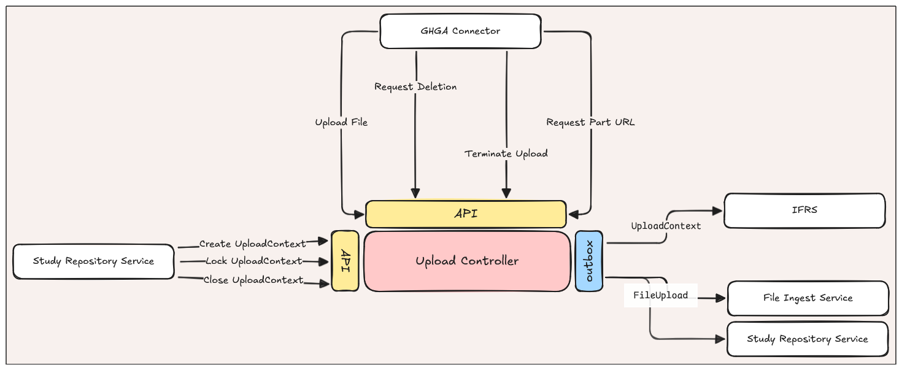

# Upload Service Redux (Lynx Boreal)
**Epic Type:** Implementation Epic

Epic planning and implementation follow the
[Epic Planning and Marathon SOP](https://docs.ghga-dev.de/main/sops/sop001_epic_planning.html).

## Scope
### Outline:
The goal of this epic is to overhaul the Upload Controller Service (UCS) as part of the
new [File Upload concept](https://ghga.pages.hzdr.de/internal.ghga.de/feature_archconcept-file-upload/developer/architecture_concepts/ac007_file_upload/).



#### Domain Objects
The UCS owns two domain objects, which it broadcasts as outbox events via Kafka. The
first domain object is the `UploadContext`, which broadly serves to delineate
in-progress and finalized file submissions for a given study. The second domain
object is the `FileUpload`. As its name suggests, the `FileUpload` object reflects
the upload status of a single file within an `UploadContext`. Thus, there is a
hierarchical, one-to-many relationship between `UploadContext` and `FileUpload`.

We will define the Pydantic models for these two classes in `ghga-event-schemas`,
along with one stateful config class for each.

#### Inputs
The UCS only receives user input in the form of HTTP requests. It doesn't subscribe to
any Kafka events. However, we will define a slim CLI interface for the service that
exposes commands to `run-rest` and `publish-events`. These commands are commonly seen
across our services at this time.

### Outputs
There are three categories of output in the UCS: HTTP responses, published events, and
data stored in the database. HTTP responses are described below in the API Definitions
section. The published events and database storage are driven simultaneously by
Hexkit's MongoKafkaDaoPublisher, which the UCS uses to store `UploadContext` and
`FileUpload` instances. Changes to objects of both categories results in a new Kafka
event.

#### Auth
Users will not access the UCS's HTTP API directly, but rather through the
`ghga-connector`. Successful access to HTTP endpoints will require the encrypted
access token they obtained from the Data Portal when creating the Upload Context.
The HTTP request responsible for creating the Upload Context does not come directly
from the user, but rather from the Study Repository Service.
For more information on the HTTP API, see endpoint definitions below.

### Included/Required:
- Remove existing core logic
- Create new core class w/ outbox publisher
- Write Unit and Integration Tests

### Optional:
\<List any optional features that may or may not be realized as part of this epic.\>

### Not included:
\<List features that will not be addressed as part of this epic.\>

## User Journeys

### UploadContext Creation
Using the Data Portal, the user initiates file upload for a study. The request flows
from the Data Portal to the Study Repository Service (where it passes through
validation and other checks) and ultimately to the UCS's HTTP endpoint
`POST /contexts`. The UCS creates a new
`UploadContext` with the state set to `OPEN` and returns the `UploadContext` to the
Study Repository Service. The Study Repository Service returns authentication info
to the user via the Data Portal.

### UploadContext Update
The user makes a request to the `PATCH /contexts` endpoint via the Study Repository
Service. If a valid encrypted access token is supplied with the request, the UCS
updates the state of the `UploadContext` to `LOCKED`, `CLOSED`, or `OPEN`, as
specified by the request. If the `UploadContext` is already in the given state, nothing
happens and the UCS returns a successful response.
If user tries to change the status of an `UploadContext` that's already set to `CLOSED`,
they receive an error. Once the update operation is complete, the UCS publishes a Kafka
event reflecting the latest state of the `UploadContext` and returns an HTTP response
indicating the update was successful.

### File Upload Init
The user initiates the upload process for a given single file by making a request to
the `POST /uploads` endpoint. If a valid encrypted access token is supplied with the
request, the UCS ensures it doesn't already have a completed `FileUpload` for the same
file, then adds the `FileUpload` to the associated `UploadContext`. The UCS publishes
upsertion events to Kafka for both the `FileUpload` and `UploadContext`
objects, and finally returns an HTTP response to the user indicating that the file
upload was successfully initiated.

The `ghga-connector` uploads a given file in chunks, and for each chunk it requests
a pre-signed upload URL. If the request includes a valid access token, the UCS
returns an HTTP response with the pre-signed upload URL if the token is valid.

### File Upload Termination
The user makes a request to `PATCH /uploads`, indicating
they wish to terminate an ongoing multipart upload for one of their files. If a
valid encrypted access token is supplied with the request, the UCS attempts to
cancel the multipart upload via the S3 client, if said upload exists. Afterward, 
it ensures that the corresponding `FileUpload` object's `state` is still set to `INIT`.
The `FileUpload` object persists, however, and the user may subsequently try uploading
the file again. Upload termination does not trigger any change to the parent
`UploadContext`. The UCS returns an HTTP response confirming that the termination
request was successful.

### File Upload Deletion
The user makes a request to the `DELETE /uploads` endpoint, indicating they wish to
delete a file from the associated Upload Context. If a valid encrypted access token
is supplied with the request, the UCS terminates the ongoing upload if it exists and
deletes the `FileUpload` object from the database. It removes the reference
from the `file_uploads` field in the `UploadContext` and publishes Kafka events
reflecting the deletion of the upload and the new state of the Upload Context.
Finally, the UCS returns an HTTP response to the user indicating the deletion was
successful.

## API Definitions:

### RESTful/Synchronous:

- POST /contexts: Create a new UploadContext
- PATCH /contexts: Update an UploadContext to change the status.
- POST /uploads: Initiate a file upload
- PATCH /uploads: Terminate an ongoing file upload
- DELETE /uploads: Remove a file upload from the UploadContext

### Payload Schemas for Events:

```python
class UploadContext(BaseModel):
    """An upload context"""
    upload_context_id: UUID4 # unique identifier for the instance
    state: str  # one of OPEN, LOCKED, CLOSED
    file_uploads: list[FileUpload]  # use list function for default_factory
```
```python
class FileUpload(BaseModel):
    """A File Upload"""
    upload_id: UUID4
    state: str  # one of INIT, COMPLETED
    original_path: str
    checksum: str
```


## Additional Implementation Details:


### Testing
Tests need to cover at least the following (not exhaustive):
- 


## Human Resource/Time Estimation:

Number of sprints required: 1

Number of developers required: 1
