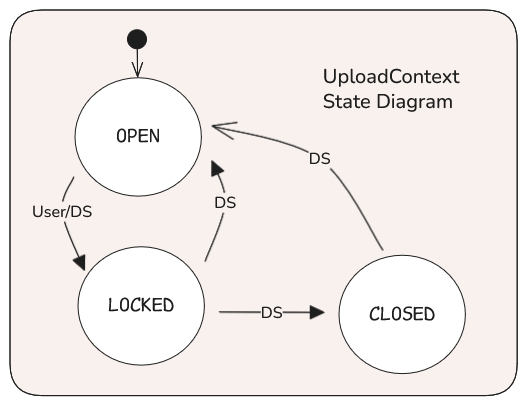

# Upload Service Intermediary Revision (Lynx Boreal)
**Epic Type:** Implementation Epic

Epic planning and implementation follow the
[Epic Planning and Marathon SOP](https://docs.ghga-dev.de/main/sops/sop001_epic_planning.html).

## Scope
### Outline:
The goal of this epic is to overhaul the Upload Controller Service (UCS) as part of the
new [File Upload concept](https://ghga.pages.hzdr.de/internal.ghga.de/feature_archconcept-file-upload/developer/architecture_concepts/ac007_file_upload/).
While AC 7 includes references to future services like the Study Repository Service,
some of the machinery there is still in the planning phase. This epic will therefore
rely upon some shortcuts, such as extra Data Steward involvement. When the full
architectural concept is realized, the appropriate adaptations will follow in a future
epic.

### Included/Required:
- Create UOS
- Revamp existing UCS logic
- Adapt WPS for "upload" work packages and tokens
- Adapt CRS to also manage claims for upload contexts
- Write Unit and Integration Tests
- Add `UploadContext` and `FileUpload` schemas to `ghga-event-schemas`

### Not included:
- Archive test bed integration
- Subsequent FIS or IFRS updates for the upload path
- Any front-end work that may be needed
- GHGA-Connector update


#### New Service: Upload Orchestration Service (UOS)

This epic introduces a new lightweight service to handle authentication concerns while
preserving the boundary between file services and auth concerns like user IDs and roles.

All publicly expose UCS endpoints will require a Work Order Token (WOT), which can only be created from
existing Work Packages in the Work Package Service (WPS) based on claims in the Claims
Repository Service (CRS). We don't want Data Stewards interacting directly with the
CRS to create claims, but the UCS shouldn't be aware of claims or user identities either.
Recognizing that enabling file uploads and creating upload claims are
bundled actions, we will instead delegate these things to a new service, the UOS.
Data Stewards will query the UOS HTTP API to enable uploads for a new study (i.e. create
a new `UploadContext`) and create the required upload claims for the user.


> General service diagram showing the new UOS and UCS

### Upload Controller Service

#### Domain Objects
The UCS owns two domain objects, which it broadcasts as outbox events via Kafka. The
first domain object is the `UploadContext`, which broadly serves to delineate
in-progress and finalized file submissions for a given study. The second domain
object is the `FileUpload`. As its name suggests, the `FileUpload` object reflects
the upload status of a single file within an `UploadContext`. Thus, there is a
hierarchical, one-to-many relationship between `UploadContext` and `FileUpload`.

We will define the Pydantic models for these two classes in `ghga-event-schemas`,
along with one stateful config class for each.

#### Inputs
The UCS only receives user input in the form of HTTP requests. It doesn't subscribe to
any Kafka events. However, we will define a slim CLI interface for the service that
exposes commands to `run-rest` and `publish-events`. These commands are commonly seen
across our services at this time.

#### Outputs
There are three categories of output in the UCS: HTTP responses, published events, and
data stored in the database. HTTP responses are described below in the API Definitions
section. The published events and database storage are driven simultaneously by
Hexkit's MongoKafkaDaoPublisher, which the UCS uses to store `UploadContext` and
`FileUpload` instances. Anytime an `UploadContext` or `FileUpload` is created, modified,
or deleted, the UCS publishes a Kafka event containing the latest state. This is done
according to the Outbox Pattern (not described in further detail here). 
Other services, like the IFRS and FIS will later consume these events as part of the
official file upload and management strategy. Presently, the WPS will watch
the `UploadContext` events to enable proper work package management.

#### Auth
**Tokens**  
The UCS secures its endpoints through WOT authentication. While the Download Controller
Service requires just one flavor of WOT to operate, the UCS requires several:
| Token                          | Issuer | Who                  | Action Authorized                                |
|--------------------------------|--------|----------------------|--------------------------------------------------|
| `CreateUploadContextWorkOrder` | UOS    | Data Stewards        | Create a new `UploadContext`                     |
| `ChangeUploadContextWorkOrder` | UOS    | Data Stewards        | Update an existing `UploadContext`               |
| `ViewUploadContextWorkOrder`   | UOS    | Users, Data Stewards | View one or more `UploadContexts`                |
| `CreateFileWorkOrder`          | WPS    | Users                | Initialize a `FileUpload` and obtain new file ID |
| `DeleteFileUploadWorkOrder`    | WPS    | Users                | Delete a `FileUpload` from an `UploadContext`    |
| `UploadFileWorkOrder`          | WPS    | Users                | Obtain a part upload URL for a given file ID     |

These tokens authorize users to perform the labeled action within the UCS, and they only
carry information necessary for the given action, such as `file_id` or `context_id`.

**Claims and Work Packages**
Before general users (not Data Stewards) can upload files, three things must happen:
1. A Data Steward must create the `UploadContext` via the Upload Orchestration Service.
   - The UOS signs a `CreateUploadContextWorkOrder` token and contacts the UCS.
2. A Data Steward must grant the user a claim enabling them to use the `UploadContext`.
   - No token is required here, the UOS just verifies the Data Steward role exists.
3. The user must create a Work Package via the Data Portal to obtain a Work Package
Access Token (WPAT). Only one WPAT is needed for the entire series of files under normal
circumstances.
   - No token is required to create the WPAT.

The user then supplies the WPAT to the `ghga-connector` to upload files.
The `ghga-connector` obtains Work Order Tokens (WOTs) automatically by providing the
WPAT to the WPS, and then makes at least three calls for each file:
1. A POST request to the UCS to create the `FileUpload`.
   - This requires a `CreateFileWorkOrder` token from the WPS.
   - The user supplies the file `alias` in this request.
   - The user receives the `file_id` of the newly created `FileUpload`
2. A GET request to the UCS to obtain a file part upload URL. This call is repeated for
each file part.
   - This requires an `UploadFileWorkOrder` token from the WPS.
   - The user supplies the `file_id` to get the above token.
   - The token is only valid for a file with the matching `file_id`.
3. A final PATCH request to the UCS to complete the file upload.
   - This uses the same `UploadFileWorkOrder` token.

Should the user desire to delete a file, they obtain a `DeleteFileUploadWorkOrder`
token from the WPS and perform a DELETE request via the `ghga-connector`.

When the user has completed uploading all files, the user contacts the UOS to move the
`UploadContext` to the `LOCKED` state, preventing further changes (Data Stewards can
lock the context as well, if needed). The UOS signs a `ChangeUploadContextWorkOrder`
token and relays the request to the UCS. When the user is
satisfied that all uploads are correct and complete, they ask a Data Steward to move
the `UploadContext` to the `CLOSED` state. Closing the `UploadContext` requires the user
to be a Data Steward. Likewise, only a Data Steward can re-open the context once it
has been `CLOSED`. Claims for closed `UploadContexts` remain valid; the UCS is
responsible for filtering activity based on state.

In summary:
- UOS:
  - Inspects auth context details to discern between Data Stewards and regular users
  - Communicates with the CRS
  - Relays `UploadContext`-related requests to the UCS
  - Signs UOS-owned WOTs for the requests it sends to the UCS.
  - The Data Steward role required to create `UploadContext`s and grant upload claims
  - Data Steward role required for all `UploadContext` changes except `OPEN` -> `LOCKED`
- UCS:
  - Knows nothing about "users" or "claims"
  - Endpoints require appropriate WOTs

For more information on the HTTP API, see the endpoint definitions below.

### Work Package Service
The WPS is hardcoded to set up an error when creating a work package if the work type
is anything other than "download". The logic is all download-centric, so the WPS needs
to be updated to accommodate "upload" work packages. To this end, these are the main
points to address:
1. Update `WorkPackageRepository` logic to handle CRUD-ing "upload" work packages
2. Revamp Work Order Tokens (see Additional Implementation Details)
3. Listen for outbox events carrying `UploadContext` data, and store the context IDs
   - Context deletion is not allowed in this version of the upload path. We can add it later.
4. Change `AccessCheckConfig.download_access_url` to `AccessCheckConfig.access_url` to work for both up- and download
5. Augment the `AccessCheckAdapter` so it can call `/upload-access/users/{user_id}/contexts/{context_id}`
   to check if a user has access to a given `UploadContext`
6. Provide a way to distribute WOTs, either by modifying the
   `/work-packages/{work_package_id}/files/{file_id}/work-order-tokens` endpoint or
   replacing it with one or more endpoints that allow passing the type and
   additional token content


### Claims Repository
1. Extend the access API (not the claims API, which is not active at the moment) to also
support upload grants. The new endpoints here will be used by the UOS and the WPS for
granting and verifying access.

Please see the API Definitions for details on the endpoints for extending the
access API.

2. Create a new visa type. The currently-used visas for download,
ControlledAccessGrants, imply download access and should therefore not be used as upload
visas. Instead, we should create a new visa:

type: `GHGA_UPLOAD = "https://www.ghga.de/GA4GH/VisaTypes/Upload/v1.0"`
value: `https://ghga.de/uploads/{context_id}`

We will have to extend the utilities surrounding visa handling to accommodate this
new visa type in the core `claims` module because all the logic there is download-
centric.

## User Journeys


### UploadContext Creation
A Data Steward makes a call to the UOS to create a new `UploadContext`.
The UOS calls the UCS's `POST /contexts` endpoint to create the actual `UploadContext`
with the state set to `OPEN`. The UCS issues an outbox event, which is consumed by the
Work Package Service (for now - in the future, more services will join).

The UOS receives the new `UploadContext` ID from the UCS and returns it to the Data
Steward. The Data Steward then calls the UOS endpoint `POST /access`, supplying the
user ID, user IVA ID, context ID, plus any other required data, such as access expiry,
in order to grant the user an access claim. The user must first have a valid and validated 
IVA just like in the download path.

Finally, the UOS makes a call to the CRS to award an upload claim to
the user for the given `UploadContext` (specified by ID). Without this claim, the
user cannot create a work package or upload files.
If the UOS determines that the `UploadContext` does not exist, it returns an error.
It might do this through querying the UCS or by maintaining a record of context IDs in
its own database.

### UploadContext Update
Users are only allowed to make the initial change from `OPEN` to `LOCKED`. Only Data
Stewards may move an `UploadContext` from `LOCKED` to `CLOSED`, `LOCKED` to `OPEN`, or
from `CLOSED` to `OPEN`.

The Data Steward calls the `PATCH /contexts/{context_id}` endpoint on the UOS API,
which verifies their Data Steward role.
The request body should contain at least the desired context state.

The UOS relays state change requests to and responses from the UCS.

The UCS updates the state of the `UploadContext` to `LOCKED`, `CLOSED`, or `OPEN`, as
specified by the request. If the `UploadContext` is already in the given state, nothing
happens and the UCS returns a successful response (relayed by the UOS).
The initial state of the `UploadContext` is `OPEN`. When the user finishes uploading
files, they can lock the context themselves by calling the UOS with a WOT provided by
the WPS. It is possible that the user decides they need to make changes, such as
uploading or removing a file, and in that case a Data Steward can revert the Context to
`OPEN`. If no changes are needed, however, the user can request the Data Stewards to 
fully finalize the Context by setting it to `CLOSED`, after which point no changes
can be made without re-opening the `UploadContext`.
If user tries to change the status of an `UploadContext` that's not `OPEN`,
they receive an error. Once an update operation is complete, the UCS publishes an
event reflecting the latest state of the `UploadContext` and returns an HTTP response
indicating the update was successful.



An `UploadContext` may only be moved from `LOCKED` to `CLOSED` if all its linked
`FileUpload`s are set to `COMPLETED`.

### File Upload Init
Using the Data Portal, the user creates an upload work package for the `UploadContext`
and receives a WPAT. The following is accomplished using the
`ghga-connector` and the WPAT:

1. The user initiates the upload process for a given single file (can be looped or batched):
   - The Connector contacts the WPS and exchanges the WPAT for a `CreateFileWorkOrder` token.
   - The Connector calls the UCS's `POST /contexts/{context_id}/uploads/` endpoint.
The request body includes the unencrypted checksum, the file alias, and possibly further information. The WOT carries the context ID and file alias.
   - The UCS ensures the `UploadContext` is currently open and doesn't already have a completed `FileUpload` for the same file alias, then adds the `FileUpload` to the associated `UploadContext`.
   - The UCS initiates a multipart upload for the file.
   - The UCS publishes upsertion events for both the `FileUpload` and `UploadContext` objects, and returns an HTTP response to the Connector indicating
that the file upload was successfully initiated. 
     - The response contains the UCS-generated file id (UUID4) of the new file upload.

2. The Connector uploads the file in chunks:
   - For each file part, the Connector uses a valid `UploadFileWorkOrder` token (or gets a new one) to call the UCS's `GET /contexts/{context_id}/uploads/{file_id}/parts/{part_no}` endpoint.
   - The WOT carries the file ID.
   - Assuming the WOT is valid, the UCS returns a presigned, short-lived upload URL.
   - The Connector uploads the file parts until complete.

### File Upload Termination (Upload Completion)
When the upload is complete, the connector automatically makes a request to the UCS
endpoint `PATCH /contexts/{context_id}/uploads/{file_id}` using a valid `UploadFileWorkOrder` token.
This call instructs the UCS to communicate with the S3 instance and terminate (complete) the multipart upload.
The UCS will update the `FileUpload` instance to `COMPLETED` and publish a Kafka event reflecting the new state.
Finally, the UCS will return an HTTP response indicating the operation was successful.
The Connector displays a message to the user saying the file upload is complete.
If applicable, the Connector proceeds with the next file in the upload batch.

### `FileUpload` Deletion
The user, via the `ghga-connector` and a valid WPAT, makes a request to the
`DELETE /contexts/{context_id}/uploads/{file_id}` endpoint, indicating they wish to
delete a file from the associated Upload Context. If a valid `DeleteFileWorkOrder` token is supplied with the
request, the UCS cancels the ongoing upload if it exists and deletes the `FileUpload`
object from the database. It removes the reference from the `file_uploads` field in the
`UploadContext` and publishes events reflecting the deletion of the `FileUpload` and the
new state of the Upload Context. Finally, the UCS returns an HTTP response to the user
indicating the deletion was successful.

## API Definitions:

### RESTful/Synchronous:

#### Upload Controller Service:
- `POST /contexts`: Create a new `UploadContext`
  - Requires `CreateUploadWorkOrder` WOT and only allowed for Data Stewards via the UOS.
  - Returns the `context_id` of the newly created `UploadContext`
- `GET /contexts/{context_id}`: Retrieve an `UploadContext` by ID
  - Requires `ViewUploadContextWorkOrder` WOT issued by UOS
  - Path arg and token must agree on context ID
- `PATCH /contexts/{context_id}`: Update the state of an `UploadContext`
  - Currently only available to Data Stewards, as only they can obtain the required token.
  - Path arg and token must agree on context ID
  - Request body must contain the new state of the context
- `POST /contexts/{context_id}/uploads/`: Add a new `FileUpload` to an existing `UploadContext`
  - Requires CreateFileUploadWorkOrder WOT
  - Request body must contain the required file upload details
  - Path arg and token must agree on context ID, and alias must match between body and token
- `PATCH /contexts/{context_id}/uploads/{file_id}`: Conclude file upload in UCS
  - Requires FileUploadWorkOrder WOT of type "close"
  - Sets the `FileUpload` status to `COMPLETE` and tells S3 to close the multipart upload.
  - Path args and token must agree on context ID and file ID
- `DELETE /contexts/{context_id}/uploads/{file_id}`: Remove a `FileUpload` from the `UploadContext`
  - Requires FileUploadWorkOrder WOT of type "delete"
  - Deletes the `FileUpload` and tells S3 to cancel the multipart upload if applicable.
  - Path args and token must agree on context ID and file ID
- `GET /contexts/{context_id}/uploads/{file_id}/parts/{part_no}`: Get pre-signed S3 upload URL for file part
  - Requires FileUploadWorkOrder WOT of type "upload"
  - Path args and token must agree on context ID and file ID

#### Upload Orchestration Service:
- `POST /contexts`: Create a new `UploadContext` and grant a claim for it for a user
  - Requires Data Steward Role
  - Request body must contain at least one user ID (whether this is one ID or a list of IDs can be decided during implementation)
  - Uses a self-issued WOT to instruct the UCS to create a new `UploadContext` via HTTP call
- `PATCH /contexts/{context_id}`: Update the state of an `UploadContext`
  - Requires Data Steward Role *or* valid claim to the context
    - Only Data Stewards can do `LOCKED` -> `CLOSED` or `LOCKED` -> `OPEN`
    - Users are allowed to do `OPEN` -> `LOCKED`
  - Path arg and token must agree on context ID
  - Request body must include the properties to update. Empty body has no effect.
  - In turn, calls the matching UCS endpoint
- `POST /access`: Grant user access to an `UploadContext`
  - Requires Data Steward Role
  - Instructs the CRS to create a new claim for each specified user
  - Request body must contain:
    - `UploadContext` ID
    - User ID
    - IVA ID
    - Any other pertinent information, such as access expiration date.
  - Browsing for and revoking claims can be done through the upcoming Claims Browser

#### Work Package Service:
- `GET /users/{user_id}/contexts`: List all `UploadContext` IDs available to the user
- `POST /work-packages/{work_package_id}/contexts/{context_id}/work-order-tokens`: Create a WOT for uploading files
  - Requires a Work Package Access Token, so the user must have already created a Work Package
  - The request body must contain the work type and file alias or ID, depending on the
    work type

#### Claims Repository Service:
- CRS Authentication for upload endpoints should match existing download counterparts
- `GET /upload-access/users/{user_id}/contexts/{context_id}`: check if a user has access to a certain upload context
- `POST /upload-access/users/{user_id}/ivas/{iva_id}/contexts/{context_id}`: grant upload access
  - This is called by the UOS when the Data Steward grants a user upload access
- `DELETE /upload-access/users/{user_id}/contexts/{context_id}`: revoke upload access

### Payload Schemas for Events:

```python
class UploadContextState(StrEnum):
    """The allowed states for an UploadContext instance"""

    OPEN = "open"
    LOCKED = "locked"
    CLOSED = "closed"

class UploadContext(BaseModel):
    """A class representing an Upload Context"""

    context_id: UUID4 # unique identifier for the instance
    state: UploadContextState  # one of OPEN, LOCKED, CLOSED
    description: str  # used to help distinguish contexts since they aren't linked to studies
    file_uploads: list[FileUpload]  # use list function for default_factory

class FileUploadState(StrEnum):
    """The allowed states for a FileUpload instance"""

    INIT = "init"
    COMPLETED = "completed"

class FileUpload(BaseModel):
    """A File Upload"""

    upload_id: UUID4
    state: FileUploadState  # one of INIT, COMPLETED
    original_path: str  # subject to change, used to match file upload to metadata
    checksum: str
```


## Additional Implementation Details:

### WOT Modifications in WPS
The WPS needs to be able to authorize work in a compartmentalized fashion.
Instead of adapting the existing WOT schema to work for multiple services,
there should be specific schemas dedicated to a given action (work order).
The existing WorkOrderToken model must be modified & renamed.
Accordingly, new WOT schemas should be created in the WPS:

```python
DownloadFileWorkOrder:  # replaces current `WorkOrderToken` model
   type: "download"
   file_id: str  # note: user information is no longer included

CreateUploadContextWorkOrder:
  type: "create"
  name: str

ChangeUploadContextWorkOrder:
   type: "lock" | "close" | "open"
   context_id: str

ViewUploadContextWorkOrder:
   type: "view"
   context_ids: list[str]

CreateFileWorkOrder:
  type: "create"
  alias: str
  context_id: str

UploadFileWorkOrder:
   type: "upload" | "close"
   file_id: str

DeleteFileWorkOrder:
   type: "delete"
   file_id: str
```


### Download Controller WOT Dependency
The Download Controller Service (DCS) uses WOTs to authenticate download URL requests.
It maintains a model in a core module that defines the WOT structure. Depending on the
exact changes to the WOT model in the WPS, the DCS may or may not have to be updated too.

### Testing
Tests need to cover at least the following items (not exhaustive):
- Standard endpoint authentication battery
- Happy path for each endpoint
- Core error translation for HTTP API for each endpoint
- Disallow changing status of a CLOSED UploadContext
- Disallow removing a file from a CLOSED UploadContext
- Make sure only Data Stewards can create, close, or reopen contexts
- Users can only see upload contexts that they have a valid claim for
- Data Stewards can see all upload contexts
- Work packages are revoked/invalidated when upload context is closed
- Users cannot create work packages for closed contexts
- UCS rejects http requests for closed contexts even with a valid WOT
  - Exception being to re-open the context
- UCS rejects requests for locked contexts, except to move state to `OPEN` or `CLOSED`

### Loose Ends/Ideas for Future Enhancements
- Maybe the UOS could preemptively generate `UploadContext`s if it can associate them
with studies?
  - Is there a way the ARS could facilitate the first part of the upload process?
- When should the WPS invalidate WorkPackages for a context?


## Human Resource/Time Estimation:

Number of sprints required: 3

Number of developers required: 2
