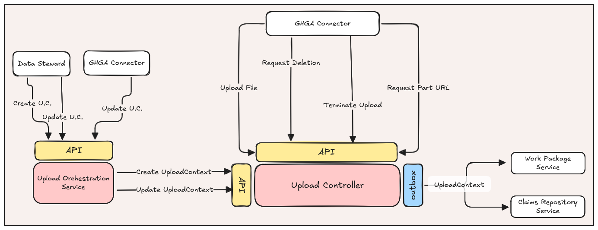
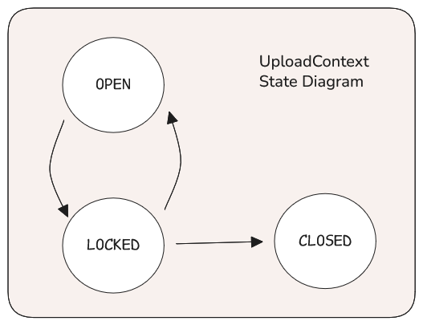
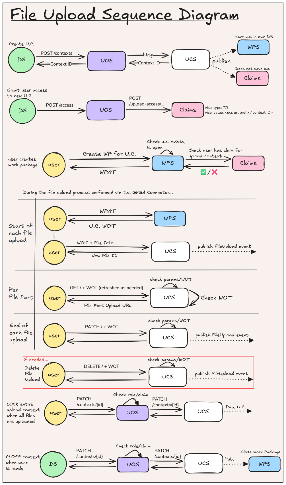

# Upload Service Intermediary Revision (Lynx Boreal)
**Epic Type:** Implementation Epic

Epic planning and implementation follow the
[Epic Planning and Marathon SOP](https://docs.ghga-dev.de/main/sops/sop001_epic_planning.html).

## Scope
### Outline:
The goal of this epic is to overhaul the Upload Controller Service (UCS) as part of the
new [File Upload concept](https://ghga.pages.hzdr.de/internal.ghga.de/feature_archconcept-file-upload/developer/architecture_concepts/ac007_file_upload/).
While AC 7 includes references to future services like the Study Repository Service,
some of the machinery there is still in the planning phase. This epic will therefore
rely upon some shortcuts, such as extra Data Steward involvement. When the full
architectural concept is realized, the appropriate adaptations will follow in a future
epic.

### Included/Required:
- Create UOS
- Revamp existing UCS logic
- Adapt WPS for "upload" work packages and tokens
- Adapt CRS to also manage claims for upload contexts
- Write Unit and Integration Tests

### Not included:
- Archive test bed integration
- Subsequent FIS or IFRS updates for the upload path
- Any front-end work that may be needed


#### New Service: Upload Orchestration Service (UOS)

This epic introduces a new lightweight service to handle authentication concerns while
preserving the boundary between file services and auth concerns like user IDs and roles.

All UCS actions will require a Work Order Token (WOT), which can only be created from
existing Work Packages in the Work Package Service (WPS) based on claims in the Claims
Repository Service (CRS). We don't want Data Stewards interacting directly with the
CRS to create the claim, but the UCS likewise shouldn't be responsible for creating
the claim. Recognizing that enabling file uploads and creating the upload claim are
bundled actions, we will instead delegate these things to a new service, the UOS.
Data Stewards will query the UOS HTTP API to enable uploads for a new study (i.e. create
a new `UploadContext`) and create the required upload claims for the user.


> General service diagram showing the new UOS and UCS

### Upload Controller Service

#### Domain Objects
The UCS owns two domain objects, which it broadcasts as outbox events via Kafka. The
first domain object is the `UploadContext`, which broadly serves to delineate
in-progress and finalized file submissions for a given study. The second domain
object is the `FileUpload`. As its name suggests, the `FileUpload` object reflects
the upload status of a single file within an `UploadContext`. Thus, there is a
hierarchical, one-to-many relationship between `UploadContext` and `FileUpload`.

We will define the Pydantic models for these two classes in `ghga-event-schemas`,
along with one stateful config class for each.

#### Inputs
The UCS only receives user input in the form of HTTP requests. It doesn't subscribe to
any Kafka events. However, we will define a slim CLI interface for the service that
exposes commands to `run-rest` and `publish-events`. These commands are commonly seen
across our services at this time.

#### Outputs
There are three categories of output in the UCS: HTTP responses, published events, and
data stored in the database. HTTP responses are described below in the API Definitions
section. The published events and database storage are driven simultaneously by
Hexkit's MongoKafkaDaoPublisher, which the UCS uses to store `UploadContext` and
`FileUpload` instances. Anytime an `UploadContext` or `FileUpload` is created, modified,
or deleted, the UCS publishes a Kafka event containing the latest state. This is done
according to the Outbox Pattern (not described in further detail here).

#### Auth
Before general users (not Data Stewards) can upload files, three things must happen:
1. A Data Steward must create the `UploadContext` via the Upload Orchestration Service.
2. A Data Steward must grant the user a claim enabling them to use the `UploadContext`.
3. The user must create a Work Package via the Data Portal to obtain a Work Package Access Token (WPAT). Only one WPAT is needed for the entire series of files under normal circumstances.

The user then supplies the WPAT to the `ghga-connector` to upload files.
The `ghga-connector` obtains Work Order Tokens (WOTs) automatically by providing the WPAT to the WPS, and then makes at least two calls for each file:
1. A POST request to the UCS to create the `FileUpload`.
2. A GET request to the UCS to obtain a file part upload URL. This call is repeated for each file part.

Both the POST and GET requests will require a valid WOT to succeed.

There is an important difference here from the download path's usage of WOTs: during download, WOTs must carry the file ID being requested for download. For upload, file IDs are not used, and WOTs merely carry the Upload Context's uuid.
This is because we want the upload process to not be too restrictive nor prescriptive. This way, the user can upload the files they want without announcing them beforehand.

When the user has completed uploading all files, the user (or a Data Steward) moves the `UploadContext` to the `LOCKED` state and eventually to the `CLOSED` state by an HTTP call to the UOS. 
Once `CLOSED`, the WPS and Claims Repository will process the 'deleted' Kafka event and disable/delete any existing claims or tokens.

In summary:
- UOS:
  - The Data Steward role required to create `UploadContext`s
  - A valid WPAT or the Data Steward role is required to change the state of an `UploadContext`.
- UCS:
  - Upserting/Deleting `UploadContext` requires an internal service mesh token
  - Getting an upload url requires a valid WOT

For more information on the HTTP API, see the endpoint definitions below.

### Work Package Service
The WPS is hardcoded to set up an error when creating a work package if the work type
is anything other than "download". The logic is all download-centric, so the WPS needs
to be updated to accommodate "upload" work packages. To this end, these are the main
points to address:
1. Update `WorkPackageRepository` logic to handle CRUD-ing "upload" work packages
2. Modify the Work Order Token model so `file_id` is optional, then add an optional `upload_context_id` field
3. Listen for outbox events carrying `UploadContext` data, and store/delete the context IDs
   1. For deletions, related work packages should be removed
4. Add `upload_access_url` to `AccessCheckConfig`
5. Augment the `AccessCheckAdapter` so it can call `/upload-access/users/{user_id}/uploads/{upload_context_id}` to check if a user has access to a given `UploadContext`
6. Provide a way to distribute WOT, either by modifying the `/work-packages/{work_package_id}/files/{file_id}/work-order-tokens` endpoint or creating a new endpoint


### Claims Repository
Currently, the CRS only manages claims for `datasets`. Claims' visa values for download
access to datasets are a combination of a hardcoded prefix (specific to datasets in
general) and a dataset ID. There are specific functions to determine if given claim
is for a dataset and if so, which dataset that is - such as `get_dataset_for_value()`.
`create_controlled_access_claim()` should be modified to work for both up- and download
access.

The CRS needs new HTTP endpoints for managing `UploadContext`-specific claims in the Access.
Please see the API Definitions for details.

## User Journeys

### UploadContext Creation
A Data Steward makes a call to the UOS to create a new `UploadContext`, specifying the ID(s) of the user(s) who will upload files.
The UOS calls the UCS's `POST /contexts` endpoint to create the actual `UploadContext` with the state set
to `OPEN`. The UCS issues an outbox event, which is consumed by the Work Package
Service. Afterward, the UOS makes subsequent calls to the CRS to award upload claims to
the user(s) for the given `UploadContext` (specified by ID). Without this claim, the
user cannot create a work package or upload files.

### UploadContext Update
For now, only Data Stewards are allowed to change the state of an `UploadContext`.
Therefore, a user must communicate with a Data Steward when they are ready to LOCK or CLOSE an `UploadContext`.

The Data Steward calls the `PATCH /contexts/{context_id}` endpoint on the UCS API,
authenticating the call with a WOT which also contains the context ID.
The request body should contain at least the desired context state.

The UCS updates the state of the `UploadContext` to `LOCKED`, `CLOSED`, or `OPEN`, as
specified by the request. If the `UploadContext` is already in the given state, nothing
happens and the UCS returns a successful response.
The initial state of the `UploadContext` is `OPEN`. When the user finishes uploading
files, they can ask a Data Steward to set the Context to a semi-finalized state,
`LOCKED`. It is possible that the user decides they need to make changes, such as
uploading or removing a file, and in that case a Data Steward can revert the Context to `OPEN`.
If no changes are needed, however, the user can request the Data Stewards to fully finalize the Context by setting
it to `CLOSED`, after which point no changes can be made without opening a new
`UploadContext`.
If user tries to change the status of an `UploadContext` that's already set to `CLOSED`,
they receive an error. Once the update operation is complete, the UCS publishes a Kafka
event reflecting the latest state of the `UploadContext` and returns an HTTP response
indicating the update was successful.

In a future iteration of the upload path, users will directly update context state
themselves via the Data Portal or `ghga-connector`.



An `UploadContext` may only be moved from `LOCKED` to `CLOSED` if all its linked
`FileUpload`s are set to `COMPLETED`.

### File Upload Init
Using the Data Portal, the user creates an upload work package for the `UploadContext`
and receives a WPAT. The following is accomplished using the
`ghga-connector` and the WPAT:

1. The user initiates the upload process for a given single file (can be looped or batched):
   - The Connector contacts the WPS and exchanges the WPAT + context ID for a WOT.
   - The Connector calls the UCS's `POST /contexts/{context_id}/uploads/` endpoint.
The request body includes the unencrypted checksum, the file alias (or whichever naming element is used to match the file
with the metadata content), and possibly further information. The ID of the `UploadContext` is included in the WOT.
   - The UCS ensures it doesn't already have a completed `FileUpload` for the same file, then adds the `FileUpload` to the associated `UploadContext`.
   - The UCS initiates a multipart upload for the file.
   - The UCS publishes upsertion events to Kafka for both the `FileUpload` and `UploadContext` objects, and returns an HTTP response to the Connector indicating
that the file upload was successfully initiated. 
     - The response contains the UCS-generated UUID4 identifier of the new file upload.

2. The Connector uploads the file in chunks:
   - For each file part, the Connector uses a valid WOT (or gets a new one) to call the UCS's `GET /contexts/{context_id}/uploads/{file_id}/parts/{part_no}` endpoint.
   - Assuming the WOT is valid, the UCS returns a presigned, short-lived upload URL.
   - The Connector uploads the file parts until complete.

### File Upload Termination (Upload Completion)
When the upload is complete, the connector automatically makes a request to the UCS
endpoint `PATCH /contexts/{context_id}/uploads/{file_id}`.
This call instructs the UCS to communicate with the S3 instance and terminate (complete) the multipart upload.
The UCS will update the `FileUpload` instance to `COMPLETED` and publish a Kafka event reflecting the new state.
Finally, the UCS will return an HTTP response indicating the operation was successful.
The Connector displays a message to the user saying the file upload is complete.
If applicable, the Connector proceeds with the next file in the upload batch.

### `FileUpload` Deletion
The user, via the `ghga-connector` and a valid WPAT, makes a request to the
`DELETE /contexts/{context_id}/uploads/{file_id}` endpoint, indicating they wish to
delete a file from the associated Upload Context. If a valid WOT is supplied with the
request, the UCS cancels the ongoing upload if it exists and deletes the `FileUpload`
object from the database. It removes the reference from the `file_uploads` field in the
`UploadContext` and publishes Kafka events reflecting the deletion of the `FileUpload` and the
new state of the Upload Context. Finally, the UCS returns an HTTP response to the user
indicating the deletion was successful.

## API Definitions:

### RESTful/Synchronous:

#### Upload Controller Service:
- `GET /contexts`: Retrieve all `UploadContexts`
  - Requires WOT
  - Data Stewards can see all `UploadContexts`, while users can only see ones they have an active claim for.
- `POST /contexts`: Create a new `UploadContext`
  - Requires WOT and only allowed for Data Stewards via the UOS.
- `GET /contexts/{context_id}`: Retrieve an `UploadContext` by ID
  - Requires WOT
  - Data Stewards can see all `UploadContexts`, while users can only see ones they have an active claim for.
- `PATCH /contexts/{context_id}`: Update the state of an `UploadContext`
  - Currently only available to Data Stewards, as only they can obtain the required token.
  - Request body must contain the new state of the context
- `POST /contexts/{context_id}/uploads/`: Add a new `FileUpload` to an existing `UploadContext`
  - Requires WOT
  - Request body must contain the required file upload details
- `PATCH /contexts/{context_id}/uploads/{file_id}`: Conclude file upload in UCS
  - Requires WOT
  - Sets the `FileUpload` status to `COMPLETE` and tells S3 to close the multipart upload.
- `DELETE /contexts/{context_id}/uploads/{file_id}`: Remove a `FileUpload` from the `UploadContext`
  - Requires WOT
  - Deletes the `FileUpload` and tells S3 to cancel the multipart upload if applicable.
- `GET /contexts/{context_id}/uploads/{file_id}/parts/{part_no}`: Get pre-signed S3 upload URL for file part
  - Requires WOT

#### Upload Orchestration Service:
- `POST /contexts`: Create a new `UploadContext` and grant a claim for it for a user
  - Requires Data Steward Role
  - Request body must contain at least one user ID (whether this is one ID or a list of IDs can be decided during implementation)
  - Uses a token to instruct the UCS to create a new `UploadContext` via HTTP call
  - Instructs the CRS to create a new claim for each specified user
- `PATCH /contexts/{upload_context_id}`: Update the state of an `UploadContext`
  - Requires Data Steward Role *or* valid claim to the context
    - Only Data Stewards can do `LOCKED` -> `CLOSED` or `LOCKED` -> `OPEN`
    - Users are allowed to do `OPEN` -> `LOCKED`
  - Request body must contain the new state of the context
  - In turn, calls the matching UCS endpoint

#### Work Package Service:
- `GET /users/{user_id}/uploads`: List all `UploadContext` IDs available to the user
- `POST /work-packages/{work_package_id}/uploads/{upload_context_id}/work-order-tokens`: Create a WOT for uploading files
  - Requires a Work Package Access Token, so the user must have already created a Work Package

#### Claims Repository Service:
- CRS Authentication for upload endpoints should match existing download counterparts
- `GET /upload-access/users/{user_id}/uploads/{upload_context_id}`: check if a user has access to a certain upload bucket
- `POST /upload-access/users/{user_id}/uploads/{upload_context_id}`: grant upload access
  - This can be called by the WPS at an appropriate time (not nailed down right now).
- `DELETE /upload-access/users/{user_id}/uploads/{upload_context_id}`: revoke upload access

### Payload Schemas for Events:

```python
class UploadContextState(StrEnum):
    """The allowed states for an UploadContext instance"""

    OPEN = "open"
    LOCKED = "locked"
    CLOSED = "closed"

class UploadContext(BaseModel):
    """A class representing an Upload Context"""

    upload_context_id: UUID4 # unique identifier for the instance
    state: UploadContextState  # one of OPEN, LOCKED, CLOSED
    file_uploads: list[FileUpload]  # use list function for default_factory

class FileUploadState(StrEnum):
    """The allowed states for a FileUpload instance"""

    INIT = "init"
    COMPLETED = "completed"

class FileUpload(BaseModel):
    """A File Upload"""

    upload_id: UUID4
    state: FileUploadState  # one of INIT, COMPLETED
    original_path: str  # subject to change, used to match file upload to metadata
    checksum: str
```


## Additional Implementation Details:

#### WOT Modifications in WPS
The Work Order Tokens in the WPS are defined with `file_id` as a required field. The
`file_id` field should be made optional, and a new optional field called `upload_context_id`
should be added.

#### Download Controller WOT Dependency
The Download Controller Service (DCS) uses WOTs to authenticate download URL requests.
It maintains a model in a core module that defines the WOT structure. Depending on the
exact changes to the WOT model in the WPS, the DCS may or may not have to be updated too.

### Testing
Tests need to cover at least the following items (not exhaustive):
- Standard endpoint authentication battery
- Happy path for each endpoint
- Core error translation for HTTP API for each endpoint
- Disallow changing status of a CLOSED UploadContext
- Disallow removing a file from a CLOSED UploadContext
- Make sure only Data Stewards can create, close, or reopen contexts
- Users can only see upload contexts that they have a valid claim for
- Data Stewards can see all upload contexts
- Claims are revoked when upload context is closed
- Work packages are revoked/invalidated when upload context is closed
- Users cannot create work packages for closed contexts
- UCS rejects http requests for closed contexts even with a valid WOT
- UCS rejects requests for locked contexts, except to move state to `OPEN` or `CLOSED`

### Loose Ends/Ideas for Future Enhancements
- Can we leverage `WorkType` to provide more fine-grained/nested action control via WOTs?
- Maybe the UOS could preemptively generate `UploadContext`s if it can associate them with studies?
  - Is there a way the ARS could facilitate the first part of the upload process?
- What tool does the Data Steward use to access the UOS?
- In what cases would we *delete* an `UploadContext` aside from fixing some mistake?
- Is it sufficient for the WPS/CRS to invalidate WorkPackages/Claims when they see via
Kafka that an `UploadContext` is `CLOSED`? Or does the UOS need to make explicit calls?


## Diagrams



## Human Resource/Time Estimation:

Number of sprints required: 3

Number of developers required: 2
