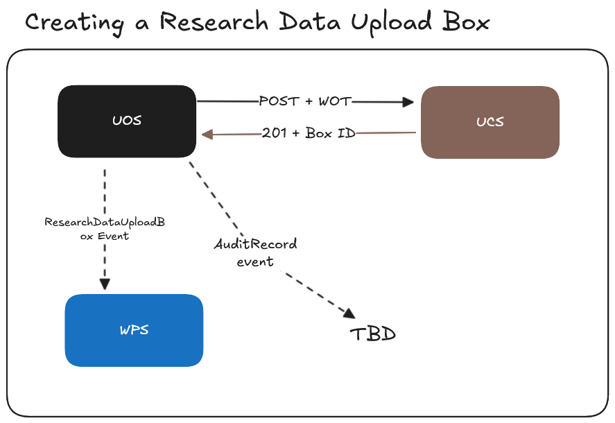
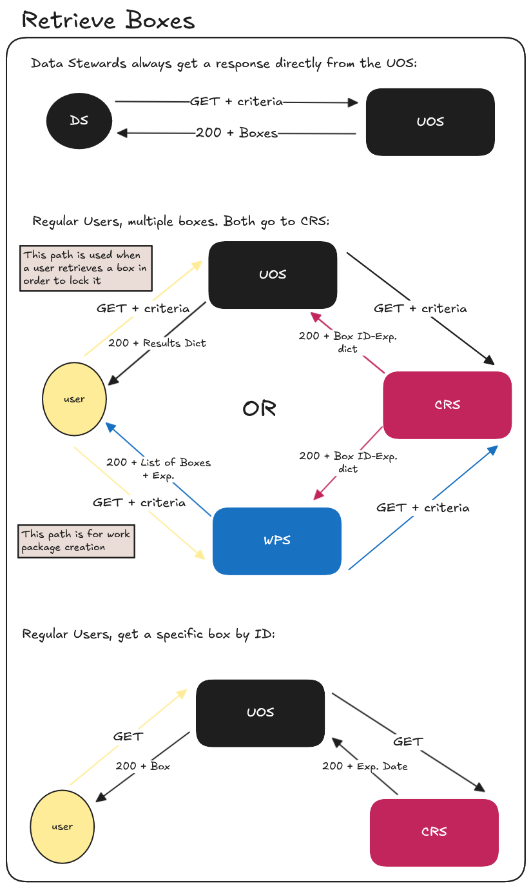

# Upload Service Intermediary Revision (Lynx Boreal)
**Epic Type:** Implementation Epic

Epic planning and implementation follow the
[Epic Planning and Marathon SOP](https://docs.ghga-dev.de/main/sops/sop001_epic_planning.html).

## Scope
### Outline:
The goal of this epic is to overhaul the Upload Controller Service (UCS) as part of the
new [File Upload concept](https://ghga.pages.hzdr.de/internal.ghga.de/feature_archconcept-file-upload/developer/architecture_concepts/ac007_file_upload/).
While this concept includes references to future services like the Study Repository Service,
some of the machinery there is still in the planning phase. This epic will therefore
rely upon some shortcuts, such as extra Data Steward involvement. When the full
architectural concept is realized, the appropriate adaptations will follow in a future
epic.

### Included/Required:
- Implement new Upload Orchestrator Service as described below
- Revamp existing UCS logic
- Adapt WPS for "upload" work packages and tokens
- Adapt CRS to also manage claims for upload boxes
- Add new schemas to `ghga-event-schemas`

### Not included:
- Archive test bed integration
- Subsequent FIS or IFRS updates for the upload path
- Any front-end work that may be needed
- GHGA-Connector update

### Upload Controller Service (UCS)

The UCS is responsible for two things:
1. Cataloging individual files for a given file bundle without knowing
anything about studies or other business concepts.
2. Facilitating the actual upload of said files by:
   - Opening a new multipart S3 upload
   - Dispensing pre-signed part upload URLs
   - Completing/cancelling the S3 upload

In the UCS, a file bundle is represented by a minimalistic abstraction called a
`FileUploadBox`, and a file is represented as a `FileUpload`. The former offers a way to
group file uploads, lock them for changes and check the uniqueness of the included file aliases. The latter offers specific
file information and a way for other services to be aware of that file's existence.

Each `FileUploadBox` is labeled by a random UUID and has a boolean that determines
whether any changes can be made to it or a given associated `FileUpload`, as well as
fields for file count and total file size.
Each `FileUpload` has a random UUID, an alias, a file size, a checksum, a bool
indicating if upload is completed, and a field containing its parent `FileUploadBox` ID.
There is a 1:many relationship between `FileUploadBox` and `FileUpload`.

When a user shall be enabled to upload Research Data to GHGA, a Data Steward creates a new `ResearchDataUploadBox` which internally maps to the creation of a `FileUploadBox`. Then the
user can create a work package for the new `FileUploadBox` and use the `ghga-connector` to upload
 Research Data. See the description of the UOS and the **User Journeys** for more detailed information.

Both `FileUploadBox` and `FileUpload` changes are emitted as outbox events, but the
UCS does not consume any events or store any other data. `FileUploadBox` events are
consumed by the UOS in oder to update the file count and total size of the corresponding
`ResearchDataUploadBoxes`, while the `FileUploads` are consumed by other file services.

The UCS has a REST API, but requests only come from two places: `ghga-connector` and the
UOS. All endpoints are secured by Work Order Tokens (WOTs) signed by either the UOS (see
below) or the Work Package Service (WPS). All requests from the Connector use WOTs from
the WPS, while all requests from the UOS use WOTs signed by the UOS itself.
In this arrangement, the UCS avoids coupling with the auth service or business logic,
and the service as a whole remains fairly lightweight.

For more information on WOTs or API definitions, see below.


### Upload Orchestration Service (UOS)

The UOS is the service in charge of applying business and authentication logic for the
upload path, and it does not perform any of the S3 operations found in the UCS.
The UOS maintains richer information about each ongoing research data upload effort and
produces audit records on who changes that information and when.
While the UCS is tasked with facilitating the actual upload processes, the UOS stores an
enriched wrapper around the `FileUploadBox` concept, called a `ResearchDataUploadBox`. It also
talks to the Claims Repository Service to control access to the `ResearchDataUploadBox`.
Users/Data Stewards can access the UOS through the Data Portal, and requests are
routed through the auth adapter so the UOS can inspect user IDs and roles.

The other responsibility of the UOS is to relieve the UCS from handling browsing needs.
When anyone wants to view existing `ResearchDataUploadBoxes`, they talk to the UOS, not the UCS.
This is a happy arrangement because viewing this content inherently involves auth:
users should only be able to see a `ResearchDataUploadBox` if they actually have access to it.
Also, the users can be provided with the richer information that is only available in the  `ResearchDataUploadBox`.

How the UOS sits in relation to the UCS:  
When a Data Steward intends to enable a Research Data upload, they log on to the Data Portal and 
create a new object, called a `ResearchDataUploadBox`. The Data Steward will
enter at least a title and description so they can later identify the box.
The Data Portal will make a call to the UOS with the inputted information.
The UOS will generate a new UUID for the `ResearchDataUploadBox` and then tell the UCS
to create a corresponding `FileUploadBox`, which receives its own ID. The UOS will return the ID of the `ResearchDataUploadBox` to the Data Portal, and the Data Steward will subsequently grant the
relevant user upload access to the `ResearchDataUploadBox` by calling the UOS,
which in turn talks to the CRS.

Each `ResearchDataUploadBox` has a random UUID, a title, a description, a state (`OPEN`,
`LOCKED`, `CLOSED`), and the associated `FileUploadBox` data from the UCS.
Every change to a `ResearchDataUploadBox` triggers an outbox event, as well as a persistent
event for auditing with the user ID, timestamp, and info about what action occurred.
The UOS subscribes to `FileUploadBox` events in order to be informed when the file count or total size bytes of the upload box changes, but not `FileUpload` events.
The UOS offers a REST API for users and Data Stewards, but these endpoints are covered
by the auth protocol rather than WOTs. When a user interacts with the UCS via the UOS,
the UOS signs its own WOTs (assuming everything else is copacetic) authorizing the
specific action. This epic introduces changes and augmentations to GHGA's WOTs, and you
can find more information in the **Auth** section below.

### Work Package Service
The WPS is hardcoded to raise an error when creating a work package if the work type
is anything other than "download". The logic is all download-centric, so the WPS needs
to be updated to accommodate "upload" work packages. To this end, these are the main
points to address:
1. Update `WorkPackageRepository` logic to handle CRUD-ing "upload" work packages
   - Add `get_upload_box()` and `get_upload_boxes` functions that mirror
      `get_dataset()` and `get_datasets()`
   - Add `register_upload_box()` to store boxes as events are received
   - Update `get()` to return upload-type work packages
   - Update `create()` to enable creating upload-type work packages
   - Add a `box_dao` (name is an implementation detail) to the repository
2. Revamp Work Order Tokens (see Additional Implementation Details)
3. Listen for outbox events carrying `ResearchDataUploadBox` data, and store the box
   IDs and titles.
4. Change `AccessCheckConfig.download_access_url` to `AccessCheckConfig.access_url` to work for both up- and download
5. Augment the `AccessCheckAdapter` so it can call `/upload-access/users/{user_id}/boxes/{box_id}`
   to check if a user has access to a given `FileUploadBox`
6. Provide a way to distribute WOTs, either by modifying the
   `/work-packages/{work_package_id}/files/{file_id}/work-order-tokens` endpoint or
   replacing it with one or more endpoints that allow passing the type and
   additional token content'
7. Provide an endpoint to return the list of existing boxes for a user.
8. Restructure existing work package models to accommodate upload-type work packages
   - How this is accomplished is not important for this epic
9. Decide if upload and download work packages will share the same collection
9. Define a database migration for the existing work package data if needed

### Claims Repository
1. Extend the access API (not the claims API, which is not active at the moment) to also
support upload grants. The new endpoints here will be used by the UOS and the WPS for
granting and verifying access.

Please see the API Definitions for details on the endpoints for extending the
access API.

2. Create a new visa type. The currently-used visas for download,
ControlledAccessGrants, imply download access and should therefore not be used as upload
visas. Instead, we should create a new visa:

type: `GHGA_UPLOAD = "https://www.ghga.de/GA4GH/VisaTypes/Upload/v1.0"`
value: `https://ghga.de/uploads/{box_id}`

We will have to extend the utilities surrounding visa handling to accommodate this
new visa type in the core `claims` module because all the logic there is download-
centric.

### Auth
#### Tokens
The UCS secures its endpoints through WOT authentication. While the Download Controller
Service requires just one flavor of WOT to operate, the UCS requires more:
| Token                          | Issuer | Who                  | Action Authorized                                |
|--------------------------------|--------|----------------------|--------------------------------------------------|
| `CreateFileBoxWorkOrder` | UOS    | Data Stewards        | Create a new `FileUploadBox`                     |
| `ChangeFileBoxWorkOrder` | UOS    | All                  | Update the mutability of an existing `FileUploadBox`               |
| `ViewFileBoxWorkOrder`           | UOS    | All                  | View list of files for a `FileUploadBox`        |
| `CreateFileWorkOrder`          | WPS    | Users                | Initialize a `FileUpload` and obtain new file ID |
| `UploadFileWorkOrder`          | WPS    | Users                | Obtain a part upload URL for a given file ID. Can also be used to delete the file. |

These tokens authorize users to perform the labeled action (work type) within the UCS, and they only
carry information necessary for the given action, such as `file_id` or `box_id` in
addition to the work type.

#### For Enabling User Access to a New Upload Procedure
Before general users (not Data Stewards) can upload files, three things must happen:
1. A Data Steward must create the `ResearchDataUploadBox`/`FileUploadBox` via the Data Portal.
   - The UOS signs a `CreateFileBoxWorkOrder` token and contacts the UCS.
2. A Data Steward must grant the user a claim enabling them to use the `ResearchDataUploadBox`.
   - Internal auth token required here, the UOS verifies the Data Steward role exists
     before it contacts the CRS.
3. The user must create a Work Package via the Data Portal to obtain a Work Package
Access Token (WPAT). Only one WPAT is needed for the entire series of files under normal
circumstances.

#### For File Upload
The user then supplies the WPAT to the `ghga-connector` to upload files.
The `ghga-connector` obtains Work Order Tokens (WOTs) automatically by providing the
WPAT to the WPS, and then makes at least three calls for each file:
1. A POST request to the UCS to create the `FileUpload`.
   - This requires a `CreateFileWorkOrder` token from the WPS.
   - The user supplies the file `alias` in this request. 
   - The user receives the `file_id` of the newly created `FileUpload`
2. A GET request to the UCS to obtain a file part upload URL. This call is repeated for
each file part.
   - This requires an `UploadFileWorkOrder` token of type "upload" from the WPS.
   - The user supplies the `file_id` to get the above token.
   - The token is only valid for a file with the matching `file_id`.
3. A final PATCH request to the UCS to complete the file upload.
   - This uses a `UploadFileWorkOrder` token of type "close".
4. *Optional*: The user desires to delete a file:
   - The user obtains a `UploadFileWorkOrder` token of type "delete" from the WPS
   - The user performs a DELETE request via the `ghga-connector`.


#### For Altering an Existing `ResearchDataUploadBox`
- Modifying the details of an existing `ResearchDataUploadBox`, such as the title or description
  requires the user to have the Data Steward role.
- Changing the state of a `ResearchDataUploadBox` from `OPEN` to `LOCKED` requires the user to
  have either a valid claim for the `ResearchDataUploadBox` or have the Data Steward role.
- Changing the state of a `ResearchDataUploadBox` otherwise requires the Data Steward role.
- When a `ResearchDataUploadBox` is set to `LOCKED` or `CLOSED`, the UOS signs a
  `ChangeFileBoxWorkOrder` of type "lock" and tells the UCS to lock the
  associated `FileUploadBox`.
- Claims and work packages for closed `ResearchDataUploadBoxes` remain valid in the CRS 
  - The UCS and UOS are responsible for screening requests based on the state of a given
    `ResearchDataUploadBox`, `FileUploadBox`, or `FileUpload`, as applicable.

#### For Viewing/Accessing `ResearchDataUploadBoxes`
Data Stewards can see all `ResearchDataUploadBoxes`, while other users can only see what belongs
to them. The UOS checks the auth context for the Data Steward role to distinguish between
the two categories of users. In the case of a regular user, the UOS additionally
consults the CRS to obtain a list of `ResearchDataUploadBox` IDs that the user may access.

#### In summary
- UOS:
  - Inspects auth context details to discern between Data Stewards and regular users
  - Communicates with the CRS to create or consult claims
  - Sends `ResearchDataUploadBox`-related requests to the UCS using self-signed WOTs
  - The Data Steward role is required to create `ResearchDataUploadBox` and grant upload access
  - Data Steward role is required for all `ResearchDataUploadBox` changes except `OPEN` -> `LOCKED`
  - Viewing `ResearchDataUploadBoxes` does not involve any WOTs, just the internal auth tokens
  - Endpoints are protected by requiring internal auth tokens
- UCS:
  - Knows nothing about users, claims, studies, `ResearchDataUploadBoxes`, etc.
  - Endpoints are protected by requiring WOTs that come from either the WPS or UOS

For more information on the HTTP API, see the endpoint definitions below.

## User Journeys


### `ResearchDataUploadBox` Creation


A Data Steward uses the Data Portal to create a new `ResearchDataUploadBox`. The Data Portal
makes a `POST` call to the UOS, which verifies the Data Steward's access and subsequently
makes a call to the UCS to create a new `FileUploadBox`. The UCS returns the `FileUploadBox`
ID to the UOS, and the UOS stores this ID and the title/description supplied by the
Data Steward as a `ResearchDataUploadBox`, with its state set to `OPEN`. Both the UCS and the
UOS issue outbox events for their `FileUploadBox` and `ResearchDataUploadBox` insertions,
respectively.

The UOS returns the `ResearchDataUploadBox` ID to the Data Steward. The Data Steward then uses
the Data Portal to create a claim for the user. The Data Portal sends a `POST` request
to the UOS, which carries the user ID, IVA ID, and the `ResearchDataUploadBox` ID. The UOS
verifies the Data Steward's access, then makes a request to the CRS. The CRS creates the
claim for the user for the given `ResearchDataUploadBox` and IVA. The IVA is important because
if the user has not completed the IVA verification process, they cannot receive upload
access. Given that the IVA is valid, the CRS and UOS return a successful response. The
Data Steward can then inform the user that they make proceed with work package creation
and file upload.

### `ResearchDataUploadBox` Retrieval


In the case of a Data Steward:  
1. A Data Steward uses the Data Portal to make a `GET` request to the UOS.
2. The UOS sees that the request comes from a user with the Data Steward role and
   returns any/all `ResearchDataUploadBoxes`, according to any filtering and pagination applicable.

In the case of a non-Data Steward:  
1. The user uses the Data Portal to view a list of `ResearchDataUploadBoxes` available to them.
2. The Data Portal makes a `GET` request to the UOS.
3. The UOS sees that the request from a user that is NOT a Data Steward.
4. The UOS sends a request to the CRS to see which `ResearchDataUploadBoxes` the user may access.
5. The CRS returns a list of IDs to the UOS.
6. The UOS returns any/all `ResearchDataUploadBoxes`, according to any filtering and pagination applicable.

### `ResearchDataUploadBox` Info Update
> Requires that the user journey "`ResearchDataUploadBox` Creation" has been completed.


The Data Steward calls the `PATCH /boxes/{box_id}` endpoint on the UOS API
from a page on the Data Portal. The request body should contain the updated 
`ResearchDataUploadBox` or, alternatively, indicate which fields to change and how. This could
be a change to the title or description, for example.
The UOS verifies their Data Steward role is in the auth context and validates the
request parameters. If there are no errors, the UOS updates its copy of the
`ResearchDataUploadBox` and emits an outbox event and returns a successful response.
The UOS will also emit an audit log event with the ID of the user who made the change
as well as the timestamp.

### Work Package Creation
> The user journey "`ResearchDataUploadBox` Creation` must have been completed.


The user uses the Data Portal to see which `ResearchDataUploadBoxes` they have access to, then
creates a work package for the new `ResearchDataUploadBox`. The WPS validates the request,
creates the work package, and returns the Work Package Access Token (WPAT) to the user.
The user can then use this WPAT with the `ghga-connector` to upload files.

### File Upload Init
> Requires that the user journey "Work Package Creation" has been completed.


The following is accomplished using the `ghga-connector` and the WPAT:

1. The user initiates the upload process for a given single file (can be looped or batched):
   - The Connector contacts the WPS and exchanges the WPAT for a `CreateFileWorkOrder` token.
   - The Connector calls the UCS's `POST /boxes/{box_id}/uploads/` endpoint.
The request body includes the unencrypted checksum, the file alias, and possibly further
information. The WOT carries the box ID and file alias.
   - The UCS ensures the `FileUploadBox` is currently open and doesn't already have a
     completed `FileUpload` for the same file alias, then adds the `FileUpload` to the
     associated `FileUploadBox`.
   - The UCS initiates a multipart upload for the file.
   - The UCS publishes upsertion events for both the `FileUpload` and `FileUploadBox`
     objects, and returns an HTTP response to the Connector indicating that the file
     upload was successfully initiated. 
     - The response contains the UCS-generated file id (UUID4) of the new file upload.

### File Upload
> Requires that the user journey "File Upload Init" has been completed.


The following is accomplished using the `ghga-connector` for each file:

1. The Connector uploads the file in chunks:
   - The Connector sends the WPAT and file ID to the WPS in order to obtain a `UploadFileWorkOrder`.
   - The Connector uses the `UploadFileWorkOrder` token to call the UCS's
     `GET /boxes/{box_id}/uploads/{file_id}/parts/{part_no}` endpoint.
   - The WOT carries the file ID and box ID, which are cross-checked with the URL.
   - Assuming the WOT is valid, the UCS returns a presigned, short-lived upload URL.
   - The Connector uploads the file part by using the upload URL.
   - The Connector repeats this process for every file part until all parts are uploaded.
2. The Connector makes a call to `PATCH /boxes/{box_id}/uploads/{file_id}` to
   inform the UCS that the file upload is complete. This request requires a
   `UploadFileWorkOrder` token. The UCS sets `complete=True` for the `FileUpload` with
   the matching ID and instructs S3 to complete the multipart upload. The Connector
   displays a message to the user indicating that the file upload was successful.

### `FileUpload` Deletion


The user, via the `ghga-connector` with a valid WPAT, makes a request to the UCS's
`DELETE /boxes/{box_id}/uploads/{file_id}` endpoint, indicating they wish to
delete a file from the associated `FileUploadBox`. If a valid `UploadFileWorkOrder` token
of type "delete" is supplied with the request, the UCS cancels the ongoing upload if it
exists and deletes the `FileUpload` object from the database. It modifies the linked
`FileUploadBox` so that the total file size field is reduced by the size of the deleted
file, and decrements the file count. The UCS then emits an outbox event for the
`FileUpload` deletion and another outbox event for the change to the `FileUploadBox`.
Finally, the UCS returns an HTTP response to the user indicating the deletion was successful.

### `ResearchDataUploadBox` State Change
> Requires that the user journey "File Upload" has been completed.


The user uses the Data Portal to *LOCK* the `ResearchDataUploadBox`. The Data Portal sends this
request to the UOS, which checks with the CRS that the user may access this `ResearchDataUploadBox`.
As long as the user is authorized and the `ResearchDataUploadBox`'s current state is `OPEN`,
the UOS signs a `ChangeFileBoxWorkOrder` token and calls the UCS's
`PATCH /boxes/{box_id}` endpoint. The UCS checks that there are no `FileUploades`
for the `FileUploadBox` with `completed=False`. If all files are completed, the UCS
changes the `FileUploadBox`'s mutability to `False`, emits a new outbox event for the
upsertion, and sends a successful response to the UOS. The UOS updates the
`ResearchDataUploadBox` state to `LOCKED`.

Users are only allowed to make the initial change from `OPEN` to `LOCKED`. Only Data
Stewards may move an `ResearchDataUploadBox` from `LOCKED` to `CLOSED`, `LOCKED` to `OPEN`, or
from `CLOSED` to `OPEN`. These other state changes follow a similar path to the one
described above. In the case of a Data Steward, the UOS does not make the CRS call.


### List File Uploads for a Box
> Requires that the user journey "`ResearchDataUploadBox` Creation" has been completed.


The user uses the Data Portal to request a list of completed files associated with a given ResearchDataUploadBox. The Data Portal makes a request to the UOS. The UOS makes a request to the CRS in order to verify the user's access. If the user is not authorized to access the box, they will see a 403 error. If the user is authorized to see the box, however, then the UOS signs a `ViewFileBoxWorkOrder` token and calls the UCS's `GET /boxes/{box_id}/uploads` endpoint. The UCS compiles a list of **completed** file uploads and returns their IDs. The UOS then returns this list to the Data Portal.

### Grant File Upload Access
> Requires that the user journey "`ResearchDataUploadBox` Creation" has been completed.


A Data Steward uses the Data Portal to make a request to grant upload access to a user for a given research data upload box ID. The Data Portal sends a request to the UOS, which verifies that the Data Steward has the requisite role. Then, the UOS verifies that the box exists. If the box exists, the UOS makes a call to the CRS's `POST /upload-access/users/{user_id}/ivas/{iva_id}/boxes/{box_id}` endpoint to create a new upload claim with the given information. If this operation is successful, the CRS returns a 201 response and the UOS creates an AuditRecord in its database and emits it as a Kafka event.

### Revoking Upload Access
> Requires that the user journey "Grant File Upload Access" has been completed.


A Data Steward uses the Data Portal to make a request to revoke a given upload access grant by ID. The Data Portal sends a request to the UOS, which verifies that the Data Steward has the requisite role. UOS makes a call to the CRS's `DELETE /upload-access/grants/{grant_id}` endpoint to delete the claim if it exists.

### List Upload Access Grants
> Requires that the user journey "Grant File Upload Access" has been completed.


A Data Steward uses the Data Portal to make a request to revoke a given upload access grant by ID. The Data Portal sends a request to the UOS, which verifies that the Data Steward has the requisite role. The UOS makes a call to the CRS's `GET /upload-access/grants` endpoint, including any search filters provided by the DS as query parameters. The CRS returns a compiled list of grants to the UOS, which returns the information to the Data Portal.

## API Definitions:

### RESTful/Synchronous:

#### Upload Controller Service:
- `POST /boxes`: Create a new `FileUploadBox`
  - Requires `CreateUploadWorkOrder` token and only allowed for Data Stewards via the UOS.
  - Request body should contain the S3 storage alias to use for uploads tied to the box
  - Returns the `box_id` of the newly created `FileUploadBox`
- `PATCH /boxes/{box_id}`: Update a `FileUploadBox` (to lock/unlock)
  - Requires `ChangeFileBoxWorkOrder` token issued by UOS
  - Currently only available to Data Stewards
  - Path arg and token must agree on box ID
  - Request body must contain the new state of the box
- `GET /boxes/{box_id}/uploads`: Retrieve list of file IDs for box
  - Requires a `ViewFileBoxWorkOrder` token signed by the UOS
  - Path arg and token must agree on box ID
- `POST /boxes/{box_id}/uploads`: Add a new `FileUpload` to an existing `FileUploadBox`
  - Requires `CreateFileWorkOrder` token from WPS
  - Request body must contain the required file upload details
  - Path arg and token must agree on box ID, and alias must match between body and token
- `GET /boxes/{box_id}/uploads/{file_id}/parts/{part_no}`: Get pre-signed S3 upload URL for file part
  - Requires `UploadFileWorkOrder` token of type "upload" from WPS
  - Path args and token must agree on box ID and file ID
- `PATCH /boxes/{box_id}/uploads/{file_id}`: Conclude file upload in UCS
  - Requires `UploadFileWorkOrder` token of type "close" from WPS
  - Sets the `FileUpload` to `completed=True` and tells S3 to close the multipart upload.
  - Path args and token must agree on box ID and file ID
- `DELETE /boxes/{box_id}/uploads/{file_id}`: Remove a `FileUpload` from the `FileUploadBox`
  - Requires `UploadFileWorkOrder` token of type "delete" from WPS
  - Deletes the `FileUpload` and tells S3 to cancel the multipart upload if applicable.
  - Path args and token must agree on box ID and file ID

#### Upload Orchestration Service:
- `GET /boxes`: Retrieve all boxes allowed based on claims or user role
- `GET /boxes/{box_id}`: Retrieve a `ResearchDataUploadBox` by ID
- `POST /boxes`: Create a new `ResearchDataUploadBox`
  - Requires Data Steward Role
  - Signs a `CreateFileBoxWorkOrder` token and sends request to the UCS
  - Returns the ID of the newly created `ResearchDataUploadBox`
- `PATCH /boxes/{box_id}`: Update a `ResearchDataUploadBox`'s state, title, or description
  - Requires Data Steward Role *or* valid claim to the `ResearchDataUploadBox`
    - Only Data Stewards can do `LOCKED` -> `CLOSED` or `LOCKED` -> `OPEN`
    - Users are allowed to do `OPEN` -> `LOCKED`
  - Request body must include the properties to update. Empty body has no effect.
  - Signs a `ChangeFileBoxWorkOrder` token and calls the matching UCS endpoint
    if the request involves toggling the `FileUploadBox`'s mutability
- `POST /access-grants`: Grant user access to a `ResearchDataUploadBox`
  - Requires Data Steward Role
  - Instructs the CRS to create a new claim for the specified user
  - Request body must contain:
    - `ResearchDataUploadBox` ID
    - User ID
    - IVA ID
    - Any other pertinent information, such as access expiration date.
  - Browsing for and revoking claims can be done through the upcoming Claims Browser
- `GET /access-grants`: List access grants
  - Requires Data Steward Role
  - Makes a call to the CRS to list existing access grants
  - Query parameters can be supplied to filter results:
    - User ID
    - IVA ID
    - Box ID
    - Validity (a boolean)
- `DELETE /access-grants/{grant_id}`: Revoke an access grant
  - Requires Data Steward Role
  - Makes a call to the CRS to delete the access grant
- `GET /boxes/{box_id}/uploads`: Retrieve list of file IDs for `ResearchDataUploadBox`
  - Signs a `ViewFileBoxWorkOrder` token and calls matching UCS endpoint

#### Work Package Service:
- `GET /users/{user_id}/boxes`: List all `ResearchDataUploadBox` IDs available to the user based on upload access grants in the CRS
- `POST /work-packages/{work_package_id}/boxes/{box_id}/work-order-tokens`: Create a WOT for uploading files
  - Requires a Work Package Access Token, so the user must have already created a Work Package
  - The request body must contain the work type and file alias or ID, depending on the
    work type
  - The box ID is the ID of a `ResearchDataUploadBox`, and the WPS exchanges that for the ID of the associated `FileUploadBox` in its database when making the WOT.

#### Claims Repository Service:
- CRS Authentication for upload endpoints should match existing download counterparts
- `GET /upload-access/grants`: lists existing upload access grants
- `GET /upload-access/users/{user_id}/boxes`: lists which `ResearchDataUploadBoxes` a user can access
- `GET /upload-access/users/{user_id}/boxes/{box_id}`: check if a user has access to a certain research data upload box
- `POST /upload-access/users/{user_id}/ivas/{iva_id}/boxes/{box_id}`: grant upload access
  - This is called by the UOS when the Data Steward grants a user upload access
- `DELETE /upload-access/grants/{grant_id}`: revoke upload access

### Payload Schemas for Events:

```python
class FileUploadBox(BaseModel):
  """A class representing a box that bundles files belonging to the same upload"""

  id: UUID4  # unique identifier for the instance
  locked: bool = False  # Whether or not changes to the files in the box are allowed
  file_count: int = 0 # The number of files in the box
  size: int = 0 # The total size of all files in the box
  storage_alias: str

class FileUpload(BaseModel):
    """A File Upload"""

    upload_id: UUID4
    completed: bool = False # whether or not the file upload has finished
    alias: str  # the submitted alias from the metadata (unique within the box)
    checksum: str # Unencrypted checksum
    size: int

class ResearchDataUploadBoxState(StrEnum):
    """The allowed states for an ResearchDataUploadBox instance"""

    OPEN = "open"
    LOCKED = "locked"
    CLOSED = "closed"

class ResearchDataUploadBox(BaseModel):
    """A class representing a ResearchDataUploadBox.
    
    Contains all fields from the FileUploadBox.
    """

    id: UUID4
    state: ResearchDataUploadBoxState  # one of OPEN, LOCKED, CLOSED
    title: str  # short meaningful name for the box
    description: str  # describes the upload box in more detail
    last_changed: UTCDatetime
    changed_by: str  # ID of the user who performed the latest change
    file_upload_box: FileUploadBox

class AuditRecord(BaseModel):
  """A generic record for audit purposes"""

  created: UTCDatetime
  service: str
  label: str
  description: str
  user_id: UUID4 | None = None
  correlation_id: UUID4
  action: Literal["C", "R", "U", "D"] | None = None
  entity: str | None = None
  entity_id: str | None = None
```


## Additional Implementation Details:

### WOT Modifications in WPS
The WPS needs to be able to authorize work in a compartmentalized fashion.
Instead of adapting the existing WOT schema to work for multiple services,
there should be specific schemas dedicated to a given action (work order).
The existing WorkOrderToken model must be modified & renamed.
The following new WOT schemas should be created in the WPS:

```python
# Authored by the WPS:
DownloadFileWorkOrder:  # replaces current `WorkOrderToken` model
   type: "download"
   file_id: str  # note: user information is no longer included

CreateFileWorkOrder:
  type: "create"
  alias: str
  box_id: str

UploadFileWorkOrder:
   type: "upload" | "close" | "delete"
   file_id: str
   box_id: str

# Authored by the UOS
CreateFileBoxWorkOrder:
  type: "create"

ChangeFileBoxWorkOrder:
   type: "lock" | "unlock"
   box_id: str

ViewFileBoxWorkOrder:
   type: "view"
   box_id: str
```


### Download Controller WOT Dependency
The Download Controller Service (DCS) uses WOTs to authenticate download URL requests.
It maintains a model in a core module that defines the WOT structure. Depending on the
exact changes to the WOT model in the WPS, the DCS may or may not have to be updated too.

### Testing
Tests need to cover at least the following items (not exhaustive):
- Standard endpoint authentication battery
- Happy path for each endpoint
- Core error translation for HTTP API for each endpoint
- Disallow adding/uploading/deleting files in locked `FileUploadBoxes`
- Make sure only Data Stewards can create, close, or reopen a `ResearchDataUploadBox`
- Users can only see `ResearchDataUploadBoxes` that they have a valid claim for
- Data Stewards can see all `ResearchDataUploadBoxes`
- UCS rejects http requests for locked `FileUploadBoxes` even with a valid WOT
  - Exception being to re-open the `FileUploadBox`
- UOS rejects requests for locked `ResearchDataUploadBoxes`, except to move state to `OPEN` or `CLOSED`


## Human Resource/Time Estimation:

Number of sprints required: 3

Number of developers required: 2
