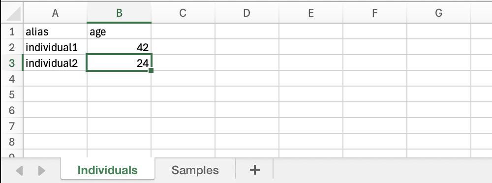

# Make Metadata Downloadable (Alpine Longhorn Beetle)

**Epic Type:** Implementation Epic

Epic planning and implementation follow the
[Epic Planning and Marathon SOP](https://docs.ghga-dev.de/main/sops/sop001_epic_planning.html).

## Scope

### Outline

The goal of this epic is to enable Data Portal users to download the full non-personal metadata for a *study*. The download shall be supported in JSON and XLSX format.

### Included/Required

- Rewrite the [production metadata config](https://github.com/ghga-de/metadata-config/blob/main/configuration/metadata_config.yaml) to infer all references to all entities under the "Study" class. That is, the `embedded_public` artifact produced by the [GHGA workflow](https://github.com/ghga-de/metldata/blob/main/src/metldata/builtin_workflows/ghga_archive.py) shall include all metadata entities that are included under the root entity `Submission`.
- Alter the metldata load API such that not only the `EmbeddedDataset` entities from the `embedded_public` artifact are published via Kafka but also the `Study` entities 
- Implement a new service that consumes the `Study` events and produces and persists XLSX representations thereof. The service shall enable downloading these XLSX files through an HTTP API on the basis of the study IDs.
- Modify the Data Portal to include a metadata download button on the "Study" tab of the detailed dataset view that links to the aforementioned HTTP API endpoint.

### Implementation Detail

#### Reverse Transpiler Service

The reverse transpiler service shall consume JSON data of the following form:

- the JSON data is of the type "object" (referred to as the "root" object).
- all properties of the root object are of the type `array` with items of the type `object`.
- each property of the root object is mapped to a *sheet* in the output data
- each array element is mapped to a *row* in the respective sheet

Example:
```
{
  "individuals": [
    {
      "alias" : "individual1",
      "age" : 42
    },
    {
      "alias" : "individual2",
      "age" : 24
    }
  ],
  "samples": [...]
}
```
would result in



The service shall be implemented as follows:

- Column names for each sheet are inferred as the union of all property names of all elements
- For primitive data types, the cell type is adjusted accordingly and the data is copied as is
- For other data types (list, object), the data is JSON serialized first and the cell type is set to text

The API of the service shall reflect the [metldata query API](https://data.ghga.de/api/metldata/docs), i.e. the paths shall follow the pattern
```
/artifacts/{artifact_name}/classes/{class_name}/resources/{resource_id}
```

The service configuration shall allow renaming the sheets according to a map. It may look similar to the following example:

```
- source_topic: some_topic
  artifact_name: some_name
  class_name: some_class
  sheet_names:
    individuals: Individual
    studies: Study
    ...
- source_topic: ...
```

## Human Resource/Time Estimation:

Number of sprints required: 1

Number of developers required: 2
