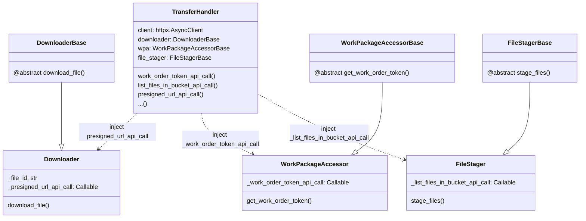

# GHGA Connector refactoring/rewrite and upload path implementation (Hedgehog Seahorse)
**Epic Type:** Implementation Epic

Epic planning and implementation follow the
[Epic Planning and Marathon SOP](https://ghga.pages.hzdr.de/internal.ghga.de/main/sops/development/epic_planning/).

## Scope
### Outline:
This epic has two different, but related goals:
- Implementing functionality for the current upload concept, discarding the pre-release placeholder implementation existing within the GHGA Connector
- Revisiting and rewriting existing functionality in the Connector

The first goal is rather straightforward, as the currently existing code for the upload within the connector predates the launch of GHGA and concepts for the upload changed in the meantime, so the business logic also has to change.

For the second goal, the Connector has always suffered from issues due to starting out with a small feature set and code written mostly in an imperative manner, tacking on features as needed.
While multiple rounds of refactoring managed to deal with the most egregious issues, both the vertical and horizontal separation of concerns is only partially realized and will likely make extending the functionality cumbersome in the long term.

Testing of the Connector functionality also follows a different approach than our services, which adds additional complexity.
Making testing easier would make testing functionality across different OSes easier, if we want to support CLI tooling across platforms.

In short, a (partial) rewrite of the existing functionality might be more beneficial long term than another round of refactoring, contingent on the fact of actually enforcing separation between different layers of the codebase, both horizontally and vertically.

Details on which parts exactly should be changed are described below.

### Included/Required:

- Upgrading the codebase to only support Python >=3.10, as 3.9 will be deprecated soon
- Structure code more clearly into shared functionality and path/command specific code

#### For the upload path

The existing functionality for the upload is outdated and needs to be replaced with logic for the new concept described in [Lynx Boreal](../76-lynx-boreal/technical_specification.md).

This means

- Refactor/rewrite the WorkPackageAccessor to support tokens for the upload path.
- Rewriting the async task based file download code to also support uploads reusing the same general mechanism. Currently the code is ignorant about the actual function passed in for execution, but there's some coupling to the download around the `TaskHandler` that would make this cumbersome to reuse.
- The inplace encryption code present in the current, unused upload code path is a variant of an earlier implementation in the DS-Kit and can be recycled for the current vision of the upload process.
- Enable upload functionality analogous to what is implemented for the download, i.e. parallelized part upload using work package/work order tokens.
This should reuse the TaskHandler, if possible.
- Calls to UCS to manage `FileUpload`s and retrieve presigned part upload URLs

#### For the download path

- Decoupling different layers of the download process that are far too tightly intertwined right now, i.e. disentangle WorkPackageAccessor, FileStager and Downloader.
Those should be injectable components and should not form a more or less implicit hierarchy.
- Sort out the mixed responsibilities between the class based Downloader and the more or less standalone functions in the `api_calls` module. This goes hand in hand with making the different components properly injectable, as the current implementation has issues here due to how communicating with the WPS is implemented.
- The initial caching implementation was based on a bit of a misunderstanding after reading the RFC and needs to be revisited to improve upon the existing hotfix.
The current implementation uses the appropriate caching headers, but additionally relies on a fixed TTL for cache entries.
A local bound on the cache lifetime will likely still be needed, but should be more dynamic. This part might need some more investigation.
- Investigate if the `RetryHandler` could be implemented in an easier way.

### Optional:

- Requiring a lower bound of Python >=3.11, so the code can take advantage of [task groups](https://docs.python.org/3/library/asyncio-task.html#task-groups) for the actual async transfer code, which would make it easier to reason about what's happening and make setup/teardown a bit easier to handle
- Find a better way to support a range of Python versions long term.
The repository template based system curren-tly tends to needlessly break stuff sometimes, making it necessary to work around it every once in a while and opting out of the update mechanism for the affected files

## User Journeys:

The journeys for the download path stay the same, only the underlying implementation changes.

The user journeys for the new upload path are based on the description provided in [Lynx Boreal](../76-lynx-boreal/technical_specification.md):

1. The user initiates the upload process for one or multiple files, providing a `WorkPackageAccessToken` of type upload and their GHGA keypair.
If multiple files are provided, those are processed in sequence.
For each file, the following happens:

   1. The Connector contacts the WPS and exchanges the WPAT for a CreateFileWorkOrder token.
   2. The Connector calls the UCS's POST /boxes/{box_id}/uploads/ endpoint. The request body includes the unencrypted checksum, the file alias, and possibly further information. The WOT carries the box ID and file alias.
   3. The UCS ensures the FileUploadBox is currently open and doesn't already have a completed FileUpload for the same file alias.
   4. The UCS initiates a multipart upload for the file and returns an HTTP response to the Connector indicating that the file upload was successfully initiated.
   The response contains the UCS-generated file id (UUID4) of the new file upload.
   5. The file is read in chunks, which are  encrpyted using the users private key and the GHGA public key, and assembled into file parts for the multipart upload
   6. The Connector makes a GET request to the UCS to obtain a file part upload URL. This call is repeated for each file part and, in contrast to the download path, the result cannot be cached, as each URL is specific to the part being uploaded. Files can have thousands of file parts, so the Connector will self-impose rate limits to this UCS endpoint via a small delay between calls. Interaction with this endpoint requires an `UploadFileWorkOrder` token of type "upload" from the WPS. The user supplies the file_id to get the above token. The token is only valid for a file with the matching file_id.
   7. Once all parts are uploaded, the Connector makes a final request to the UCS endpoint `PATCH /boxes/{box_id}/uploads/{file_id}` to conclude the upload. This requires first obtaining an `UploadFileWorkOrder` token of type "close" from the WPS.

2. (Optional) The user initiates the deletion of an already uploaded file or a file for which a currently opened multipart upload exists providing the `WorkPackageAccessToken` and the file id
   1. The connector obtains a `UploadFileWorkOrder` token of type "delete" from the WPS
   2. The connector performs a DELETE request to the corresponding UCS endpoint, which then either deletes the file, if the upload has already been completed, or cancels the ongoing multipart upload, deleting all file parts which have been submitted so far.
   3. A response is returned from the UCS, informing about the successful deletion

## Additional Implementation Details:

### General issues

- URLs with a hardcoded part are defined inplace across different modules
- Using the RetryHandler causes code duplication in the calling code when dealing with exception sources

### Download

- Most of the issues making this a hard codebase to work with can be traced down to passing an instance of the `WorkPackageAccessor`, `httpx.AsyncClient` and `MessageDisplay` down the call stack and inconsistencies in who is responsible for calling functions on those instance objects.
- Use dependency injection for the initial configuration that does not need remote calls, i.e. init and/or inject MessageDisplay and the http client.
- As the Downloader is dependent on the current file_id, something like the builder pattern could be used to inject a base instance that is then fully specialized by providing the ID
- Download handling should have a central point that gets all other functionality injected and is responsible for managing and handling.
- The CLI layer should be thin and delegate more complex functionality to the core.

In the current implementation, the different concerns that are involved in the download process are entangled in the following way:

#### `cli.py`:

- Calls the WellKnownValue service
- Calls the WorkPackage service
- Contains dataclass definitions for DownloadParamters, UploadParameters, MessageDisplay
- Does some precondition checks for functionality further down in the call hieararchy, but those functions do additional precondition checks

#### `batch_processing.py`

- Needs httpx.AsyncClient and WorkPackageAccessor
- Contains multiple ABCs for inplace use
- Also accesses the WorkPackage service
- Calls auth service
- Waits on user input if file IDS are not present on the remote

#### `downloader.py`

- Needs httpx.AsyncClient and WorkPackageAccessor
- Calls functionality from `donwloading/api_calls.py`, passing either the client or WorkPackageAccessor along
- Contains TaskHandler class, which is not download specific

A better approach to properly separate the concerns could be achieved this way:

The trinity of `Downloader`, `WorkPackageAccessor` and `FileStager` are replaced by a central class that exposes the necessary API calls and delegates the responsibilities, flattening the call stack hierarchy.
The idea is to inject not yet finalized instances of classes that deal with specialized parts of the download lifecycle into the `TransferHandler` and inject the functionality that deals with API calls from the `TransferHandler` into the respective classes.

Here's a basic example of how this could look like based on the currently existing classes, omitting most of the details. `TransferHandler` is the central class managing everything and provides the functionality for API calls:

The other classes have a base variant that represents the not yet fully initialized state which will be finalized by the `TransferHandler`, e.g. `DownloaderBase` is initialized with all information needed that is available statically, i.e. from config, injected into the `TransferHandler` and a fully initialized `Downloader` instance is built on demand from the base class by injecting the missing `file_id` and methods performing API calls. 
The finalization could then happen like this `downloader_base.with_file_id(file_id).with_presigned_url_call(presigned_url_api_call).complete() -> Downloader` or, depending on the situation, directly in the constructor of the `TransferHandler`. 
Those instances are then used by the `TransferHandler` to achieve the required functionality.

### Upload

As similar structure as described for the download could also be adopted for the upload process, as there will be similar components governing the lifecycle of file uploads.

## Human Resource/Time Estimation:

Number of sprints required: 2

Number of developers required: 2
