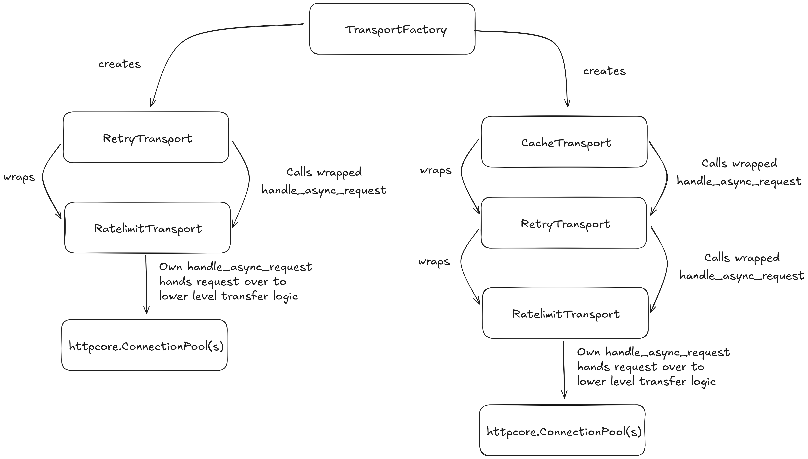

# Client Retry Logic Refactoring for Ratelimiting (Laotian Rock Rat)
**Epic Type:** Implementation Epic

Epic planning and implementation follow the
[Epic Planning and Marathon SOP](https://ghga.pages.hzdr.de/internal.ghga.de/main/sops/development/epic_planning/).

## Scope
### Outline:

This epic aims to improve upon the current implementation of retry logic for HTTP requests in CLI tools and to provide a generic solution that can be employed in any service or CLI tool.

The current implementation is based on [tenacity](https://tenacity.readthedocs.io/en/latest/) and tacked on top of existing functionality, provided as a wrapper around httpx.AsyncClient calls.
Tenacity offers an ergonomic decorator, but we can't (easily) use this due to how we dynamically configure the retry parameters. Instead, we configure an (`Async`)`Retrying` object at startup and awkwardly pass it along the call stack.

To move the responsibility away from the caller and make the retry functionality reusable, the current logic can be moved into custom httpx.(Async)Transport class that can be plugged into an httpx.(Async)Client.
Adding more functionality on top of an existing transports can be achieved by wrapping them and delegating the call to actually perform the request up through the wrapping layers.
This way correctly responding to HTP 429 rate limiting responses and caching can be combined with more general retry logic.

### Included/Required:

#### Custom (Async)HTTPTransport
A transport is an object that resides at the interface of higher level abstractions and the lower level code dealing with the actual details of transporting bytes over the network.

It can easily be plugged into a client, manages the underlying connection (pool), delegates requests and performs basic error handling (see 
[transports in httpx](https://github.com/encode/httpx/blob/master/httpx/_transports/default.py)).
As such, it seems a fitting base class for implementing a custom variant with more involved retry logic, adhering to rate limits.

#### RetryTransport

Moving the existing tenacity based retry logic should be straight forward, converting the AsyncRetrying to a property of the transport, wrapping the `self._transport.handle_async_request(request)` call inside its own `handle_async_request` method.

#### RatelimitTransport

A Transport dealing with rate limiting would need to be on top of the call chain, meaning it cannot wrap another transport.
In addition, rate limiting can be (somewhat) decoupled from the general retry and caching logic, if all transports get to see the response and can process it independently.
The Transport implementing the caching or retry logic has to wrap the RatelimitTransport and call `RatelimitTransport.handle_async_request`, so this transport is the only one that directly forwards the request to the underlying connection pool(s), meaning it can manage state around the connections without interfering with the other transports wrapping it.
Managing some lightweight amount of state seems necessary to enforce request rates when reusing existing connections.

#### AsyncCacheTransport

This is an already existing transport implemented by the `hishel` library, currently used in the GHGA Connector.
To get caching to work correctly, this one has to be on the lowest level of the call chain, not being wrapped by another transport. 

#### Transport Factory

The description of the different Transports induces a hierarchy and the setup logic, that is required, does not allow for trivial composability.
In addition, different combinations of Transports are possible, but not all are meaningful for actual usage, e.g. a transport providing caching and rate limiting, but not retry functionality would be ill-suited to deal with flaky connections.
To hide implementation complexity from the users of the composed transports, a factory shall be implemented alongside the missing Transports inside ghga-service-commons.
This factory should provide methods to get two transports:
The first one providing all three mentioned layers, i.e. caching, retry logic and responding to rate limiting, and the second one providing a transport covering only the retry and rate limiting logic, as not all users need a caching layer.

The instances returned by the factory are the respective lowest level Transport, referenced directly by the arrows from the `TransportFactory` in the image.
Those can be plugged into the `httpx.AsyncClient` of the caller during instantiation. 
One crucial point that this factory has to provide is getting generic Transport configuration to the correct Transport, as only the configuration of the innermost wrapped Transport is applied.

## Additional Implementation Details:

### Responding to Rate Limiting 

Connection pools are handled by httpcore, one level below httpx, and introducing rate limiting on that level would likely get quite messy and should be avoided.
Instead, the logic should not change how connection pools work, but use them as best as possible.

There are some requirements and possible (existing) pitfalls to consider during implementation:
1) It is assumed that rate limiting happens on a per connection level
2) Each connection responds to its own 429 responses by adjusting its request frequency accordingly
3) As requests are effectively fired in batches (for parallel/concurrent transfer operations), a small amount of jitter should be introduced to space them out a bit more evenly, so they don't hit the remote endpoint at the same time
4) The logic around jitter could be reused for the 429 response if the `RetryAfter` header is treated as a baseline for all subsequent requests and not just the immediately following one, so something like `asyncio.sleep(max(self.jitter, self.retry_after))` could be applied per connection.
5) The potential issue in this approcach is throttling the request frequency too much and never recovering to a more appropriate rate. 
To combat this, the connection could forget about the `retry_after` after a specified amount of requests and go back to just using the jitter.
6) There's no easily apparent way to track separate connections/influence handout on the httpx/transport level. 
To guarantee that connections are reused and the limit is respected on a per connection level, the transport would need to keep track of n 1 sized connection pools, instead of one n sized connection pool. 
This idea has to be tested in practice first, to see if there are inherent shortcomings compared to using a normal transport backed by one connection pool

This idea has been superseeded in the actual implementation.
Customising connection pools is more involved and would couple the raw `AsyncHttpTransport` wrapped by the lowest layer to the `RatelimitingTransport` at the highest layer, which is not something that should be done without more consideration.
For now, the `Retry-After` response is saved as shared state and applied to configurable number of subsequent requests, falling back to an exponential backoff strategy if no `Retry-After` header is present in the HTTP 429 response.

### Logging

Logging can be implemented around the `tenacity` based functionality inside the RetryTransport, as the (Async)Retrying can be configured with callbacks to run before or after each retry.
A default implementation is provided logging internal state for the current retry attempt to help with debugging, but a custom implementation can be passed along to the construct to be used instead.
### Where to test and implement

An initial implementation could be tested in the recent S3 part size benchmarking repo, while the completed implementation should be placed in a repository from which it can easily be imported into different parts in the code base, so ghga-service-commons is most likely the appropriate place.
Then, as a first step and use case, this implemetation could be used both in the datasteward kit and the connector.

## Human Resource/Time Estimation:

Number of sprints required: 1

Number of developers required: 1
