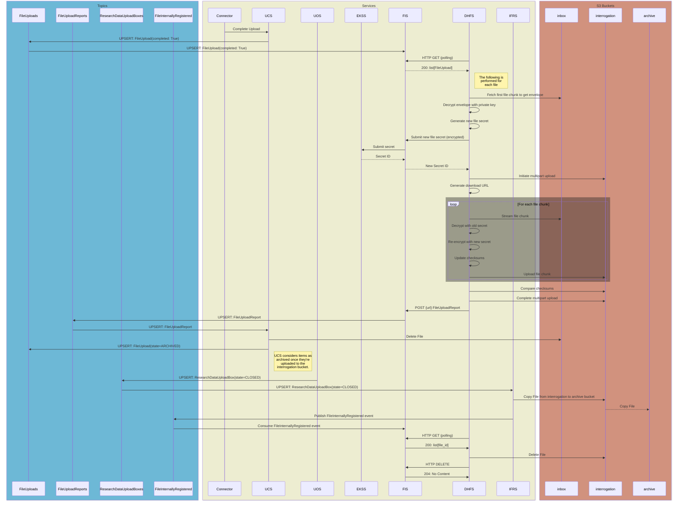

# File Upload Path Pt. 2 (Sarcastic Fringehead)
**Epic Type:** Implementation Epic

Epic planning and implementation follow the
[Epic Planning and Marathon SOP](https://ghga.pages.hzdr.de/internal.ghga.de/main/sops/development/epic_planning/).

## Scope
### Outline:
This epic includes all work required to bring the remaining file services into line with the new file upload concept. The first portion of work for the file services was executed under [Lynx Boreal](../76-lynx-boreal/technical_specification.md), and there was also a subsequent portion of work for the GHGA Connector which was carried out according to [Hedgehog Seahorse](../80-hedgehog-seahorse/technical_specification.md). When this epic is finished, all *backend* modifications required for the new upload concept to be realized will be complete. Frontend changes are *not* included in this epic, however, so more work will be required to bring the Data Portal up to speed.
As for the work to be completed within this epic, the services affected include the File Ingest Service (FIS), Internal File Registry Service (IFRS), the Well-Known Value Service (WKVS), the Upload Controller Service (UCS), the ghga-event-schemas library, and a new service called the Data Hub File Service (DHFS). Additionally, if it is discovered during implementation that further changes need to be made to other services *beyond what is described this epic*, then tickets will be added ad-hoc and associated with this epic.

In Lynx Boreal, the UCS was rewritten, the Upload Orchestration Service (UOS) was implemented for the first time, the Claims Repository Service (CRS) was updated to manage permissions for Research Data Upload Boxes, and the Work Package Service (WPS) was updated to manage upload-type work packages. Taken together, these changes create the operational framework for remote file upload, but only to the point of initial ingest. In order to fully realize our file upload concept, we still need to decrypt the uploaded file, verify the integrity via checksum comparison, re-encrypt the file with a new file secret (securely stored in the Encryption Key Store Service, or EKSS), and move the file to a permanent storage bucket registered with the IFRS in what we call "archival".


### Included/Required:
All work described in the Additional Implementation Details section below is required.

### Optional:
Add email notifications for important events related to archival. This could include, for example, a notification conveying that all files in a Research Data Upload Box have been successfully archived, or that there was a problem with file XYZ during interrogation. To prevent scope creep, this should *probably* be done in another epic, but we should keep that potential requirement in mind during development.

Add audit events -- can also be performed in a separate epic.

### Not included:
Data Portal updates or any upcoming metadata-related services. This is purely for file upload.

## User Journeys (optional)

All user journeys are already detailed in Lynx Boreal. The operations added in this epic will occur automatically without further action required on the part of either the user or GHGA personnel. 

## API Definitions:

### RESTful/Synchronous:

FIS:
- `POST /secrets`
  - Authorization requires a token signed with Data Hub-specific private key
  - Request body must contain an encrypted file secret
  - Returns `201 CREATED`
- `GET /uploads/{storage_alias}/inbox`
  - Authorization requires a token signed with Data Hub-specific private key
  - Returns `200 OK` and a list of `FileUploads` for files awaiting interrogation
  - Files are grouped by storage alias
- `POST /reports`
  - Authorization requires a token signed with Data Hub-specific private key
  - Request body must contain a `FileUploadReport`
  - Returns `201 CREATED`

WKVS:
- `GET /values/data_hub_public_keys`
  - Returns `200 OK` and a dictionary as described in the WKVS section below

DINS:
- `GET /file_information/{file_id}`
  - Returns `200 OK` and basic information about the requested file
  - Returns `404 NOT FOUND` if the file doesn't exist
  - *This is already implemented - included here for reference*

### Payload Schemas for Events:

#### FileUploadBox
> Unchanged from Lynx Boreal
```python
id: UUID4           # Unique identifier for the file upload box
locked: bool        # Whether or not changes to the files in the box are allowed
file_count: int     # The number of files in the box
size: int           # The total size of all files in the box
storage_alias: str  # S3 storage alias to use for uploads
```

#### FileUpload
```python
id: UUID4       # Unique identifier for the file upload
box_id: UUID4   # The ID of the FileUploadBox this FileUpload belongs to
completed: bool # Whether or not the file upload has finished
state: str      # The state of the FileUpload. Either "init", "inbox", or "archived"
state_updated: UTCDatetime  # Timestamp of when state was update
alias: str      # The submitted alias from the metadata (unique within the box)
unencrypted_checksum: str   # SHA-256 checksum of the unencrypted file content
size: int       # The size of the unencrypted file
```

#### FileUploadReport
```python
file_id: UUID4          # Unique identifier for the file upload
secret_id: str | None   # The Vault ID of the file secret used for re-encryption
storage_alias: str      # The storage alias for the interrogation bucket
inspected_at: UTCDatetime | None  # Date that inspection was completed
inspection_result: "pass" | "fail" | None  # Outcome of inspection
```

## Additional Implementation Details:

> For a comprehensive overview, please see the [Service Diagrams](#service-diagrams) section below.

### UCS:
- Emits `FileUpload` events as changes and insertions occur. *Already implemented as part of Lynx Boreal.*
- Responsible for `inbox` bucket cleanup

#### Work to be performed for the UCS
- [ ] Get schema updates
- [ ] Adapt existing code for updated schemas as necessary

### WKVS:
- Provides the Data Hub Crypt4GH public keys via public HTTP API

#### Work to be performed for the WKVS
- [ ] Provide a way to retrieve Crypt4GH public keys for Data Hubs. This can be a dictionary where the keys are storage aliases and the values are the keys. We could alternatively add two-step relation, where the requester exchanges a storage alias for a Data Hub alias, and the Data Hub alias for a key.

### GHGA Connector:
The Connector performs initial file encryption and upload from the user's machine. In order to properly encrypt the file for a specific Data Hub, the Connector needs to contact the WKVS to obtain the appropriate Crypt4GH public key based on the storage alias assigned to the `ResearchDataUploadBox`/`FileUploadBox` created by the Data Steward.

#### Work to be performed for the GHGA Connector
- [ ] Fetch and use Data Hub public key for file encryption

### FIS:
The FIS straddles the border between the file services group and everything else, similar to the role played by the UOS. In the past, the FIS acted as a way to ingest file upload metadata and tell other services when a manually validated ("interrogated") file was ready for permanent storage. This had to be done as a temporary solution until the remote file upload and automatic file interrogation was implemented, which is the work proposed in this epic.

The new role of the FIS is to inform the DHFS when new files arrive in the DHFS's `inbox` bucket. To do this, the FIS operates as an event consumer in one instance, and runs an HTTP API in another instance. Both instances are described below.

#### FIS Event Consumer
The FIS subscribes to `FileUploadBox` and `FileUpload` *outbox events* from the UCS. FIS is only concerned with `FileUploadBox` events for the purpose of matching up a `file_id` to its `storage_alias`.

When a new `FileUpload` event arrives, the FIS first checks to see if it has a copy already stored in its database. If it does, it then looks at the value in the `state_updated` field; if the local copy is newer, the FIS makes a log and ignores the event. If the inbound event is newer, the FIS compares the values for `state` on the local copy and the inbound copy of the event. If the two values depict a valid transition, e.g. `INIT -> INBOX` or `INBOX -> ARCHIVED`, then the FIS updates its local copy. If the transition is not valid (e.g. `ARCHIVED -> INIT`), FIS raises an error and sends the event to the DLQ. The exact details of the event validation on the FIS-side are not actually important here; they can be decided at implementation time.

If the event represents a `FileUpload` moved into the `INBOX` state, the FIS first tries to find a matching `FileUploadBox` in its database, raising an error if it can't find one. After retrieving the `FileUploadBox`, the FIS will create a new `FileUploadReport` for with the `file_id` and `storage_alias` (from the `FileUploadBox`) fields populated. The `secret_id`, `inspected_at`, and `inspection_result` fields will all be `None`. The `FileUploadReport` will be updated with the other details later on in the other FIS instance (see below).

#### FIS HTTP API
> NOTE: Please see the [API Definitions](#api-definitions) section above
The FIS operates an HTTP API the three endpoints.
1. (`GET`) Serve a list of new file uploads (yet to be interrogated)
   - A token-authenticated request specifies the storage alias of the `inbox` bucket in question
   - FIS gets the `FileUploads` matching the requested storage alias, then subtracts files for which it already has a finished `FileUploadReport`.
   - FIS returns the list of remaining `FileUploads`
2. (`POST`) Accept a new file secret for deposition in the EKSS
   - A token-authenticated request carries an encrypted file secret and a file ID.
   - FIS finds the existing `FileUploadReport` in its database, raising an error if it doesn't find it.
   - FIS forwards the file secret to EKSS (still encrypted) in exchange for a secret ID.
   - FIS updates the `FileUploadReport` with the new secret ID.
3. (`POST`) Accept interrogation results
   - A token-authenticated request contains information about a completed file interrogation. The information includes the `file_id`, `inspection_result`, and `storage_alias` of the interrogation bucket if interrogation is successful.
   - FIS finds the existing `FileUploadReport` in its database, raising an error if it doesn't find it.
   - FIS updates the `FileUploadReport` with the received information and publishes this as a *persistent event*. 

For a given single file upload, the endpoints will be called in the order listed above.

#### FIS Configuration
The FIS needs the following configuration:
- MongoDbConfig
- ApiConfigBase
- LoggingConfig
- OpenTelemetryConfig
- EventPubConfig:
  - ghga-event-schemas -> FileUploadReportEventsConfig
- OutboxSubConfig:
  - ghga-event-schemas -> FileUploadBoxEventsConfig
  - ghga-event-schemas -> FileUploadEventsConfig
- ekss_api_url
- wkvs_api_url

Upon startup, the HTTP API instance of the FIS will retrieve the list of Data Hub public keys from the WKVS.

In addition, the existing functionality and config that directly interacts with Vault should be removed so that EKSS is the sole middleman for Vault activity.


#### Open questions
1. What do we do with the existing FIS data? Just leave it there for now?

#### Work to be performed for the FIS
- [ ] Ensure DLQ is enabled
- [ ] Add outbox subscriber for `FileUploadBox` and `FileUpload` events
- [ ] Add persistent publisher for `FileUploadReport` events
- [ ] Add HTTP endpoints as outline above
- [ ] Write tests

When the DHFS finishes re-encrypting a file, it makes a POST request to the FIS with a `FileUploadReport` in the request body. The `FileUploadReport` specifies a file and indicates whether re-encryption was successful or not. Since the DHFS is not connected to our event communication infrastructure, the FIS maintains and publishes these `FileUploadReports` on its behalf. When the DHFS requests a list of files that have been uploaded to its `inbox` bucket, the list returned by the FIS only contains files for which a successful `FileUploadReport` has *not already been received*. This mitigates a race condition where the DHFS polls for `FileUploads` with the INBOX state too quickly. When the FIS gets a new `FileUploadReport`, it publishes the same information as an event, which is consumed by the UCS. The UCS then updates the `FileUpload` to ARCHIVED (which gets published) and deletes the file copy from the `inbox` bucket.


### DHFS:
The DHFS is a new service that is operated by the various Data Hubs for the purpose of performing file validation and re-encryption, and to keep file ingest in general as a federated operation. It polls the FIS's HTTP API to get a list of `FileUploads` for files that have been recently uploaded to its `inbox` bucket. The DHFS decrypts each file and re-encrypts it using a new file secret before uploading it to the Data Hub's `interrogation` bucket. Along the way, it calculates the checksums of the unencrypted and re-encrypted file content. When the whole file has been re-encrypted and uploaded, the DHFS compares the unencrypted content's checksum against the value obtained from the corresponding `FileUpload`, and the re-encrypted content's checksum against the value calculated by S3 in the `interrogation` bucket.

If a checksum discrepancy is found, the DHFS rejects the upload and posts a `FileUploadReport` to the FIS's HTTP API which indicates that the file did not pass inspection. If checksums match and there are no other errors during upload, the DHFS accepts the upload and the `FileUploadReport` sent to the FIS reflects that the file passed inspection.

In both cases, the `FileUploadReport` is broadcasted by the FIS as a Kafka event and picked up by the UCS, which would update its local `FileUpload` accordingly. If the upload is successful, the UCS deletes the file from the `inbox`.

#### Interrogation Process in List Format
- [Per File]
  - Reads the first file part to sift for the Crypt4GH envelope
  - Decrypts the envelope using the configured private key (specific to the Data Hub)
  - Obtains the original file secret for decryption
  - Generates a new file secret for re-encryption
  - Sends the new file secret to the FIS's HTTP API
    - This is done right away instead of waiting to see if re-encryption is successful 
  - Calculates the content starting position (offset) from the envelope length
  - Initiates a multipart upload with the Data Hub's `interrogation` bucket
  - Streams the object from the Data Hub's `inbox` bucket chunk-by-chunk
  - [Per File Chunk]
    - Decrypts the chunk
    - Updates the SHA-256 checksum over the unencrypted content
    - Re-encrypts the chunk using the newly generated file secret
    - Updates the MD5 checksum over the encrypted file content
    - Uploads the re-encrypted chunk to the `interrogation` bucket
  - Compares the unencrypted file's checksum against the one reported by the submitter during upload, and the encrypted checksum against the one calculated by S3
  - Sends a `FileUploadReport` to the FIS's HTTP API

The final duty of the DHFS is to clean up files from the `interrogation` bucket after archival. It does this by polling the FIS for a list of files that should be deleted. The FIS sources this list from the `FileInternallyRegistered` events published by the IFRS. When the DHFS deletes a file, it contacts the FIS HTTP API with the deleted file ID. This mechanism removes the need for the DHFS to keep track of the files in its `interrogation` bucket, provides idempotent behavior, and lets the DHFS carry out its own deletions (as opposed to giving the IFRS this duty). If the DHFS fails to find a file during deletion, it logs the absence but otherwise treats it as a successful deletion.


### IFRS:
The role of the IFRS is to shepherd files into permanent storage, or "archival", by copying them from the `interrogation` bucket located at a Data Hub into the `archive` or `permanent` bucket located at GHGA Central. This only occurs once the Data Hub in question has completed the interrogation process, which consists of decryption, checksum verification, and re-encryption. The IFRS subscribes to `FileUpload` outbox events from the UCS and `ResearchDataUploadBox` outbox events from the UOS. When it encounters a box which is set to CLOSED, it knows that the associated files are ready for archival. It then copies each file in the `ResearchDataUploadBox` from the specified `interrogation` bucket (in the storage location specified by `ResearchDataUploadBox.storage_alias`) into the GHGA central `permanent` bucket. Once that is successful, the IFRS issues a `FileInternallyRegistered` event, which the FIS consumes and ultimately relays to the DHFS for deleting the file from the `interrogation` bucket.

#### Work to be performed for the IFRS:
- [ ] Add outbox subscriber for `FileUpload` events
- [ ] Add outbox subscriber for `ResearchDataUploadBox` events
- [ ] Upon encountering a closed `ResearchDataUploadBox`, retrieve list of concerned files from the FIS service
- [ ] Copy each file from the `interrogation` bucket over to the IFRS's permanent bucket
- [ ] Ensure that the `FileInternallyRegistered` event is properly published. This is already implemented, but it is possible that we'll have to adjust something to keep it functioning.
  - Consumed by the Download Controller Service so it knows what files are available
  - Consumed by the FIS for the purpose of telling the DHFS which files need to be deleted from the Data Hub's `interrogation` bucket.

## Diagrams:

### Service Diagrams:
#### Service Map


#### S3 Bucket Access Permissions


#### Sequence Diagram



## Human Resource/Time Estimation:

Number of sprints required: 3

Number of developers required: 1-2
