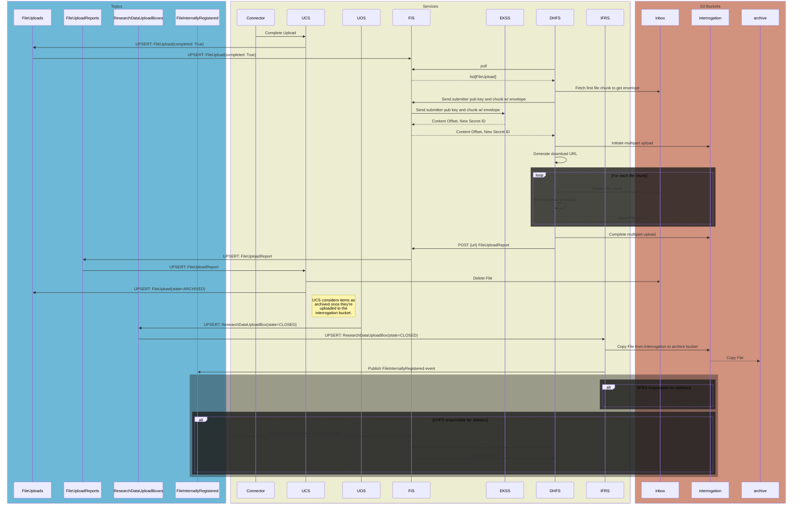

# File Upload Path Pt. 2 (Sarcastic Fringehead)
**Epic Type:** Implementation Epic

Epic planning and implementation follow the
[Epic Planning and Marathon SOP](https://ghga.pages.hzdr.de/internal.ghga.de/main/sops/development/epic_planning/).

## Scope
### Outline:
This epic includes all work required to bring the remaining file services into line with the new file upload concept. The first portion of work for the file services was executed under [Lynx Boreal](../76-lynx-boreal/technical_specification.md), and there was also a subsequent portion of work for the GHGA Connector which was carried out according to [Hedgehog Seahorse](../80-hedgehog-seahorse/technical_specification.md). When this epic is finished, all *backend* modifications required for the new upload concept to be realized will be complete. Fontend changes are *not* included in this epic, however, so more work will be required to bring the Data Portal up to speed.
As for the work to be completed within this epic, the services affected include the File Ingest Service (FIS), Internal File Registry Service (IFRS), and a new service called the Data Hub File Service (DHFS). Additionally, if it is discovered during implementation that further changes need to be made to other services *beyond what is described this epic*, e.g. to add an endpoint parameter, then tickets will be added ad-hoc and associated with this epic.

In Lynx Boreal, the Upload Controller Service (UCS) was rewritten, the Upload Orchestration Service (UOS) was implemented for the first time, the Claims Repository Service (CRS) was updated to manage permissions for Research Data Upload Boxes, and the Work Package Service (WPS) was updated to manage upload-type work packages. Taken together, these changes create the operational framework for remote file upload, but only to the point of initial ingest. In order to comply with our file upload concept, we still need to decrypt the uploaded file, verify the integrity via checksum comparison, re-encrypt the file with a new file secret (securely stored in the Encryption Key Store Service, or EKSS), and move the file to a permanent storage bucket registered with the IFRS in what we call "archival".


### Included/Required:
Updates for FIS, IFRS, and DHFS.

### Optional:
Add email notifications for important events related to archival. This could include, for example, a notification conveying that all files in a Research Data Upload Box have been successfully archived, or that there was a problem with file XYZ during interrogation. To prevent scope creep, this should *probably* be done in another epic, but we should keep that potential requirement in mind during development.

### Not included:
Data Portal updates or any upcoming metadata-related services. This is purely for file upload.

## User Journeys (optional)

All user journeys are already detailed in Lynx Boreal. The operations added in this epic will occur automatically without further action required on the part of either the user or GHGA personnel. 

## API Definitions:

### RESTful/Synchronous:

FIS:
- POST /federated/ingest_secret
- GET /uploads/{storage_alias}

### Payload Schemas for Events:

#### FileUpload
```python
id: UUID4       # Unique identifier for the file upload
box_id: UUID4   # The ID of the FileUploadBox this FileUpload belongs to
completed: bool # Whether or not the file upload has finished
state: str      # The state of the FileUpload. Either "init", "inbox", or "archived"
alias: str      # The submitted alias from the metadata (unique within the box)
checksum: str   # Checksum of the unencrypted file content
size: int       # The file size in bytes
```
#### FileUploadReport
```python
file_id: UUID4      # Unique identifier for the file upload
secret_id: str      # The Vault ID of the new file secret used to re-encrypt the file
passed_inspection: bool  # Whether the file passed interrogation
storage_alias: str  # The storage alias for the bucket with the re-encrypted file
```

## Additional Implementation Details:

> For a comprehensive overview, please see the Mermaid sequence diagram below.

UCS:
- Emits `FileUpload` events as changes and insertions occur. *Already implemented as part of Lynx Boreal.*

### FIS:
The FIS straddles the border between the file services group and everything else, similar to the role played by the UOS. In the past, the FIS acted as a way to ingest file upload metadata and tell other services when a manually validated ("interrogated") file was ready for permanent storage. This had to be done as a temporary solution until the remote file upload and automatic file interrogation was implemented, which is the work proposed in this epic. 

The new role of the FIS is to monitor `FileUpload` outbox events for *completed* uploads. At the same time, the FIS operates an HTTP API with three main endpoints:
- a `GET` endpoint that returns a list of completed `FileUploads` for a given storage alias
  - It's helpful to remember that these are not batched by box ID, but by storage location
  - Polled by the DHFS
- a `POST` endpoint that accepts new file encryption secrets for deposition and returns their Vault ID
  - The DHFS generates a new file encryption secret during re-encryption
  - The FIS accepts the key, deposits it in the EKSS, and returns the secret ID
  - *This endpoint already exists in the FIS*
- a `POST` endpoint that accepts `FileUploadReport` objects from Data Hubs, each of which details a file that has been [un-]successfully re-encrypted and uploaded to the `interrogation` bucket.

Since the DHFS is not connected to our event communication infrastructure, the FIS maintains and publishes the `FileUploadReports` on behalf of the DHFS. When the DHFS requests a list of files that have been uploaded to its `inbox` bucket, the list returned by the FIS only contains files for which a successful `FileUploadReport` has not already been received.

#### Work to be performed for the FIS:
- [ ] Add outbox subscriber for `FileUpload` events
- [ ] Add outbox publisher for `FileUploadReport` events
- [ ] Add subscriber for `FileInternallyRegistered` events, but only if the DHFS is responsible for deleting archived files from the `interrogation` bucket
- [ ] Add HTTP endpoint for DHFS instances to poll for `inbox` files
- [ ] Add HTTP endpoint for DHFS instances to submit `FileUploadReports`
- [ ] Secure the endpoints by _____(*?*).

### DHFS:
The DHFS is a new service that is operated by the various Data Hubs for the purpose of performing file validation and re-encryption, and to keep file ingest in general as a federated operation. It polls the FIS's HTTP API to get a list of `FileUploads` for files that have been recently uploaded to its `inbox` bucket. For each file, the DHFS obtains the 

- Polls the FIS HTTP API to get a list of completed `FileUploads`, which can be interrogated.
  - Also looks for files that have been fully archived so it can delete them from its interrogation bucket.
    - If there is an archived file that doesn't exist in the DHFS's interrogation bucket, it logs the absence but otherwise treats it as a successful deletion.
- [Per File]
  - Reads the first file part to sift for the Crypt4GH envelope
  - Queries the EKSS, sending the file part as well as the submitter's public key in exchange for:
    - Old & New File Secrets
    - ID of the new file secret
    - Start position (offset) of the actual file content
  - Initiates a multipart upload with the Data Hub's `interrogation` bucket.
  - Streams the object from the Data Hub's `inbox` bucket chunk-by-chunk.
  - Each chunk is decrypted using the original file secret, then re-encrypted with the new one and finally uploaded to the Data Hub's `interrogation` bucket.
  - The checksums of both the unencrypted and encrypted file chunks are tracked. Once the entire file is uploaded, the DHFS compares the unencrypted file's checksum against the one reported by the submitter during upload, and the encrypted checksum against the one calculated by S3.

### IFRS
The role of the IFRS is to shepherd files into permanent storage, or "archival", by copying them from the `interrogation` bucket located at a Data Hub into the `archive` or `permanent` bucket located at GHGA Central. This only occurs once the Data Hub in question has completed the interrogation process, which consists of decryption, checksum verification, and re-encryption. The IFRS subscribes to `FileUpload` outbox events from the UCS and `ResearchDataUploadBox` outbox events from the UOS. When it encounters a box which is set to CLOSED, it knows that the associated files are ready for archival. It then copies each file in the `ResearchDataUploadBox` from the specified `interrogation` bucket (in the storage location specified by `ResearchDataUploadBox.storage_alias`) into the GHGA central `permanent` bucket. Once that is successful, the IFRS issues a `FileInternallyRegistered` event.

> QUESTION: The file must be deleted from the interrogation bucket - is the IFRS or the DHFS responsible for this action (both are possible).

#### Work to be performed for the IFRS:
- [ ] Add outbox subscriber for `FileUpload` events
- [ ] Add outbox subscriber for `ResearchDataUploadBox` events
- [ ] Upon encountering a closed `ResearchDataUploadBox`, retrieve list of concerned files from the `FIS` service
- [ ] Copy each file from the `interrogation` bucket over to the IFRS's permanent bucket
- [ ] Ensure that the `FileInternallyRegistered` event is properly published. This is already implemented, but it is possible that we'll have to adjust something to keep it functioning.
  - Consumed by the Download Controller Service so it knows what files are available
- [ ] If we opt to have the IFRS responsible for deleting the file from the `interrogation` box, then this needs to be performed before publishing the event.

### Sequence Diagram:



## Human Resource/Time Estimation:

Number of sprints required: 3

Number of developers required: 1-2
