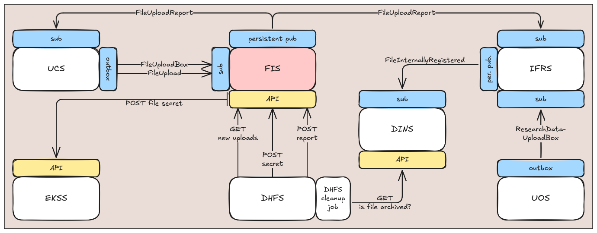
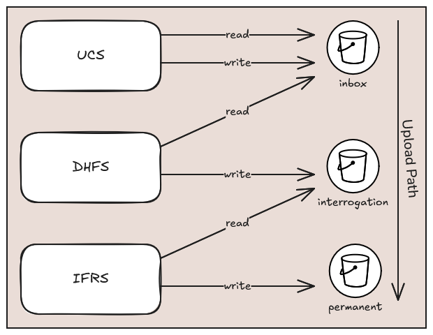
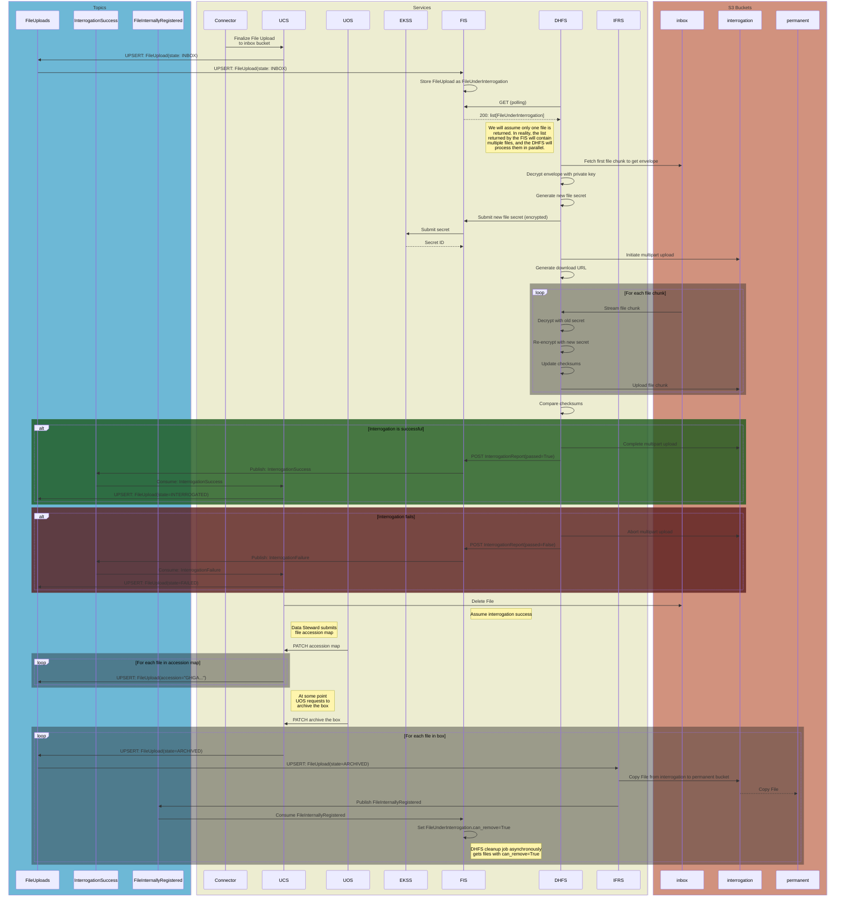
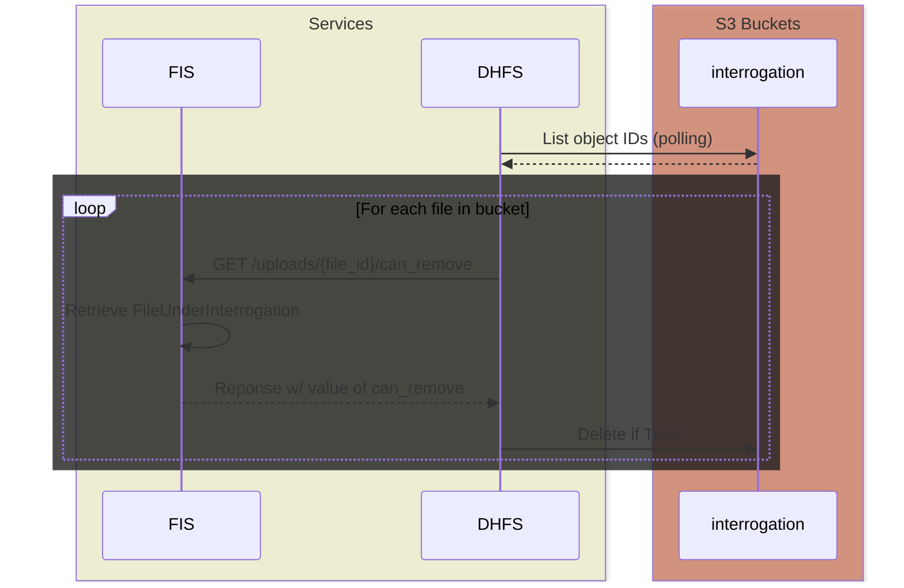
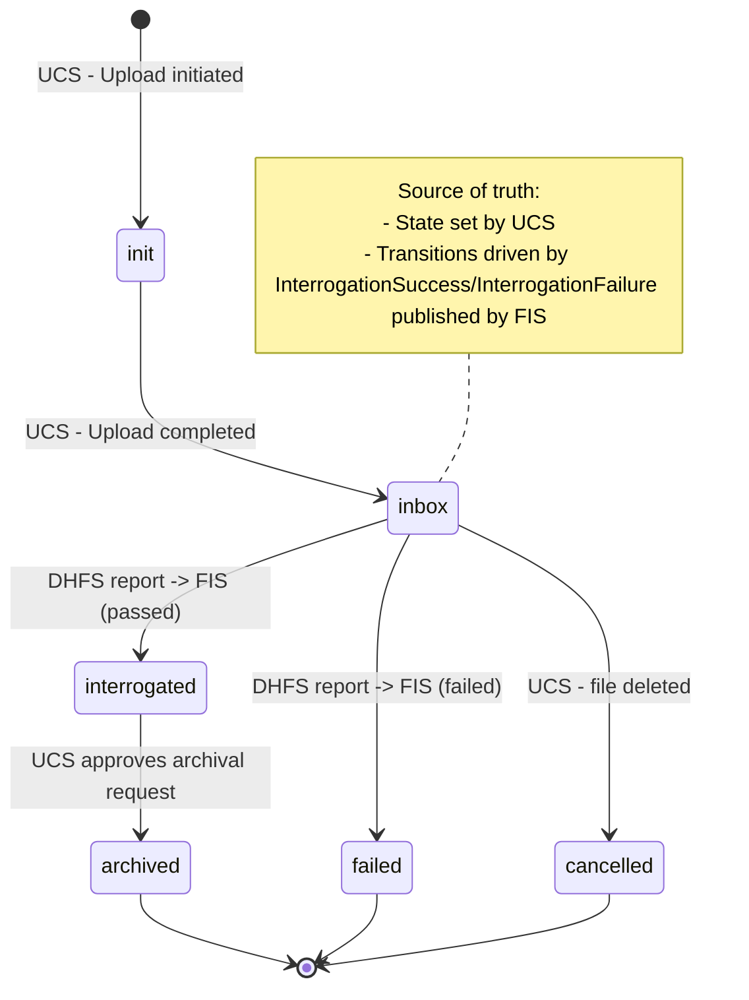
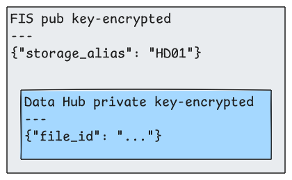

# File Upload Path Pt. 2 (Sarcastic Fringehead)
**Epic Type:** Implementation Epic

Epic planning and implementation follow the
[Epic Planning and Marathon SOP](https://ghga.pages.hzdr.de/internal.ghga.de/main/sops/development/epic_planning/).

## Scope
### Outline:
This epic includes all work required to bring the remaining file services into line with the new file upload concept. The first portion of work for the file services was executed under [Lynx Boreal](../76-lynx-boreal/technical_specification.md), and there was also a subsequent portion of work for the GHGA Connector which was carried out according to [Hedgehog Seahorse](../80-hedgehog-seahorse/technical_specification.md). When this epic is finished, all *backend* modifications required for the new upload concept to be realized will be complete. Frontend changes are *not* included in this epic, however, so more work will be required to bring the Data Portal up to speed.
As for the work to be completed within this epic, the services affected include the File Ingest Service (FIS), Internal File Registry Service (IFRS), the Well-Known Value Service (WKVS), the Upload Controller Service (UCS), the ghga-event-schemas library, and a new service called the Data Hub File Service (DHFS). Additionally, if it is discovered during implementation that further changes need to be made to other services *beyond what is described in this epic*, then tickets will be added ad-hoc and associated with this epic.

In Lynx Boreal, the UCS was rewritten, the Upload Orchestration Service (UOS) was implemented for the first time, the Claims Repository Service (CRS) was updated to manage permissions for Research Data Upload Boxes, and the Work Package Service (WPS) was updated to manage upload-type work packages. Taken together, these changes create the operational framework for remote file upload, but only to the point of initial ingest. In order to fully realize our file upload concept, we still need to decrypt the uploaded file, verify the integrity via checksum comparison, re-encrypt the file with a new file secret (securely stored in the Encryption Key Store Service, or EKSS), and move the file to a permanent storage bucket registered with the IFRS in what we call "archival".


### Included/Required:
All work described in the Additional Implementation Details section below is required.

### Not included:
- Data Portal updates or any upcoming metadata-related services. This is purely for file upload.
- Add email notifications for important events related to archival. This could include, for example, a notification conveying that all files in a Research Data Upload Box have been successfully archived, or that there was a problem with file XYZ during interrogation. To prevent scope creep, this should *probably* be done in another epic, but we should keep that potential requirement in mind during development.
- Event discovery or publication for auditing purposes

## User Journeys (optional)

All user journeys are already detailed in Lynx Boreal. The operations added in this epic will occur automatically without further action required on the part of either the user or GHGA personnel. 

## API Definitions:

### RESTful/Synchronous:

[UCS HTTP API](#ucs-http-api)  
[UOS HTTP API](#uos-http-api)  
[WKVS HTTP API](#wkvs-http-api)  
[FIS HTTP API](#fis-http-api)  

### Payload Schemas for Events:

#### ResearchDataUploadBoxState
```python
OPEN = "open"
LOCKED = "locked"
ARCHIVED = "archived"  # This used to be `CLOSED = "closed"`
```

#### ResearchDataUploadBox
```python
id: UUID4
state: ResearchDataUploadBoxState
title: str
description: str
last_changed: UTCDatetime
changed_by: UUID4
file_upload_box_id: UUID4
locked: bool
file_count: int
size: int
storage_alias: str
```

#### FileUploadBox
```python
id: UUID4
locked: bool = False  # if archived is True, then this field must also be True
archived: bool = False  # New field. If True, this box is permanently locked
file_count: int
size: int
storage_alias: str
```

#### FileUploadState
```python
INIT = "init"  # unchanged, means the file is being uploaded to the inbox
INBOX = "inbox"  # unchanged, means the file is in the inbox awaiting interrogation
FAILED = "failed"  # new state, means problem with interrogation, upload, etc.
INTERROGATED = "interrogated"  # new state, means file interrogation was valid
ARCHIVED = "archived"  # now means the file is officially in permanent storage
```

#### FileUpload
> Outbox event owned by UCS
```python
id: UUID4       # Unique identifier for the file upload
box_id: UUID4   # The ID of the FileUploadBox this FileUpload belongs to
alias: str      # The submitted alias from the metadata (unique within the box)
state: FileUploadState = "init"  # The state of the FileUpload
state_updated: UTCDatetime  # Timestamp of when state was updated
storage_alias: str  # The storage alias for the inbox bucket
# Additionally, the following fields exist but are unset until later in the process
secret_id: str | None
decrypted_sha256: str | None  # SHA-256 checksum of the entire unencrypted file content
decrypted_size: int     # The size of the unencrypted file
part_size: int  # The number of bytes in each file part (last part is likely smaller)
encrypted_parts_md5: list[str] | None     # Is None until DHFS finishes with file
encrypted_parts_sha256: list[str] | None  # Is None until DHFS finishes with file
accession: str | None   # The accession number for the file
```

#### InterrogationSuccess
> Persistent event published by FIS on behalf of DHFS
```python
file_id: UUID4
secret_id: str
storage_alias: str
interrogated_at: UTCDatetime
encrypted_parts_md5: list[str]
encrypted_parts_sha256: list[str]
```

#### InterrogationFailure
> Persistent event published by FIS on behalf of DHFS
```python
file_id: UUID4
storage_alias: str  # the interrogation bucket storage alias
interrogated_at: UTCDatetime
reason: str
```

#### FileInternallyRegistered
> Persistent event owned by the IFRS
```python
# content_offset is removed because objects are stored without an envelope
# bucket_id is removed because storage_alias should already point to specific bucket
file_id: str  # For now, this field continues to hold the accession, despite the name. In the future, the plan is to replace all values in this field with the value from object_id. We will have to simply be aware for the interim that, although `file_id` refers to `FileUpload.id` in the rest of the spec, the naming here is an unfortunate collision with existing implementation. This field is still the object's primary identifier for now. An alternative solution is to rename this field to 'accession' during the immediate work, then migrate the name back to 'file_id' once official accession management is implemented.
object_id: UUID4  # unchanged -- see note above
upload_date: UTCDatetime  # unchanged
storage_alias: str  # renamed from s3_endpoint_alias
secret_id: str      # renamed from decryption_secret_id
decrypted_size: int     # unchanged
encrypted_size: int     # new field
decrypted_sha256: str   # unchanged
part_size: int  # renamed from encrypted_part_size
encrypted_parts_md5: list[str]    # unchanged
encrypted_parts_sha256: list[str] # unchanged
```
---
### Other Schemas

#### FileUnderInterrogation
> This schema represents what FIS checks for validation when consuming a `FileUpload` event with the `inbox` state, and is used by FIS to track minimal data concerning interrogation progress. It is not itself an event schema.
```python
class FileUnderInterrogation(BaseModel):
    id: UUID4  # Unique identifier for the file upload
    state: FileUploadState = "init"  # The state of the FileUpload
    state_updated: UTCDatetime  # Timestamp of when state was updated
    storage_alias: str  # The storage alias for the inbox bucket
    decrypted_sha256: str  # SHA-256 checksum of the entire unencrypted file content
    decrypted_size: int  # The size of the unencrypted file
    part_size: int  # The number of bytes in each file part (last part is likely smaller)
    secret_id: str | None = None  # The internal ID of the DHFS-generated decryption secret
    interrogated: bool = False  # Indicates whether interrogation has been completed
    can_remove: bool = False  # Indicates whether file can be deleted from `interrogation` bucket
```

#### InterrogationReport
> This schema represents the format expected by the FIS when DHFS submits via HTTP request the results of file interrogation. It covers both success and failure.
```python
class InterrogationReport(BaseModel):
    """Contains the results of file interrogation"""
    file_id: UUID4
    storage_alias: str  # The storage alias for the interrogation bucket
    interrogated_at: UTCDatetime # Timestamp showing when interrogation finished
    passed: bool
    encrypted_parts_md5: list[str] | None = None  # Conditional upon success
    encrypted_parts_sha256: list[str] | None = None  # Conditional upon success
    reason: str | None = None  # Conditional upon failure, contains reason for failure
```

#### ArchivableFileUpload
> This schema represents what IFRS checks for validation when consuming a `FileUpload` event with the `archived` state. It is not itself an event schema.
```python
class ArchivableFileUpload(BaseModel):
    """Contains all the information needed for a file to be permanently archived"""
    id: UUID4
    storage_alias: str
    secret_id: str
    decrypted_sha256: str
    decrypted_size: int
    part_size: int
    encrypted_parts_md5: list[str]
    encrypted_parts_sha256: list[str]
    accession: str
```

#### FileAccessionMap
```python
class FileAccessionMap(BaseModel):
    """Model that maps file IDs to GHGA accession numbers"""
    mapping: dict[UUID4, str]  # this could instead be a list of tuples or similar object
```

## Additional Implementation Details:

> For a comprehensive overview, please see the [Service Diagrams](#service-diagrams) section below.

### GHGA-Event-Schemas:
- Set the `ResearchDataUploadBoxState` schema to match what is defined above
- Set the `FileUploadState` schema to match what is defined above
- Set the `FileUpload` schema to match what is defined above
- Set the `FileUploadBox` schema to match what is defined above
- Set the `FileInternallyRegistered` schema to match what is defined above
- Replace `FileUploadValidationSuccess` with `InterrogationSuccess` as defined above
- Replace `FileUploadValidationFailure` with `InterrogationFailure` as defined above
- Rename `_FileInterrogationsConfig` to `_InterrogationEventsConfig`
- Rename `FileInterrogationSuccessEventsConfig` to `InterrogationSuccessEventsConfig`
- Rename `FileInterrogationFailureEventsConfig` to `InterrogationFailureEventsConfig`
- Remove the `FileUploadReport` schema
- Remove the `FileUploadReportEventsConfig` stateless config class
- Rename `NonStagedFileRequested.s3_endpoint_alias` to `storage_alias`

### UCS:
The UCS takes on an expanded role from what was defined in Lynx Boreal. Previously, the UCS was only concerned with getting files into the `inbox` bucket, and after that it didn't care what happened. However, further consideration has resulted in the viewpoint that the UCS is actually the source of truth for files all the way up until they are copied into permanent storage. Intermediate steps that occur in other services provide subsequent information to the UCS regarding the `FileUpload`, but those services do not assume ownership of the essential file information. Not only that, but the relationship between `FileUpload` IDs and accession numbers should and will be managed by the UCS during the interim phase while official accession management is still under development. The UCS operates two instances - an HTTP API and an event consumer.

#### UCS Event Consumer
The UCS event consumer instance subscribes to the `InterrogationSuccess` and `InterrogationFailure` *persistent events* published by the FIS. The schemas are[detailed above](#interrogationsuccess). 

When a new `InterrogationSuccess` or `InterrogationFailure` event arrives, UCS:
- Finds the matching `FileUpload` in its database and raises an error if it can't.
- Checks that the `FileUpload` has a state of `inbox`.
  - If it doesn't (e.g. the state is already `interrogated`, `failed`, `cancelled`, or `archived`), UCS compares `FileUpload.state_updated` and `InterrogationSuccess.interrogated_at`.
    - If the `InterrogationSuccess` timestamp is newer, UCS raises an error and the event is sent to the DLQ.
    - If the UCS timestamp is newer, the event is ignored and no further action is taken.
    - If the timestamps are the same, the UCS verifies if there is a difference in the information. In the case that the information is the same, the UCS stops processing. If there is a difference, the UCS processes the event (this could happen if, for example, we carry out a data fix and want to re-process the events with the fixed state).

If the event is `InterrogationSuccess`, UCS also:
- Sets `FileUpload.state` to `interrogated`
- Sets `secret_id`, `state_updated`, `storage_alias`, `encrypted_parts_md5`, `encrypted_parts_sha265` based on the information in the event

However, if the event is `InterrogationFailure`, UCS sets `FileUpload.state` to `failed` and `FileUpload.state_updated` to `InterrogationFailure.interrogated_at`

In both cases, UCS deletes the file from the `inbox` bucket. At this point, the event consumer instance is finished processing the event and waits for the next event. The updates to the `FileUpload` will be published as an outbox event.

As a final note on the UCS, the UCS is the place where `box_id` is populated for `FileUpload` objects. You can read about that process in Lynx Boreal, but the long-short is that a Data Steward manually creates a `ResearchDataUploadBox` in the UOS, which has a separate ID, and that automatically triggers the creation of a subordinate `FileUploadBox` in the UCS, which has an independent ID. Whenever a new file is added for that box, the `FileUpload` gets the `box_id` of the parent `FileUploadBox`.

#### UCS HTTP API
You can read about the existing UCS endpoints in the Lynx Boreal epic. I will only detail the updates here.

> Note: The GET /boxes/{box_id}/uploads endpoint needs to exclude the secret_id and checksum fields

The UCS operates the following new endpoints:
- `PATCH /boxes/{box_id}/accessions`: Accepts a payload which maps `FileUpload` IDs to accession numbers for a given `FileUploadBox`
  - Authorized by a token signed by the UOS with the work type `"map"` and including the `box_id`
  - Returns `204 NO CONTENT`
  - Description:
    - The UCS finds the `FileUploadBox` in its database and raises an error if it can't
    - The UCS ensures the `FileUploadBox` is locked but not archived, raising an error otherwise.
    - Before making database writes, the UCS retrieves all specified `FileUpload` objects and:
      - Ensures the file state is not `archived`.
      - Ensures the file accession field is not assigned, or if it is assigned, that it matches the accession provided in the request. Otherwise, UCS raises an error and returns a `409 CONFLICT` response.
    - The updated `FileUpload` objects are published as outbox events.

- `PATCH /boxes/{box_id}`: This endpoint already exists, but is augmented here to allow `FileUploadBox` *archival*.
  - Authorized by a token signed by the UOS with the work type `"archive"` and including the `box_id`
  - Returns `204 NO CONTENT`
  - Description: 
    - The UCS finds the `FileUploadBox` in its database and raises an error if it can't.
    - The UCS verifies that the `FileUploadBox` is locked but not archived.
      - If archived, the UCS returns early as it assumes that the work is already done
    	- If not locked, the UCS raises an error
    - The UCS looks up every `FileUpload` associated with the box and verifies that each one has an assigned accession and a state of `interrogated`. If any are not set, the UCS raises an error and rejects the box archival.
      - UCS sets each `FileUpload.state` to `archived` and likewise updates the `FileUpload.state_updated` timestamp.
      - If every `FileUpload` already has an assigned accession and a state of `archived`, the UCS skips to updating the `FileUploadBox`.
    - The UCS publishes an outbox event for each modified `FileUpload`.
    - The UCS sets `FileUploadBox.archived` to True and publishes the updated object as an outbox event.

Side note:  
The work to provide a deletion endpoint accessible by GHGA Connector is *not* meant to be part of this epic. For now, assume all deletions/cancellations will be triggered from the Data Portal -> UOS -> UCS rather than from the GHGA Connector. Additionally, in case it wasn't clear, file deletions (or cancellations, rather) do not result in a `dao.delete()` call. The full document data remains, but the state is set to `cancelled`. When the GHGA Connector is enabled to perform deletions, the state might potentially be allowed to be set to `failed` in addition to `cancelled`. More thought is required here on the requirements for work order tokens, use cases, and alias vs file ID specifiers.

#### UCS Configuration
The UCS needs the following config changes:
- Add event sub config for `InterrogationSuccess` and `InterrogationFailure` events
  - ghga-event-schemas -> `InterrogationSuccessEventsConfig`
  - ghga-event-schemas -> `InterrogationFailureEventsConfig`
- Remove event sub config for `FileUploadReport` events

#### Work to be performed for the UCS
- [ ] Get schema updates from ghga-event-schemas
- [ ] Implement new endpoints
- [ ] Exclude `secret_id` and checksum fields from `FileUpload` objects returned by `GET /boxes/{box_id}/uploads`
- [ ] Remove existing subscription to `FileUploadReport` events
- [ ] Add event subscriber for `InterrogationSuccess` and `InterrogationFailure` events
- [ ] Add core behavior to handle `InterrogationSuccess` and `InterrogationFailure`
- [ ] Change existing deletion behavior to update `FileUpload.state` instead of actually deleting content.

---

### UOS:
The UOS remains mostly unchanged from its initial implementation in Lynx Boreal, except for gaining a new, temporary responsibility to relay **accession maps** to the UCS. Through a new HTTP API endpoint, the UOS will take in objects that map file IDs from `FileUpload` objects to an accession number. This is temporary because it fills in a functional gap in the overall system that still has to be planned out. In the future, this endpoint will be removed (or at least no longer used). The UOS operates both an HTTP API instance and an event consumer instance.

#### UOS HTTP API
> [Return to API list](#restfulsynchronous)

The UOS would get the following new endpoint:  
`PATCH /boxes/{box_id}/accessions`: Accept a file-to-accession mapping in order to relay it to the UCS
- Authorization uses auth context protocol and requires a Data Steward role
- Request body must contain a payload conforming to the `FileAccessionMap` [schema](#fileaccessionmap)
- Returns `204 NO CONTENT`
- Description:
  - UOS looks for the `ResearchDataUploadBox` in its database with an ID that matches the value in the path parameter, and returns a `404 NOT FOUND` if it doesn't find it.
  - UOS ensures the `ResearchDataUploadBox` is not already ARCHIVED, and raises an error if it is. This might return a `409 CONFLICT` status code.
  - UOS self-signs a `ChangeFileBoxWorkOrder` token and makes a PATCH request to the UCS's `/boxes/{box_id}/accessions` endpoint.
    - The UOS uses `ResearchDataUploadBox.file_upload_box_id` for the `box_id` parameter in both the token and UCS call.
    - The request body contains the accession map that was supplied in the original request to the UOS.


#### UOS Configuration
The UOS shouldn't need any config changes.

#### Work to be performed for the UOS
- [ ] Get schema updates from ghga-event-schemas
- [ ] Add the new API endpoint described above
- [ ] Add the FileAccessionMap definition somewhere in the UOS (not in a library)
- [ ] Rename final box state to `archived` instead of `closed`
- [ ] Add two new options to the `ChangeFileBoxWorkOrder` for the work type literal"
      - `"map"`: represents the task of submitting the accession map
      - `"archive"`: represents final, permanent sealing of `FileUploadBox`
- [ ] Add the outbound UCS call to the UOS's `FileBoxClient` that uses the `"map"` type
- [ ] Add an outbound UCS call in the `FileBoxClient` with the same structure as `lock_file_upload_box()` and `unlock_file_upload_box()`, called `archive_file_upload_box()`
- [ ] Call `FileBoxClient.archive_file_upload_box()` from the UOS core when moving a `ResearchDataUploadBox` to `archived` state (formerly labeled `closed`).

---

### WKVS:
- Provides the Data Hub Crypt4GH public keys via public HTTP API

#### WKVS HTTP API
> [Return to API list](#restfulsynchronous)

The WKVS would get the following new endpoint:  
`GET /values/data_hub_public_keys`:
- No authentication required
- Returns `200 OK` and a mapping of storage alias to public key

#### Work to be performed for the WKVS
- [ ] Provide a way to retrieve Crypt4GH public keys for Data Hubs. This can be a dictionary where the keys are storage aliases and the values are the public keys.

---

### GHGA Connector:
The Connector performs initial file encryption and upload from the user's machine. In order to properly encrypt the file for a specific Data Hub, the Connector needs to contact the WKVS to obtain the appropriate Crypt4GH public key based on the storage alias assigned to the `ResearchDataUploadBox`/`FileUploadBox` created by the Data Steward.

Per-part encryption process needs to be updated to the following:
1. Update the unencrypted content SHA-256 checksum
2. Encrypt the part and calculate the MD5 & SHA-256 checksums of the encrypted part
3. Decrypt the part and update the second unencrypted content SHA-256 checksum
4. Compare the decrypted checksums to make sure they're the same at each step in the process.

#### Work to be performed for the GHGA Connector
- [ ] Fetch and use Data Hub public key for file encryption
- [ ] Submit file part size
- [ ] Make sure we decrypt encrypted parts again and calculate a second, confirmatory checksum over the unencrypted content.

---

### FIS:
The FIS straddles the border between the file services group and everything else, similar to the role played by the UOS. In the past, the FIS acted as a way to ingest file upload metadata and tell other services when a manually validated ("interrogated") file was ready for permanent storage. This had to be done as a temporary solution until the remote file upload and automatic file interrogation was implemented, which is the work proposed in this epic.

The new role of the FIS is to inform the DHFS when new files arrive in the DHFS's `inbox` bucket. To do this, the FIS operates as an event consumer in one instance, and runs an HTTP API in another instance. Both instances are described below.

#### FIS Event Consumer
The FIS subscribes to `FileUpload` *outbox events* from the UCS.

When a new `FileUpload` event arrives with the state `inbox` FIS first checks its database to see if it has a copy already stored in its database. If it does, FIS either ignores the event or raises an error depending on specific criteria (implementation detail). If the event is new, FIS stores the event as a `FileUnderInterrogation` using the [FileUnderInterrogation schema](#FileUnderInterrogation) so that it can be later relayed to the DHFS.

When a `FileUpload` event arrives with a state other than `init` or `inbox`, e.g. `failed`, `cancelled`, `interrogated`, or `archived`, FIS will merely update its local `FileUnderInterrogation` copy (or create it if it doesn't exist) and set the `can_remove` field to True. FIS should never store any information for a `FileUpload` with the state `init`.

The FIS *also* subscribes to `FileInternallyRegistered` events from the IFRS. FIS is interested in these events because they communicate that a given file has been successfully copied from the `interrogation` bucket to the the `permanent` bucket. FIS locates the corresponding `FileUnderInterrogation` and raises an error if it can't. It then sets the `can_remove` field to True.

#### FIS HTTP API
> [Return to API list](#restfulsynchronous)

Upon startup, the HTTP API instance of the FIS will retrieve the list of Data Hub public keys from the WKVS.

In addition to implementing the endpoints defined here, the existing functionality and config that directly interacts with Vault should be removed so that EKSS is the sole middleman for Vault activity.

> See the [diagram](#example-auth-token-structure-for-dhfs-calls-to-fis-api) for an illustration of the proposed auth token structure for inbound requests to the FIS API

The FIS operates an HTTP API with these endpoints:
1. `POST /secrets`: Accept a new file secret for deposition in the EKSS
   - Authorization requires a 2-layer token created with both the FIS public key and the Data Hub-specific private key:
     - The inner layer contains the file ID and is encrypted with the Data Hub's private key
     - The outer layer contains the `storage_alias` in addition to the inner layer described above, and is encrypted with FIS public key. 
     - FIS decrypts the outer token layer with its private key to learn which Data Hub public key to use to decrypt the inner layer. The inner layer certifies that the request was indeed sent from the given Data Hub.
   - Request body must contain the associated file ID and a file secret encrypted with the GHGA central public key
   - Returns `201 CREATED`
   - Description:
     - FIS finds the existing `FileUnderInterrogation` in its database, raising an error if it doesn't find it.
     - FIS forwards the file secret to EKSS (still encrypted) in exchange for a secret ID.
     - FIS updates the `FileUnderInterrogation` with the new secret ID.
2. `GET /storages/{storage_alias}/uploads`: Serve a list of new file uploads (yet to be interrogated)
   - Authorization requires a 2-layer token created with both the FIS public key and the Data Hub-specific private key:
     - The inner layer contains the `storage_alias` and is encrypted with the Data Hub's private key.
     - The outer layer *also* contains the `storage_alias` in addition to the inner layer described above, and is encrypted with FIS public key.
     - FIS decrypts the outer token layer with its private key to learn which Data Hub public key to use to decrypt the inner layer. The inner layer certifies that the request was indeed sent from the given Data Hub.
   - Returns `200 OK` and a list of `FileUnderInterrogation` objects for files awaiting interrogation
   - Description:
     - FIS gets the `FileUnderInterrogation` objects which match the requested storage alias and have both `can_remove=False` and `interrogated=False`, i.e. interrogations which haven't reached a conclusion yet.
     - FIS returns the list of `FileUnderInterrogation` objects with the `secret_id` field omitted.
3. `GET /uploads/{file_id}/can_remove`: Returns a bool indicating whether a file can be removed from the `interrogation` bucket
   - Authorization requires a 2-layer token created with both the FIS public key and the Data Hub-specific private key:
     - The inner layer contains the file ID and is encrypted with the Data Hub's private key
     - The outer layer contains the `storage_alias` in addition to the inner layer described above, and is encrypted with FIS public key. 
     - FIS decrypts the outer token layer with its private key to learn which Data Hub public key to use to decrypt the inner layer. The inner layer certifies that the request was indeed sent from the given Data Hub.
   - Returns `200 OK` and the value of the `can_remove` field of the requested `FileUnderInterrogation`
   - Description:
     - FIS finds the existing `FileUnderInterrogation` in its database, raising an error if it doesn't find it (should be translated to True as an HTTP response but logged within the service as an error).
     - Returns the value of `FileUnderInterrogation.can_remove`
4. `POST /interrogation-reports`: Accept an interrogation report
   - Authorization requires a 2-layer token created with both the FIS public key and the Data Hub-specific private key:
     - The inner layer contains the file ID and is encrypted with the Data Hub's private key
     - The outer layer contains the `storage_alias` in addition to the inner layer described above, and is encrypted with FIS public key. 
     - FIS decrypts the outer token layer with its private key to learn which Data Hub public key to use to decrypt the inner layer. The inner layer certifies that the request was indeed sent from the given Data Hub.
   - Request body must contain a payload conforming to the `InterrogationReport` [schema](#interrogationreport)
   - Returns `204 NO CONTENT`
   - Description:
     - FIS finds the matching `FileUnderInterrogation` in its database based on the `file_id` (or raises an error).
     - If `InterrogationReport.passed` is True, FIS publishes an `InterrogationSuccess` event.
     - If `InterrogationReport.passed` is False, FIS publishes an `InterrogationFailure` event.
     - FIS sets both `FileUnderInterrogation.interrogated` and `FileUnderInterrogation.can_remove` to True

#### FIS Configuration
The FIS needs the following configuration:
- MongoDbConfig
- KafkaConfig
- ApiConfigBase
- LoggingConfig
- OpenTelemetryConfig
- EventSubConfig:
  - ghga-event-schemas -> `FileUploadEventsConfig`
  - ghga-event-schemas -> `FileInternallyRegisteredEventsConfig`
  - ghga-event-schemas -> `InterrogationSuccessEventsConfig`
  - ghga-event-schemas -> `InterrogationFailureEventsConfig`
- OutboxSubConfig:
  - ghga-event-schemas -> `FileUploadEventsConfig`
- ekss_api_url
- wkvs_api_url

#### FIS Migrations
The current FIS implementation has a persisted events collection, `fisPersistedEvents`, that contains previously published `FileInterrogationSuccessEvents` (`type_` is `"file_interrogation_success"`). These events are essentially the same as the events that will, going forward, be published by the UCS upon file archival. Therefore, we *also* need to make sure the FIS can publish to the same outbox topic as the UCS. The required migration for the persisted events collection in FIS essentially needs to convert the `payload` of the stored persisted events into outbox events with the new `FileUpload` [schema](#fileupload). This migration should be reversible. FIS will only publish to the `FileUpload` outbox topic if we *republish* events from the FIS. In other words, this is historical data that we are preserving here in FIS for continuity. The historical `FileUpload` information and the local copies of new `FileUpload` objects must use different DAOs. The former should use an outbox DAO while the latter uses a regular DAO. 
- **One alternative** is to manually exfiltrate the data to UCS.
- **A second alternative** is to simply drop the data since the files have already been archived and all relevant information is actually stored by IFRS.

There is one **problem**: IFRS has different object IDs than FIS. If we keep the event data which FIS currently has, we will need to update the information so that the file IDs in FIS are set to the file IDs (object IDs) known to IFRS, using the accession to match. That action would not be reversible, of course.

The `ingestedFiles` collection, which contains unassociated accessions, should be dropped.

Finally, FIS data migration should be moved to the init container style. Instead of executing `run_db_migrations()` as part of every entrypoint, the migrations should be run as their own command. 

#### Work to be performed for the FIS
- [ ] Ensure DLQ is enabled
- [ ] Add local definition for `FileUnderInterrogation`
- [ ] Swap persistent publisher in favor of outbox publisher for `FileUpload` events.
  - again, these are the historical data, the old events previously published by FIS.
- [ ] Add event subscriber for `FileInternallyRegistered` events
- [ ] Add outbox subscriber for `FileUpload` events
  - These are the real, actually new uploads published by the UCS
- [ ] Add persistent publisher that compacts & stores `InterrogationSuccess` and `InterrogationFailure` events
- [ ] Add HTTP endpoints as [outlined above](#fis-http-api)
- [ ] Write migrations and address existing persisted event data as [described above](#fis-migrations).
- [ ] Move migrations to own CLI command so they can be run as an init container
  - [ ] Work with DevOps to get this configured in k8s

---

### DHFS:
The DHFS is a new service that is operated by the Data Hubs for the purpose of performing file validation and re-encryption, and to keep file ingest in general as a federated operation. The DHFS operates two instances: a client instance, which performs the interrogation work and is always running; and a cleanup instance, which runs at some interval and deletes files from the `interrogation` bucket once they've been copied to permanent storage. One crucial thing to note here is that the DHFS is not connected to an event stream, and so has no direct knowledge of the information conveyed by the events in GHGA Central's event stream. The DHFS primarily interacts with FIS's REST API in order to get that information, which is limited to only what the DHFS needs to operate.

#### DHFS Interrogator (primary instance)
It polls the FIS's HTTP API to get a list of `FileUploads` for files that have been recently uploaded to its `inbox` bucket. The DHFS decrypts each file and re-encrypts it using a new, individually created file secret before uploading it to the Data Hub's `interrogation` bucket. Along the way, it calculates the:
- Cumulative SHA-256 checksum of the entire unencrypted file
  - > Used to verify that the decrypted file is identical to what was uploaded by the user
- MD5 checksum of each individual, re-encrypted file part
  - > Used to verify that the `interrogation` bucket content matches what DHFS intended to upload
- SHA-256 checksum of each individual, re-encrypted file part
  - > Can be used to perform periodic integrity checks
  - > If we deviated from the GA4GH DRS Object spec for download, the GHGA Connector could verify file parts as they were downloaded, retrying parts that don't match. But that is out of scope for this epic.
When the whole file has been re-encrypted and uploaded to the Data Hub's `interrogation` bucket, the DHFS compares the unencrypted content's SHA-256 checksum against the value obtained from the corresponding `FileUpload`. It also calculates an aggregate MD5 checksum using the individually calculated parts' MD5 checksums and compares that against the MD5 ETag calculated by S3 in the `interrogation` bucket.
If a checksum discrepancy is found, the DHFS rejects the upload and posts an `InterrogationReport` to the FIS's HTTP API which indicates that the file did not pass inspection (`passed=False`) and provides a `reason` why the interrogation failed. If checksums match and there are no other errors during upload, the DHFS accepts the upload and the `InterrogationReport` sent to the FIS reflects that the file passed inspection (`passed=True`). The authentication mechanism for the DHFS-FIS calls is described in the [FIS HTTP API](#fis-http-api) section.

#### Interrogation Process in List Format
- [Per File]
  - Reads the first file part to sift for the Crypt4GH envelope
  - Decrypts the envelope using the configured private key (specific to the Data Hub)
  - Obtains the original file secret for decryption
  - Generates a new file secret for re-encryption
  - Sends the new file secret to the FIS's HTTP API
    - This is done right away instead of waiting to see if re-encryption is successful
    - The secret is encrypted using the GHGA public key
  - Calculates the content starting position (offset) from the envelope length
  - Initiates a multipart upload with the Data Hub's `interrogation` bucket
  - Streams the object from the Data Hub's `inbox` bucket part-by-part using the same part size as found in `FileUpload.part_size`
  - [Per File Part]
    - Decrypts the part
    - Re-encrypts the part using the newly generated file secret
    - Calculates the MD5 and SHA-256 checksums over the encrypted file part and appends each to their respective lists
    - Decrypts the re-encrypted content again
    - Updates the SHA-256 checksum over this re-decrypted content
    - Uploads the re-encrypted part to the Data Hub's `interrogation` bucket
  - Compares the unencrypted file's SHA-256 checksum against the one reported by the submitter during upload (found in `FileUpload.decrypted_sha256`), and the encrypted checksum against the one calculated by S3
  - Sends an `InterrogationReport` to the FIS's HTTP API

#### DHFS Cleanup Job (secondary instance)
The secondary duty of the DHFS is to clean up files from the `interrogation` bucket. Files must be removed once they have been fully copied to the permanent bucket, as well as on occasions that files are deleted from their parent box. Neither the FIS, UCS, nor IFRS can perform this action because they don't have write access to the `interrogation` bucket. Each time this DHFS instance runs, it retrieves a list of all objects (files) currently in the `interrogation` bucket. Then for each file, the DHFS makes a separate GET request to the FIS API's `GET /uploads/{file_id}/can_remove` endpoint. For authentication, the DHFS uses its own private key to encrypt the file ID pertaining to the request, then uses the FIS public key to encrypt a token containing the Data Hub's storage alias and the encrypted file ID. The DHFS will *delete* the file from the `interrogation` bucket if FIS returns True.

#### DHFS Configuration
The DHFS needs the following configuration:
- LoggingConfig
- OpenTelemetryConfig
- S3ObjectStoragesConfig
- auth_token_signing_key
  - This is the Data Hub's private key, which it uses to sign auth tokens sent to FIS
- wkvs_api_url
  - Used to contact WKVS to get the GHGA central public key (alternatively this could be directly configured as fis_public_key)
  
---

### IFRS:
The role of the IFRS is to shepherd files into archival, by copying them from a Hub's `interrogation` bucket into the `permanent` bucket located at the same Data Hub. This only occurs once the Data Hub in question has completed the interrogation process, as detailed in the [DHFS section](#dhfs) above. This is the last step for a file in the Upload Path. Unlike the FIS and DHFS, the IFRS operates only as an event consumer.

#### IFRS Event Consumer
The IFRS subscribes to `FileUpload` outbox events from the UCS but only acts when it encounters an event with the state `archived`. It further validates the event using the [ArchivableFileUpload schema](#archivablefileupload). If the event represents a valid `FileUpload`, IFRS first checks that it doesn't already have this file registered. If it's indeed a new upload, IFRS copies the file from the `interrogation` bucket specified by `FileUpload.storage_alias` into the same location's `permanent` bucket. Once that is successful, the IFRS issues a `FileInternallyRegistered` event. This process is already in place within the IFRS, but some small tweaks are required. For example, the IFRS currently generates a *new* file ID when it registers a new file, meaning the a file would have one object ID in what is currently the inbox bucket, and a different object ID in permanent storage. This should change so the file ID is used as the object ID and remains constant from the time it is generated in the UCS through its lifespan at GHGA.

#### A note on file IDs and file accessions in the IFRS
In the future, file accessions will not exist in the file services. For now though, we will still identify files by the file ID and/or accession number depending on the context. For example, during file upload we point to files using the file ID, but during file download a user specifies a file using the accession number. There is no mechanism external to the file services that performs that linkage in a decoupled way -- but there will be, one day! For now, the IFRS will keep the accession as the primary key for the file metadata object. In the future, the primary key will be switched to the object ID/file ID and accessions will be scrubbed from the database.

Finally, the UUID4 file IDs generated by the recently revamped UCS during file upload are now also used as the object IDs in S3 storage. This does not have to be the case, and we can choose to generate a separate object ID if that layer of indirection is desired. At the time of writing though, this is not planned.

#### Migrating existing IFRS data
The `file_metadata` collection needs the following changes:
- Remove `content_offset` field. The encrypted files are stored without an envelope, meaning the content offset is always 0.
- Rename `object_id` to `file_id`.
- Rename `object_size` to `encrypted_size`.
- Rename `decryption_secret_id` to merely `secret_id`.
- Rename `encrypted_part_size` to `part_size`.
- The list `encrypted_parts_sha256` is not currently used, but we are going to keep it for now. Originally the idea was for it to serve as another integrity check, but currently we only use the decrypted content's SHA-256 and the encrypted content's MD5 checksums for verification. In the spirit of "better to have it and not need it", we will keep this data (and continue producing it during re-encryption) for the time being.

The `ifrsPersistedEvents` collection needs similar changes to the `payload` field:
- Rename `file_id` to `accession`.
- Rename `object_id` to `file_id`.
- Delete `bucket_id`. This field is not used by anything.
- Rename `s3_endpoint_alias` to `storage_alias`.
- Rename `decryption_secret_id` to `secret_id`.
- Delete `content_offset`.
- Rename `encrypted_part_size` to `part_size`.

IFRS data migration should be moved to the init container style. Instead of executing `run_db_migrations()` as part of every entrypoint, the migrations should be run as their own command.

#### IFRS Configuration
- EventSubConfig:
  - ghga-event-schemas -> `FileUploadEventsConfig`

#### Work to be performed for the IFRS
- [ ] Add local definition for `ArchivableFileUpload`
- [ ] Add event subscriber for `InterrogationReport` events
- [ ] Add outbox subscriber for `ResearchDataUploadBox` events
- [ ] Upon encountering an ARCHIVED `ResearchDataUploadBox`, retrieve the list of relevant files from the local store of `InterrogationReport` events
- [ ] Copy each file from the `interrogation` bucket to the IFRS's permanent bucket
- [ ] Get the updated `ghga-event-schemas` version and adapt IFRS for changes to `FileInternallyRegistered`
- [ ] Migrate existing data in the `file_metadata` collection
- [ ] Create new collection to preserve existing file accession-to-file ID associations
- [ ] Migrate existing data in the `ifrsPersistedEvents` collection
- [ ] Move migrations to own CLI command so they can be run as an init container
  - [ ] Work with DevOps to get this configured in k8s

---

### DINS:
The Dataset Information Service (DINS) is only relevant here because it consumes `FileInternallyRegistered` events, stores that info in its database, and provides the information to public via HTTP API. DINS needs to be updated to use the new `FileInternallyRegistered` event schema. The data in the database already uses different field names, so no migration should be necessary.

#### Work to be performed for the DINS
- [ ] Get the updated `ghga-event-schemas` version and adapt DINS for changes to `FileInternallyRegistered`. 

---

### DCS:
The DCS subscribes to `FileInternallyRegistered` events from the IFRS to learn about which files are available for download from GHGA. The changes in that event schema, which are described above in the [schema definition](#fileinternallyregistered) above, necessitate database migrations and code updates in the DCS.

#### Migrating existing DCS data
The `drs_objects` collection needs the following migration changes applied:
- Rename `decryption_secret_id` to `secret_id`.
- Rename `s3_endpoint_alias` to `storage_alias`.

The `dcsPersistedEvents` collection needs the following changes to the `payload` field:
- Where `type_` == `drs_object_served`:
  - Rename `s3_endpoint_alias` to `storage_alias`.
- Where `type_` == `drs_object_registered`:
  - Do nothing. There are no active consumers for this event.

Another note about the DCS migrations is that they should be moved to the init container style. Instead of executing `run_db_migrations()` as part of every entrypoint, the migrations should be run as their own command. 

#### Work to be completed for the DCS
- [ ] Get the updated `ghga-event-schemas` version
- [ ] Adapt code for schema updates
- [ ] Write migrations
- [ ] Move migrations to own CLI command so they can be run as an init container
  - [ ] Work with DevOps to get this configured in k8s

## Diagrams:

### Service Diagrams:
#### Service Map


#### S3 Bucket Access Permissions


#### Normal Upload Sequence Diagram (Beginning as the Upload Completes)



#### DHFS Cleanup Job Sequence Diagram


#### `FileUpload` State Diagram


#### Example Auth Token Structure for DHFS calls to FIS API
> See the [FIS HTTP API](#fis-http-api) section for context.




## Human Resource/Time Estimation:

Number of sprints required: 4

Number of developers required: 1-2
