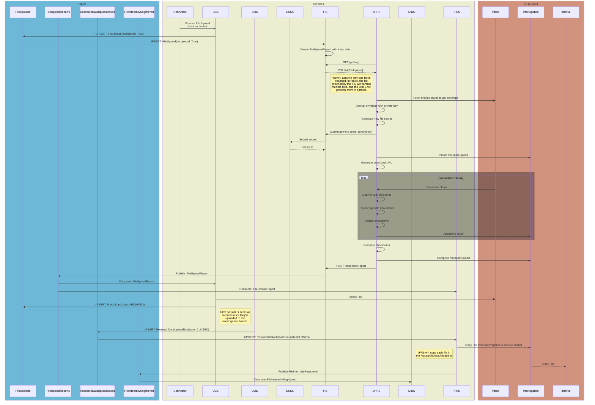
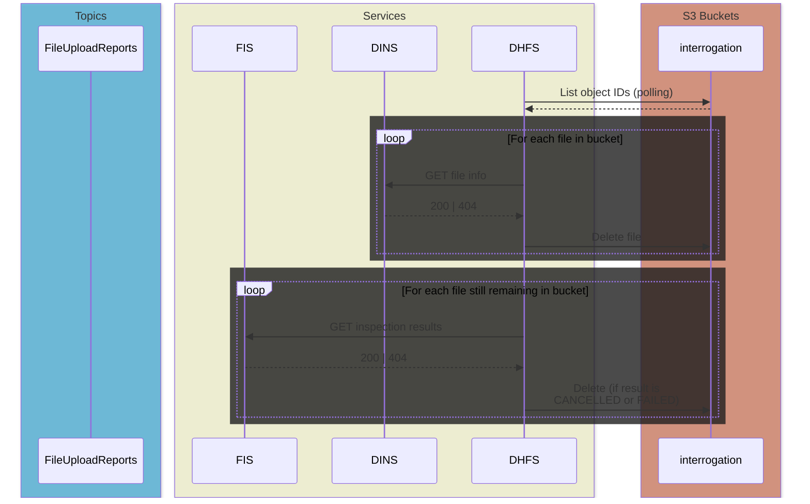
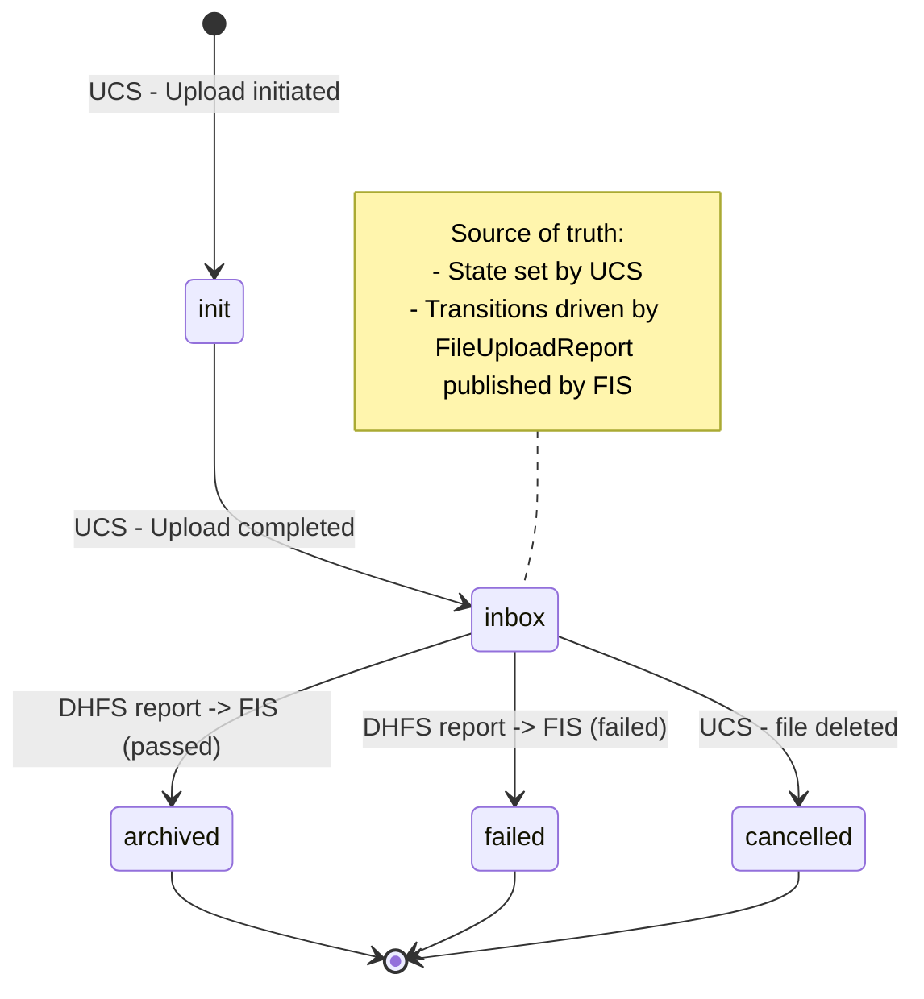

# File Upload Path Pt. 2 (Sarcastic Fringehead)
**Epic Type:** Implementation Epic

Epic planning and implementation follow the
[Epic Planning and Marathon SOP](https://ghga.pages.hzdr.de/internal.ghga.de/main/sops/development/epic_planning/).

## Scope
### Outline:
This epic includes all work required to bring the remaining file services into line with the new file upload concept. The first portion of work for the file services was executed under [Lynx Boreal](../76-lynx-boreal/technical_specification.md), and there was also a subsequent portion of work for the GHGA Connector which was carried out according to [Hedgehog Seahorse](../80-hedgehog-seahorse/technical_specification.md). When this epic is finished, all *backend* modifications required for the new upload concept to be realized will be complete. Frontend changes are *not* included in this epic, however, so more work will be required to bring the Data Portal up to speed.
As for the work to be completed within this epic, the services affected include the File Ingest Service (FIS), Internal File Registry Service (IFRS), the Well-Known Value Service (WKVS), the Upload Controller Service (UCS), the ghga-event-schemas library, and a new service called the Data Hub File Service (DHFS). Additionally, if it is discovered during implementation that further changes need to be made to other services *beyond what is described in this epic*, then tickets will be added ad-hoc and associated with this epic.

In Lynx Boreal, the UCS was rewritten, the Upload Orchestration Service (UOS) was implemented for the first time, the Claims Repository Service (CRS) was updated to manage permissions for Research Data Upload Boxes, and the Work Package Service (WPS) was updated to manage upload-type work packages. Taken together, these changes create the operational framework for remote file upload, but only to the point of initial ingest. In order to fully realize our file upload concept, we still need to decrypt the uploaded file, verify the integrity via checksum comparison, re-encrypt the file with a new file secret (securely stored in the Encryption Key Store Service, or EKSS), and move the file to a permanent storage bucket registered with the IFRS in what we call "archival".


### Included/Required:
All work described in the Additional Implementation Details section below is required.

### Optional:
Add email notifications for important events related to archival. This could include, for example, a notification conveying that all files in a Research Data Upload Box have been successfully archived, or that there was a problem with file XYZ during interrogation. To prevent scope creep, this should *probably* be done in another epic, but we should keep that potential requirement in mind during development.

Add audit events -- can also be performed in a separate epic.

### Not included:
Data Portal updates or any upcoming metadata-related services. This is purely for file upload.

## User Journeys (optional)

All user journeys are already detailed in Lynx Boreal. The operations added in this epic will occur automatically without further action required on the part of either the user or GHGA personnel. 

## API Definitions:

### RESTful/Synchronous:

[FIS HTTP API](#fis-http-api)  
[WKVS HTTP API](#wkvs-http-api)  
[DINS HTTP API](#dins-http-api)  

### Payload Schemas for Events:

#### FileUpload
```python
id: UUID4       # Unique identifier for the file upload
box_id: UUID4   # The ID of the FileUploadBox this FileUpload belongs to
completed: bool # Whether or not the file upload has finished
state: str      # The state of the FileUpload. Either "init", "inbox", "cancelled", "failed", or "archived"
state_updated: UTCDatetime  # Timestamp of when state was updated
alias: str      # The submitted alias from the metadata (unique within the box)
decrypted_sha256: str   # SHA-256 checksum of the unencrypted file content
decrypted_size: int     # The size of the unencrypted file
storage_alias: str  # The storage alias for the inbox bucket
```

#### FileUploadReport
```python
file_id: UUID4          # Unique identifier for the file upload
box_id: UUID4           # The ID of the FileUploadBox the file belongs to
secret_id: str | None   # The Vault ID of the file secret used for re-encryption
storage_alias: str      # The storage alias for the interrogation bucket
inspected_at: UTCDatetime | None  # Date that inspection was completed
inspection_result: "passed" | "failed" | "cancelled" | None  # Outcome of inspection
encrypted_part_size: int | None
encrypted_parts_md5: list[str] | None
encrypted_parts_sha256: list[str] | None
```

#### FileInternallyRegistered
```python
upload_date: UTCDatetime
file_id: UUID4
storage_alias: str
decrypted_size: int
decrypted_sha256: str
secret_id: str
encrypted_part_size: int
encrypted_parts_md5: list[str]
encrypted_parts_sha256: list[str]
```

## Additional Implementation Details:

> For a comprehensive overview, please see the [Service Diagrams](#service-diagrams) section below.

### GHGA-Event-Schemas:
The existing schemas should be updated to match what is shown above.

### UCS:
*Already implemented as part of Lynx Boreal.* The UCS needs minor updates to accommodate the expanded `FileUpload` model and to interpret the new statuses on the `FileUploadReport`. If a `FileUploadReport` event is received with the `inspection_result` "failed", then the UCS updates the `FileUpload` state to "failed" as well. However, if the value is "cancelled", the UCS will only update the `FileUpload` if the local copy is different. This is because a "cancelled" status might be due to the user deleting a file via Data Portal, or via the GHGA Connector. In the latter case, the UCS is effectively the origin of the cancellation (deletion).

The work to provide a deletion endpoint accessible by GHGA Connector is *not* meant to be part of this epic. For now, assume all deletions/cancellations will be triggered from the Data Portal or the UCS itself rather than the GHGA Connector.

#### Work to be performed for the UCS
- [ ] Get schema updates
- [ ] Add `storage_alias` to `FileUpload` by getting the updated `ghga-event-schemas`
- [ ] Handle other statuses on `FileUploadReport` events and update `FileUpload` accordingly

### WKVS:
- Provides the Data Hub Crypt4GH public keys via public HTTP API

#### WKVS HTTP API
> [Return to API list](#restfulsynchronous)

The WKVS would get the following new endpoint:  
`GET /values/data_hub_public_keys`:
- No authentication required
- Returns `200 OK` and a mapping of storage alias to public key

#### Work to be performed for the WKVS
- [ ] Provide a way to retrieve Crypt4GH public keys for Data Hubs. This can be a dictionary where the keys are storage aliases and the values are the public keys.

### GHGA Connector:
The Connector performs initial file encryption and upload from the user's machine. In order to properly encrypt the file for a specific Data Hub, the Connector needs to contact the WKVS to obtain the appropriate Crypt4GH public key based on the storage alias assigned to the `ResearchDataUploadBox`/`FileUploadBox` created by the Data Steward.

#### Work to be performed for the GHGA Connector
- [ ] Fetch and use Data Hub public key for file encryption

### FIS:
The FIS straddles the border between the file services group and everything else, similar to the role played by the UOS. In the past, the FIS acted as a way to ingest file upload metadata and tell other services when a manually validated ("interrogated") file was ready for permanent storage. This had to be done as a temporary solution until the remote file upload and automatic file interrogation was implemented, which is the work proposed in this epic.

The new role of the FIS is to inform the DHFS when new files arrive in the DHFS's `inbox` bucket. To do this, the FIS operates as an event consumer in one instance, and runs an HTTP API in another instance. Both instances are described below.

#### FIS Event Consumer
The FIS subscribes to `FileUpload` *outbox events* from the UCS. 

When a new `FileUpload` event arrives, the FIS first checks to see if it has a copy already stored in its database. If it does, it then looks at the value in the `state_updated` field; if the local copy is newer, the FIS makes a log and ignores the event. If the inbound event is newer, the FIS compares the values for `state` on the local copy and the inbound copy of the event. If the two values depict a valid transition, e.g. `INIT -> INBOX` or `INBOX -> ARCHIVED`, then the FIS updates its local copy. If the transition is not valid (e.g. `ARCHIVED -> INIT`), FIS raises an error and sends the event to the DLQ. The exact details of the event validation on the FIS-side are not actually important here; they can be decided at implementation time.

If the event represents a `FileUpload` moved into the `INBOX` state, the FIS creates a new `FileUploadReport` with the `file_id` and `storage_alias` fields populated. The remaining fields will all be `None`. The `FileUploadReport` will be updated with the other details later on in the other FIS instance (see below).

#### FIS HTTP API
> [Return to API list](#restfulsynchronous)

The FIS operates an HTTP API with these endpoints:
1. `POST /secrets`: Accept a new file secret for deposition in the EKSS
   - Authorization requires a token signed with Data Hub-specific private key
   - Request body must contain an encrypted file secret and associated file ID
   - Returns `201 CREATED`
   - Description:
     - FIS finds the existing `FileUploadReport` in its database, raising an error if it doesn't find it.
     - FIS forwards the file secret to EKSS (still encrypted) in exchange for a secret ID.
     - FIS updates the `FileUploadReport` with the new secret ID.
2. `GET /storages/{storage_alias}/uploads`: Serve a list of new file uploads (yet to be interrogated)
   - Authorization requires a token signed with Data Hub-specific private key
   - Returns `200 OK` and a list of `FileUploads` for files awaiting interrogation
   - Description:
     - FIS gets the `FileUploadReports` which match the requested storage alias and have `inspection_result=None`
     - FIS returns the list of `FileUploads` corresponding to the `FileUploadReports`
3. `GET /inspection-reports/{file_id}`: Serve an `InspectionReport` for a given file ID
   > Please see the InspectionReport schema definition below this list
   - Authorization requires a token signed with Data Hub-specific private key
   - Returns `200 OK` and the `InspectionReport` for the requested file ID
   - Description:
     - FIS finds the existing `FileUploadReport` in its database, raising an error if it doesn't find it (should be translated to a 404 response but logged within the service as an error).
     - Returns the subset of the `FileUploadReport` corresponding to the `InspectionReport` model structure. This is done to reduce the number of places that the secret ID is communicated, as well as the irrelevant box ID.
4. `POST /inspection-reports`: Accept an inspection report
   - Authorization requires a token signed with Data Hub-specific private key
   - Request body must contain a payload conforming to the `InspectionReport` schema
   - Returns `201 CREATED`
   - Description:
     - FIS finds the matching `FileUploadReport` in its database based on the `file_id` (or raises an error).
     - FIS updates the `FileUploadReport` with the received information and publishes this as a *persistent event*.

```python
class InspectionReport(BaseModel):
  """Model representing the expected results from file interrogation"""

  file_id: UUID4  # Unique identifier for the file upload
  inspected_at: UTCDatetime | None  # Date that inspection was completed
  inspection_result: "passed" | "failed" | "cancelled"  # Outcome of inspection
  encrypted_part_size: int | None
  encrypted_parts_md5: list[str] | None
  encrypted_parts_sha256: list[str] | None
```

#### FIS Configuration
The FIS needs the following configuration:
- MongoDbConfig
- KafkaConfig
- ApiConfigBase
- LoggingConfig
- OpenTelemetryConfig
- EventPubConfig:
  - ghga-event-schemas -> FileUploadReportEventsConfig
- OutboxSubConfig:
  - ghga-event-schemas -> FileUploadEventsConfig
- ekss_api_url
- wkvs_api_url

Upon startup, the HTTP API instance of the FIS will retrieve the list of Data Hub public keys from the WKVS.

In addition, the existing functionality and config that directly interacts with Vault should be removed so that EKSS is the sole middleman for Vault activity.


#### Open questions
1. What do we do with the existing FIS data? Just leave it there for now?
   - Persisted events stored in the FIS are analogous to FileUploadReport events, we might be able to migrate them for continuity.

#### Work to be performed for the FIS
- [ ] Ensure DLQ is enabled
- [ ] Add outbox subscriber for `FileUpload` events
- [ ] Add persistent publisher for `FileUploadReport` events
- [ ] Add HTTP endpoints as outlined above
- [ ] Write migration for existing persisted events if possible
- [ ] Write tests


### DHFS:
The DHFS is a new service that is operated by the Data Hubs for the purpose of performing file validation and re-encryption, and to keep file ingest in general as a federated operation. The DHFS operates two instances: a client instance, which performs the interrogation work and is always running; and a cleanup instance, which runs at some interval and deletes files from the `interrogation` bucket once they've been copied to permanent storage. One crucial thing to note here is that the DHFS is not connected to an event stream, and so has no direct knowledge of the information conveyed by the events in GHGA Central's event stream. The DHFS primarily interacts with FIS's REST API in order to get that information, which is limited to only what the DHFS needs to operate. 

#### DHFS Interrogator (primary instance)

It polls the FIS's HTTP API to get a list of `FileUploads` for files that have been recently uploaded to its `inbox` bucket. The DHFS decrypts each file and re-encrypts it using a new file secret before uploading it to the Data Hub's `interrogation` bucket. Along the way, it calculates the checksums of the unencrypted and re-encrypted file content. When the whole file has been re-encrypted and uploaded, the DHFS compares the unencrypted content's SHA-256 checksum against the value obtained from the corresponding `FileUpload`, and the re-encrypted content's MD5 checksum against the value calculated by S3 in the `interrogation` bucket.

If a checksum discrepancy is found, the DHFS rejects the upload and posts a `FileUploadReport` to the FIS's HTTP API which indicates that the file did not pass inspection. If checksums match and there are no other errors during upload, the DHFS accepts the upload and the `FileUploadReport` sent to the FIS reflects that the file passed inspection.

In both cases, the `FileUploadReport` is broadcasted by the FIS as a Kafka event and picked up by the UCS, which would update its local `FileUpload` accordingly. If the upload is successful, the UCS deletes the file from the `inbox`.

#### Interrogation Process in List Format
- [Per File]
  - Reads the first file part to sift for the Crypt4GH envelope
  - Decrypts the envelope using the configured private key (specific to the Data Hub)
  - Obtains the original file secret for decryption
  - Generates a new file secret for re-encryption
  - Sends the new file secret to the FIS's HTTP API
    - This is done right away instead of waiting to see if re-encryption is successful
    - The secret is encrypted using the GHGA public key
  - Calculates the content starting position (offset) from the envelope length
  - Initiates a multipart upload with the Data Hub's `interrogation` bucket
  - Streams the object from the Data Hub's `inbox` bucket chunk-by-chunk
  - [Per File Chunk]
    - Decrypts the chunk
    - Updates the SHA-256 checksum over the unencrypted content
    - Re-encrypts the chunk using the newly generated file secret
    - Updates the MD5 and SHA-256 checksums over the encrypted content
    - Uploads the re-encrypted chunk to the `interrogation` bucket
  - Compares the unencrypted file's checksum against the one reported by the submitter during upload, and the encrypted checksum against the one calculated by S3
  - Sends a `FileUploadReport` to the FIS's HTTP API


#### DHFS Cleanup Job (secondary instance)
The secondary duty of the DHFS is to clean up files from the `interrogation` bucket after archival. On each execution, the DHFS retrieves a list of all objects (files) currently in the `interrogation` bucket. Then for each file, the DHFS contacts the Data Hub Information Service (DINS). If the DINS responds with a 404, the DHFS leaves the file in the bucket. If the DINS responds with file information (a successful response), the DHFS knows that archival has been completed, and it deletes the file from the `interrogation` bucket.

Cleanup also needs to be performed for files that pass interrogation but nonetheless removed by the user or Data Steward. Neither the FIS, UCS, nor IFRS can perform this action because they don't have write access to the `interrogation` bucket. So in order to learn about files that need to be deleted, the DHFS will send an HTTP request to FIS for each file ID still in the bucket after completing the above request to the DINS. The DHFS expects to receive the `InspectionReport` for the file (receiving a 404 here would trigger an error since it shouldn't be possible for a file to reach interrogation without having spawned a `FileUploadReport`, the superset of the `InspectionReport`). If the `InspectionReport` data shows the status as either CANCELLED or FAILED, the DHFS will delete the file from the `interrogation` bucket. In the latter case, the DHFS should have already deleted the file itself, but it's possible that a sudden crash could have prevented it from completing the operation.

#### DHFS Configuration
The DHFS needs the following configuration:
- LoggingConfig
- OpenTelemetryConfig
- S3ObjectStoragesConfig
- auth_token_signing_key
  - This is the Data Hub's private key, which it uses to sign auth tokens sent to FIS
- wkvs_api_url
  - Used to contact WKVS to get the GHGA public key

### IFRS:
The role of the IFRS is to shepherd files into permanent storage, or "archival", by copying them from the `interrogation` bucket located at a Data Hub into the `archive` or `permanent` bucket located at GHGA Central. This only occurs once the Data Hub in question has completed the interrogation process, which is detailed in the [DHFS section](#dhfs) above. Unlike the FIS and DHFS, the IFRS operates only as an event consumer.

The IFRS subscribes to `FileUploadReport` events from the FIS and initially stores the event information for later use. The IFRS also subscribes to `ResearchDataUploadBox` outbox events from the UOS, and when it encounters a box which is set to CLOSED, it knows that the associated files are ready for archival. The association between `ResearchDataUploadBox` and `FileUploadReport` is made by examining the events' `file_upload_box_id` and `box_id`, respectively. It then copies each file from the `interrogation` bucket specified by `FileUploadReport.storage_alias` into the GHGA central `permanent` bucket. Once that is successful, the IFRS issues a `FileInternallyRegistered` event.

#### A note on file IDs and file accessions in the IFRS
Currently, the IFRS generates object IDs for new uploads, but this will be removed. The reason that happens now is that files are uploaded by a manual process and stored according to their accession number. File accessions belong to the metadata camp, and the intent is to segregate operations and data management such that metadata and file data are as independent as possible. Therefore, file accessions will be moved out of the file services' data and replaced with UUID4 file IDs. (The file accession and file ID will be linked via a process/service not defined in this epic). Finally, the UUID4 file IDs generated by the recently revamped UCS during file upload are now also used as the object IDs in S3 storage. This does not have to be the case, and we can choose to generate a separate object ID if that layer of indirection is desired. At the time of writing though, this is not planned.

#### Migrating existing IFRS data
The `file_metadata` collection needs the following changes:
- Remove `content_offset` field. The encrypted files are stored without an envelope, meaning the content offset is always 0.
- Make a *new collection* to link existing file accessions and file IDs until we develop the permanent accession-ID association solution. In this temporary collection, the `_id` field should contain `file_metadata.object_id` and an `accession` field should contain `file_metadata._id`. This *must* be done before the next step.
- Replace `_id` content with `object_id`. 
- Delete `object_id`.
- Rename `object_size` to `encrypted_size`.
- Rename `decryption_secret_id` to merely `secret_id`.

The list `encrypted_parts_sha256` is not currently used, but we are going to keep it for now. Originally the idea was for it to serve as another integrity check, but currently we only use the decrypted content's SHA-256 and the encrypted content's MD5 checksums for verification. In the spirit of "better to have it and not need it", we will keep this data (and continue producing it during re-encryption) for the time being.

The `ifrsPersistedEvents` collection needs similar changes to the `payload` field:
- Replace the value in `file_id` with the value from `object_id`.
- Delete `object_id`.
- Delete `bucket_id`. This field is not used by anything.
- Rename `decryption_secret_id` to `secret_id`.
- Rename `s3_endpoint_alias` to `storage_alias`.
- Delete `content_offset`.

IFRS data migration should be moved to the init container style. Instead of executing `run_db_migrations()` as part of every entrypoint, the migrations should be run as their own command. 

#### Work to be performed for the IFRS
- [ ] Add event subscriber for `FileUploadReport` events
- [ ] Add outbox subscriber for `ResearchDataUploadBox` events
- [ ] Upon encountering a closed `ResearchDataUploadBox`, retrieve the list of relevant files from the local store of `FileUploadReport` events
- [ ] Copy each file from the `interrogation` bucket to the IFRS's permanent bucket
- [ ] Get the updated `ghga-event-schemas` version and adapt IFRS for changes to `FileInternallyRegistered`
- [ ] Migrate existing data in the `file_metadata` collection
- [ ] Create new collection to preserve existing file accession-to-file ID associations
- [ ] Migrate existing data in the `ifrsPersistedEvents` collection
- [ ] Move migrations to own CLI command so they can be run as an init container
  - [ ] Work with DevOps to get this configured in k8s

### DINS:
The DINS subscribes to `FileInternallyRegistered` events from the IFRS to learn about which files are available in the Archive. It also hosts an HTTP API where the outside world can obtain basic information about those same files.

#### DINS HTTP API
> [Return to API list](#restfulsynchronous)

The DINS endpoint relevant for this epic is as follows:  
`GET /file_information/{file_id}`:
- No authentication required
- Returns `200 OK` and basic information about the requested file
- Returns `404 NOT FOUND` if the file doesn't exist
- *This is already implemented - included here for reference*

#### Work to be performed for the DINS
- [ ] Get the updated `ghga-event-schemas` version and adapt DINS for changes to `FileInternallyRegistered`. This should not require a DB migration because the fields in the DB are already named differently from their counterparts in the schema itself.

### DCS:
The DCS subscribes to `FileInternallyRegistered` events from the IFRS to learn about which files are available for download from the Archive. The changes in that event schema, which are described above in the [IFRS section](#ifrs), necessitate database migrations and code updates in the DCS.

#### Migrating existing DCS data

Similar to the IFRS, the DCS should get a new, temporary database collection to preserve the connection between file accession and file ID. This must be done before any of the following changes. Please note that "temporary" here does not mean the table should be dropped at the end of the migration, but that it will be made obsolete and removed after some future development.

The `drs_objects` collection needs the following migration applied:
- Replace the value of `_id` with the value from `object_id`.
- Delete `object_id`.
- Rename `decryption_secret_id` to `secret_id`.
- Rename `s3_endpoint_alias` to `storage_alias`.

The `dcsPersistedEvents` collection needs the following changes to the `payload` field:
- Where `type_` == `drs_object_served`:
  - Replace the value for `file_id` with the value from `target_object_id`
  - **QUESTION**: *Should we update the actual schema so `s3_endpoint_alias` becomes `storage_alias`?*
- Where `type_` == `drs_object_registered`:
  - Replace the value (presently accession) for `file_id` with the corresponding UUID4 value from the temporary table defined above.
  - `drs_uri` remains untouched...for now.
    - It's not clear how this will be constructed in the future, but the DCS should only be concerned with files and file IDs rather than file accessions from metadata.

Another note about the DCS migrations is that they should be moved to the init container style. Instead of executing `run_db_migrations()` as part of every entrypoint, the migrations should be run as their own command. 

#### Work to be completed for the DCS
- [ ] Get the updated `ghga-event-schemas` version
- [ ] Adapt code for schema updates
- [ ] Write migrations
- [ ] Move migrations to own CLI command so they can be run as an init container
  - [ ] Work with DevOps to get this configured in k8s

## Diagrams:

### Service Diagrams:
#### Service Map


#### S3 Bucket Access Permissions


#### Normal Upload Sequence Diagram (Beginning as the Upload Completes)



#### DHFS Cleanup Job Sequence Diagram


#### `FileUpload` State Diagram


## Human Resource/Time Estimation:

Number of sprints required: 3

Number of developers required: 1-2
