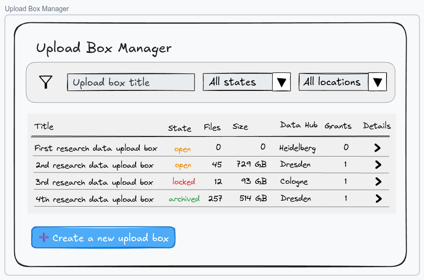
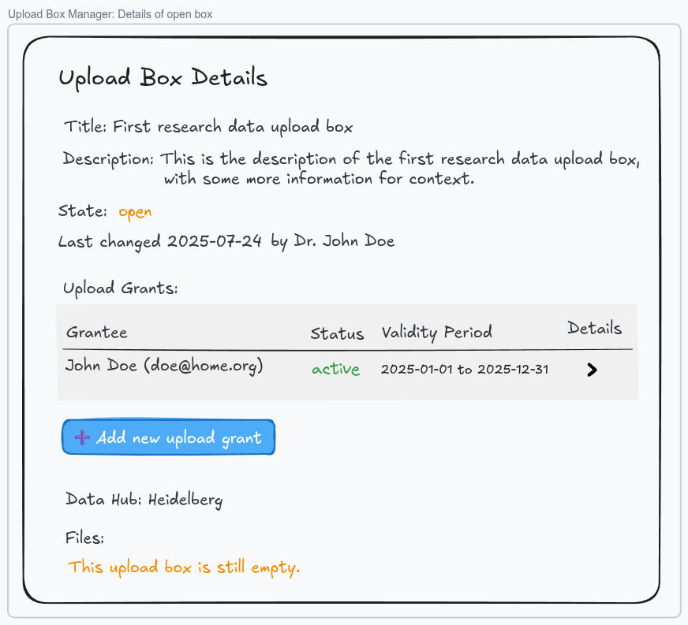
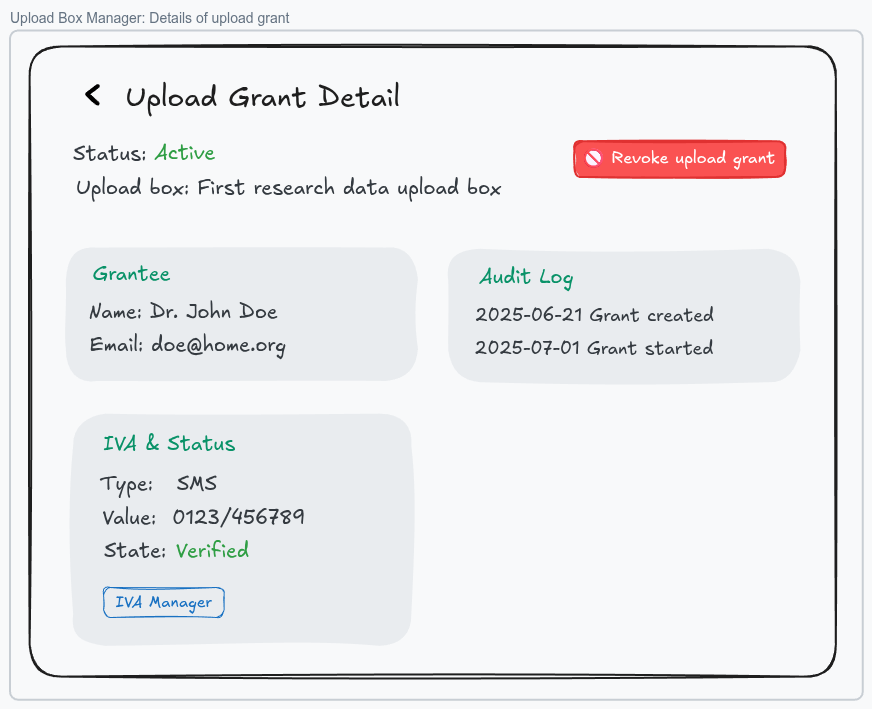
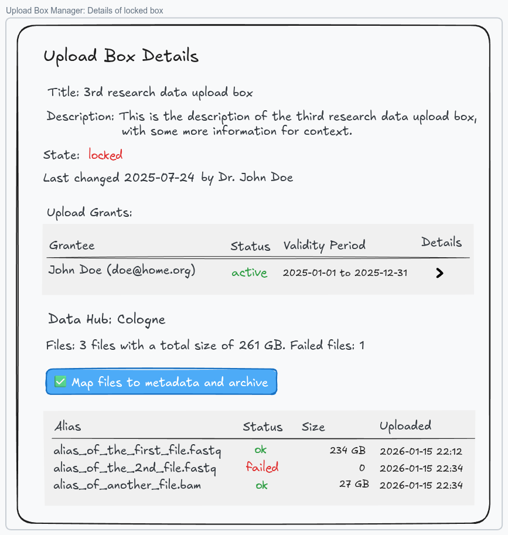
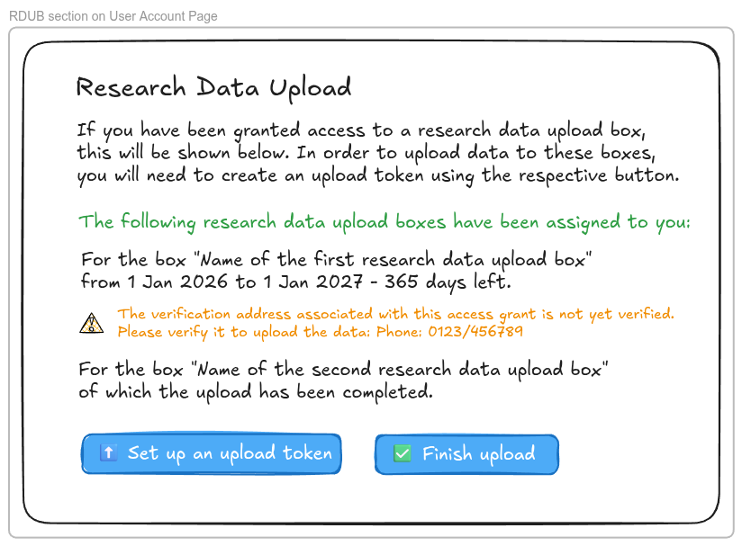
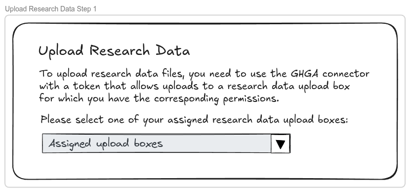
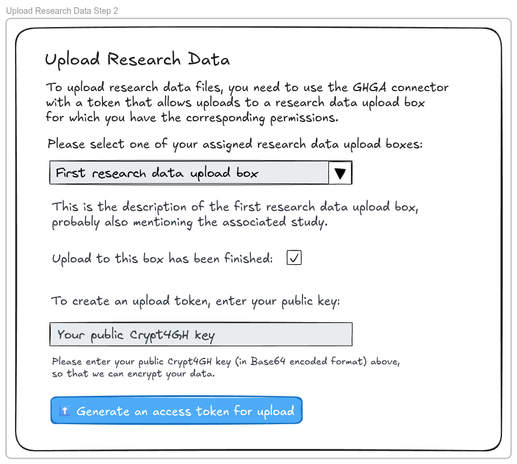
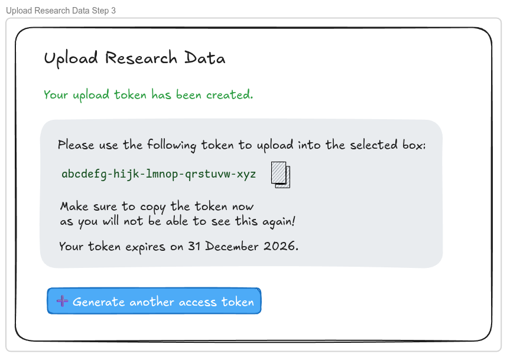
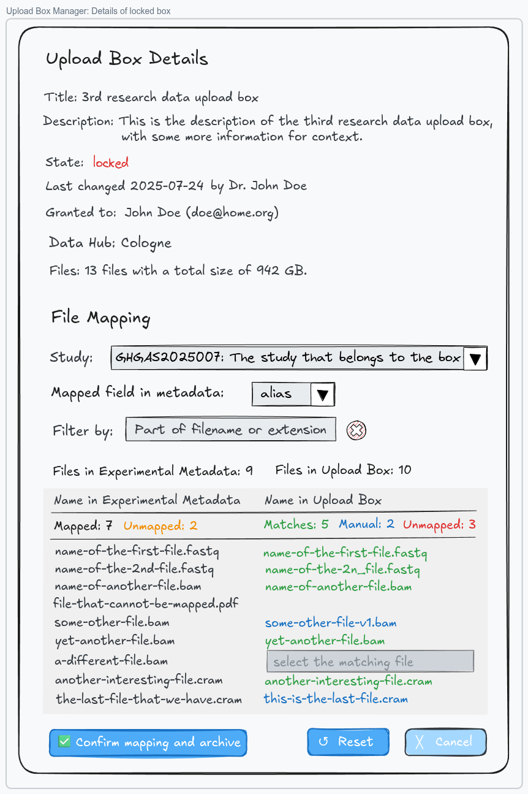

# Basic Research Data Upload Box Frontend (Archaeopteryx)

**Epic Type:** Implementation Epic

## Scope

### Outline

In this epic we implement the minimum necessary frontend functionality to make Research Data Upload Boxes fully usable with the current version of the backend and to map uploaded research data files to their corresponding entries in the submitted experimental metadata.

This will be an interim solution that still needs the data steward to help with management of the research data upload boxes and mapping the files, and this solution is not yet integrated with the planned study repository service.

Research Data Upload Boxes (RDUBs) have been specified and were implemented in the [Lynx Boreal](../76-lynx-boreal/technical_specification.md) and [Sarcastic Fringehead](../84-sarcastic-fringehead/technical_specification.md) epics on the backend side already.

### Included/Required

The implementation contains three parts:

#### 1. Upload Box Manager

An Upload Box Manager shall be integrated into the frontend. It shall be accessible by data stewards via the Admin menu and allow them to:

- list available RDUBs
- create a new RDUB for a specific user
- close, lock and unlock RDUBs

#### 2. Upload Token Creation

Users should be able to see all RDUBs that have been opened for them in a new section on their account page. For all RDUBs in the "open" state, the interface will show a button leading to a page that allows users to create an upload token for that RDUB. This should function similarly to the existing functionality for creating download tokens.

The currently existing page on the "work-packages" path that was meant to support both download and upload tokens should be moved to the path "download" and adapted to only support download tokens. Since the upload tokens are now based on RDUBs instead of datasets, it does not make much sense anymore to handle them on the same page, but we should create upload tokens on a separate page using the "upload" path.

#### 3. Research Data File to Experimental Metadata File Mapping

The Upload Box Manager should provide a sub-page that helps establishing the missing link between the uploaded files in the Research Data Upload Boxes (RDUBs) and the submitted Experimental Metadata (EM):

- RDUBs identify files via an internal address, but they also provide a unique alias
- EM identifies files via accession numbers, but files also have a field for the name of the file and an alias

The alias stored in RDUB files is the filename of the file as it was uploaded via the GHGA connector. The file name submitted with the EM usually should correspond to this filename, but that is not guaranteed. Sometimes the alias is used instead, or the filenames submitted in the EM could be slightly different. It is also not guaranteed that the number of files matches - there could be more files listed in the EM than have been uploaded, or files can have been uploaded that have no corresponding entry in the EM. The frontend should handle these cases gracefully, and support the data steward in creating a mapping between the uploaded files and the EM entries with as much automation as possible while allowing manual overrides.

All RDUBs in the locked state should have a button that opens this mapping tool. Further details of the mapping UI are described below.

### Optional

This epic should only provide the necessary functionality so that it can be shipped as soon as possible.

### Not included

The epic does not implement a full self-service solution for managing the RDUBs by the users who are uploading the files and no integration to the planned metadata services. It also does not implement any additional backend functionality.

The epic also does not include a complete Upload Grant Manager. This could be later added later, similarly to the (Download) Access Grant Manager. For now, access grants are managed via the Upload Box Details Page.

## User Journeys

This epic covers the following user journeys:

1. A data steward creates a new Research Data Upload Box and authorizes a user to upload research data files to that box, using the Upload Box Manager in the GHGA data portal.
2. The user sees the newly created box on the user account page in the GHGA data portal and hits the button to create an upload token for the box.
3. The user confirms that an upload token shall be created for that box and after entering their public Crypt4GH key, will be shown the corresponding upload token once.
4. The user copies the token and continues the upload in the GHGA connector using the generated upload token (not part of this epic).
5. After uploading all research data files, the user locks the upload box on the user account page in the GHGA data portal and informs the data steward that the upload has been completed.
6. The data steward sees that the box has been locked (or otherwise locks the box).
7. The data steward verifies that the experimental metadata for the corresponding study has been submitted.
8. Now the data steward can use the Upload Box Manager in the GHGA data portal to establish a mapping between the names of the uploaded files in the box and the file names in the experimental metadata.
9. After submitting the mapping, the Research Data Upload Box is automatically closed.

## UI Wireframes

### Upload Box Manager

Detail view for an open upload box:

Detail view for an upload grant:

Detail view for a locked upload box:

### RDUB section on User Account Page

Note: The buttons only appear if there is an open and accessible research data upload box assigned to the user.

### Upload Token Creation

Step 1: Selection of the upload box:

Step 2: After the upload box has been selected, the detailed description is shown and input fields to either finish the upload or create an upload token:

Note: The button only appears when the Crypt4GH code has been entered. If "finish upload" has been checked, the control to enter the public key will disappear and a button with the text "Lock the upload box" will appear instead.

Step 3: After "Generate an access token for upload" has been clicked, the upload token will be shown once:

### Research Data Mapping Tool

Notes:

Initially, the files will be auto-mapped using a simple string similarity comparison. This will also happen when the study or mapped field is changed, or when the "Reset" button is clicked. The mapped field ("name" or "alias") will be auto-selected when the study is changed to achieve the best mapping result.

The "Filter by" field allows filtering by filename. It shall be possible to enter just a part of the file name or just an extension, like ".fastq". The filter should be case insensitive and match both metadata names and uploaded file names. If a filter is set, a highly visible button to remove the filter should appear.

In the last column, warnings signs are shown for files that are unmapped or mapped to more than one file. When hovering over this sign a detailed explanation is shown as a tooltip (particularly, the names of the other files in case of conflicts).

In the last column, warning signs are shown for files that are unmapped or mapped to more than one file. When hovering over this sign, a detailed explanation is shown as a tooltip (particularly the names of the other files in case of conflicts).

Mapped files should show a symbol indicating how closely the file names match.

The table shall be sortable by clicking on one of the columns in the header row, including the last column. This allows sorting the names so that problems appear at the top of the table.

Below the table there should be also a paginator (same as for most other tables).

When clicking on a line in the table with file names, an inline editor should appear for the name in the upload box. This editor should provide autocompletion using the same similarity search as used for the automatic mapping.

When clicking "Reset" or "Cancel" and manual mappings have already been made, the user needs to confirm the action.

When clicking "Confirm mapping and archive" a confirmation dialog should pop up as well, explaining that the action is irrevocable and a checkbox must be checked off to proceed.

## API Endpoints used by the frontend

### UOS

Used to load the list of upload boxes and get their details:

- `GET /boxes`
- `GET /boxes/{box_id}`

Used to create and update upload boxes (e.g. lock/unlock/close):

- `POST /boxes`
- `PATCH /boxes/{box_id}`

Used to fetch, create and delete upload grants for these boxes:

- `GET /access-grants`
- `POST /access-grants`
- `DELETE /access-grants/{grant_id}`

Used to send the file mapping to the backend:

- `PATCH /boxes/{box_id}/accessions`

### Metldata

Used to get all files for the datasets belonging to a study:

- `GET /artifacts/embedded_public/classes/EmbeddedDataset/resources/`

### MASS

Used to find a study by a given name or accession and get its datasets:

- `GET /search?filter_by=study.accession`
- `GET /search?filter_by=study.name`

### WPS

Used to create an upload token:

- `POST /work-packages`

### WKVS

Used to get the full names of the data hubs:

`GET /values/data_hub_labels`

## Additional Implementation Details

It must be verified that the RDUB is in the same state when the mapping is submitted as it was when the data has been loaded by the mapping tool. For that purpose, the backend should provide a version/revision number that increases on every change of the RDUB (including changes in any of the associated files). This version number must be submitted together with the mapping, and the backend should reject a submission when the current version of the RDUB is different.

The mapping can be stored in the browser of the data steward using local storage, so that a mapping session can easily be resumed. However, this is optional since it is only important if the data steward needs to make many manual mappings, which should usually not happen.

## Human Resource/Time Estimation

Number of sprints required: 2

Number of developers required: 1.5
