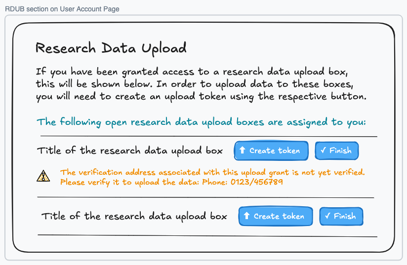
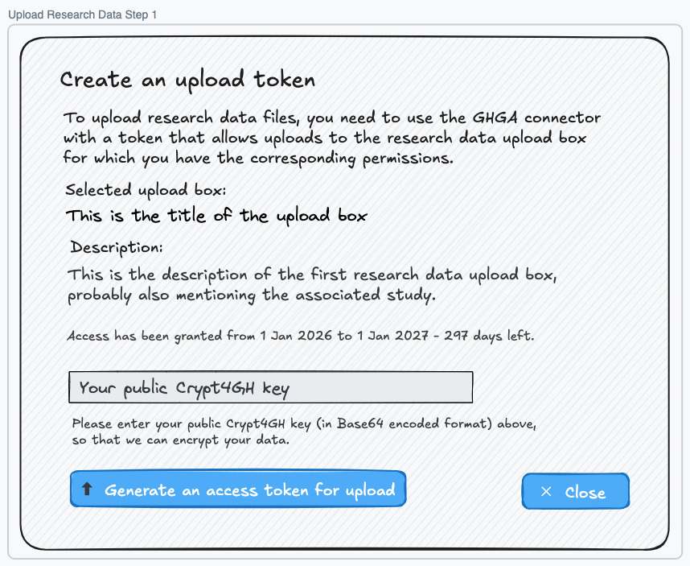
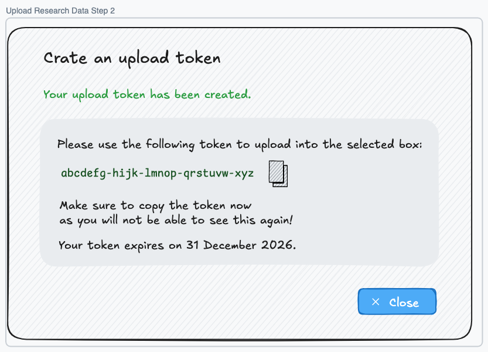

# Basic Research Data Upload Box Frontend (Archaeopteryx)

**Epic Type:** Implementation Epic

## Scope

### Outline

In this epic we implement the minimum necessary frontend functionality to make Research Data Upload Boxes fully usable with the current version of the backend and to map uploaded research data files to their corresponding entries in the submitted experimental metadata.

This will be an interim solution that still requires a data steward to help manage the Research Data Upload Boxes and map the files, and this solution is not yet integrated with the planned study repository service.

Research Data Upload Boxes (RDUBs) have been specified and were implemented in the [Lynx Boreal](../76-lynx-boreal/technical_specification.md) and [Sarcastic Fringehead](../84-sarcastic-fringehead/technical_specification.md) epics on the backend side already.

### Included/Required

The implementation contains three parts:

#### 1. Upload Box Manager

An Upload Box Manager shall be added to the frontend. It shall be accessible by data stewards via the Admin menu and allow them to:

- List available RDUBs.
- Create a new RDUB for a specific user.
- Close, lock and unlock RDUBs.

Additionally, an "Upload Grants" section should be added to the User Manager that shows the upload grants of the user and the corresponding RDUBs.

#### 2. Upload Token Creation

Users should be able to see all RDUBs opened for them in a new section on their account page. For all RDUBs in the "open" state, the interface will show a button leading to a page that allows users to create an upload token for that RDUB. This should function similarly to the existing functionality for creating download tokens.

The currently existing page on the "work-packages" path that was meant to support both download and upload tokens should be removed. Both kinds of tokens should be created directly on the account page instead, using modals for entering the public key and showing the token.

#### 3. Research Data File to Experimental Metadata File Mapping

The Upload Box Manager should provide a sub-page that helps establish the missing link between the uploaded files in the Research Data Upload Boxes (RDUBs) and the submitted Experimental Metadata (EM):

- RDUBs identify files via a globally unique ID and a user-specified alias that is unique per RDUB.
- EM identifies files via accession numbers, but files also have a field for the name of the file and an alias.

By default, the ghga-connector assigns the alias based on the filename when uploading to an RDUB. The file name submitted with the EM usually should correspond to this filename, but that is not guaranteed. Sometimes the alias is used instead, or the filenames submitted in the EM could be slightly different. It is also not guaranteed that the number of files matches - there could be more files listed in the EM than have been uploaded, or files can have been uploaded that have no corresponding entry in the EM. The frontend should handle these cases gracefully, and support the data steward in creating a mapping between the uploaded files and the EM entries with as much automation as possible while allowing manual overrides.

All RDUBs in the locked state should have a button that opens this mapping tool. Further details of the mapping UI are described below.

### Optional

This epic should only provide the necessary functionality so that it can be shipped as soon as possible.

### Not included

The epic does not implement a full self-service solution for managing the RDUBs by the users who are uploading the files and no integration to the planned metadata services. It also does not implement any additional backend functionality.

The epic also does not include a complete Upload Grant Manager. This could be added later, similarly to the (Download) Access Grant Manager. For now, upload grants are managed via the Upload Box Details page and are also listed on the user detail page in the User Manager.

## User Journeys

This epic covers the following user journeys:

1. A data steward creates a new Research Data Upload Box and authorizes a user to upload research data files to that box, using the Upload Box Manager in the GHGA data portal.
2. The user sees the newly created box on the user account page in the GHGA data portal and hits the button to create an upload token for the box.
3. After entering their public Crypt4GH key, the user can create the upload token, which is shown only once with the option to copy it to the clipboard.
4. The user copies the token and continues the upload in the GHGA connector using the generated upload token (not part of this epic).
5. After uploading all research data files, the user locks the upload box on the user account page in the GHGA data portal and informs the data steward that the upload has been completed.
6. The data steward sees that the box has been locked (or otherwise locks the box).
7. The data steward verifies that the experimental metadata for the corresponding study has been submitted.
8. Now the data steward can use the Upload Box Manager in the GHGA data portal to establish a mapping between the names of the uploaded files in the box and the file names in the experimental metadata.
9. After submitting the mapping, the Research Data Upload Box is automatically closed.

## UI Wireframes

### Upload Box Manager

List of all upload boxes with filter controls:

Optionally, the grantee(s) could also be shown in the list and in the filter.

Detail view for an open upload box:

Detail view for an upload grant:

Detail view for a locked upload box:

### RDUB section on User Account Page

Notes:

Only open RDUBs for which access has been granted to the user will appear here.

In the case that an upload grant does not have an IVA or the IVA is not yet verified, a warning will be shown.

When the "Submit" button is clicked, the upload will be considered as finished and the box will be closed. Since this can only be reverted by a data steward, the user will be asked for confirmation after clicking the button.

### Upload Token Creation

Step 1: After the "create token" button next to the upload box on the account page has been clicked, the detailed description is shown and the user's public Crypt4GH key is requested:

Notes:

The button will only be enabled after the Crypt4GH key has been entered.

Step 2: After "Generate an access token for upload" has been clicked, the upload token will be shown once:

### Research Data Mapping Tool

Notes:

Initially, nothing will be mapped. Only when the "mapped field in metadata" is selected, metadata file names with a matching file name in the upload box are mapped automatically. Only exact matches count. Casing may be only different if there is a single case-insensitive match. All such exact matches are shown in green color on the right side.

We may later change this and pre-select the "mapped field in metadata" automatically (the one that maximizes the number of such exact matches), but for now we decided that the data steward needs to make an explicit choice.

If the selected metadata field is changed or the "Reset" button is clicked, any manually established mappings shall be removed after confirmation by the user, and the matching files should be newly mapped again.

The "Filter by" field allows filtering by filename. It shall be possible to enter just a part of the file name or just an extension, like ".fastq". The filter should be case-insensitive and match both metadata names and uploaded file names. If a filter is set, a highly visible button to remove the filter should appear.

The table shall be sortable by clicking on one of the columns in the header row, including the last column. This allows sorting the names so that unmapped files (which have no file name in the right column) appear at the top. The default sorting should be by extension first, then by filename.

Below the table header row, the number of mapped and unmapped files from metadata, the number of exact matches, manually established links and unmapped (unused) files in the outbox shall be shown unless the corresponding numbers are zero. Leaving files from metadata unmapped shall be allowed, but unmapped files in the outbox shall be considered an error that needs to be fixed by deleting the surplus files.

Below the table there should also be a paginator (same as for most other tables).

When clicking a row in the table, an inline editor should appear where the user can enter a file name in the upload box that shall be mapped. Also, a selection box should pop up below the inline editor that shows all unmapped files and narrows down as the user types in characters. Exact matches should appear at the top of the selection list, followed by other names ordered in the same way as the right column. When clicking outside the field or the selection box, or when pressing Enter, the selected file name shall be accepted if it exists in the upload box and is not yet mapped elsewhere. Otherwise, the entry in the mapped columns shall remain empty. This also allows removing an already established mapping.

Mappings that have been established manually and do not match exactly should be shown in blue instead of green color (optionally with additional indication, e.g. a warning icon, for better visibility and accessibility).

When clicking "Reset" or "Cancel" and manual mappings have already been made, the user needs to confirm the action.

When clicking "Confirm mapping and archive", a confirmation dialog should pop up as well, explaining that the action is irrevocable, and a checkbox must be ticked to proceed. If not all files in the outbox have been mapped, the dialog should show the number of unmapped files and the name of the first unmapped file and tell the user that these files need to be either mapped or deleted before the submission can be completed. If not all files from metadata have been mapped, the dialog should just show a warning with the number of unmapped files and the name of the first unmapped file, but allow the user to proceed without these files being mapped.

## API Endpoints used by the frontend

### UOS

Used to load the list of upload boxes and get their details:

- `GET /boxes`
- `GET /boxes/{box_id}`

Used to create and update upload boxes (e.g. lock/unlock/close):

- `POST /boxes`
- `PATCH /boxes/{box_id}`

Used to fetch, create and delete upload grants for these boxes:

- `GET /access-grants`
- `POST /access-grants`
- `DELETE /access-grants/{grant_id}`

Used to send the file mapping to the backend:

- `PATCH /boxes/{box_id}/accessions`

### Metldata

Used to get all files for the datasets belonging to a study:

- `GET /artifacts/embedded_public/classes/EmbeddedDataset/resources/`

### MASS

Used to find a study by a given name or accession and get its datasets:

- `GET /search?filter_by=study.accession`
- `GET /search?filter_by=study.name`

### WPS

Used to create an upload token:

- `POST /work-packages`

### WKVS

Used to get the full names of the storage locations:

`GET /values/storage_labels`

## Additional Implementation Details

It must be verified that the RDUB is in the same state when the mapping is submitted as it was when the data has been loaded by the mapping tool. For that purpose, the backend should provide a revision number that increases on every change of the RDUB (including changes in any of the associated files). This revision number must be submitted together with the mapping, and the backend should reject a submission when the current version of the RDUB is different.

The mapping can be stored in the browser of the data steward using local storage, so that a mapping session can easily be resumed. However, this is optional since it is only important if the data steward needs to make many manual mappings, which should usually not happen.

## Human Resource/Time Estimation

Number of sprints required: 2

Number of developers required: 1.5
