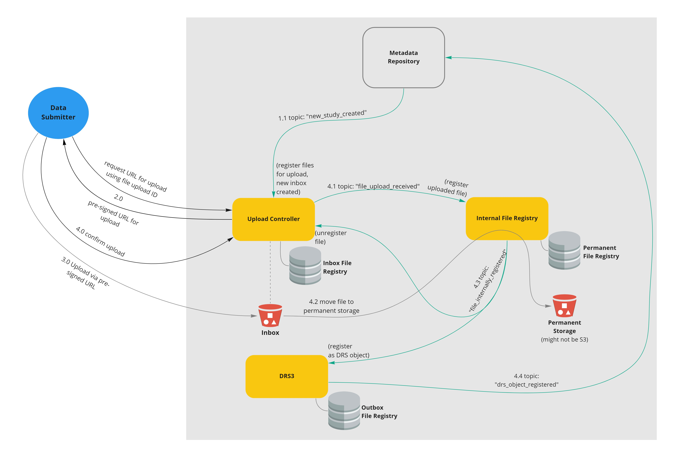

# \<Epic Title\> (\<Epic Code Name\>)
**Epic Type:** Implementation Epic

Epic planning and implementation follows the
[Epic Planning and Marathon SOP](https://docs.ghga-dev.de/main/sops/sop001_epic_planning.html).

**Attention: Please do not put any confidential content here.**

\<Please replace all appearances of `<...>`.\>

## Scope
### Outline:
\<Provide a brief outline of the goal of this epic in one or few sentences.\>

### Included/Required:
\<List the required features without going into too much technical detail.\>

### Optional:
\<List any optional features that may or may not be realized as part of this epic.\>

### Not included:
\<List features that will not be addressed as part of this epic.\>

## User Journeys (optional)

This epic covers the following user journeys:

\<Images and descriptions of user journeys go here. Images are deposited in the `./image` sub-directory.\>

## API Definitions:

### RESTful/Synchronous:

\<List all endpoints in the following way:\>

- GET /samples/{sample_id}: Get metadata on a sample
- POST /submissions: Post a submission
- ...

### Payload Schemas for Events:

\<Describe the schema of event either using example events or json schemas\>

## Additional Implementation Details:

- \<List further implemenation details here. (Anything that might be relevant for defining and executing tasks.)>

## Human Resource/Time Estimation:

Number of sprints required: \<Insert a number.\>

Number of developers required: \<Insert a number.\>
